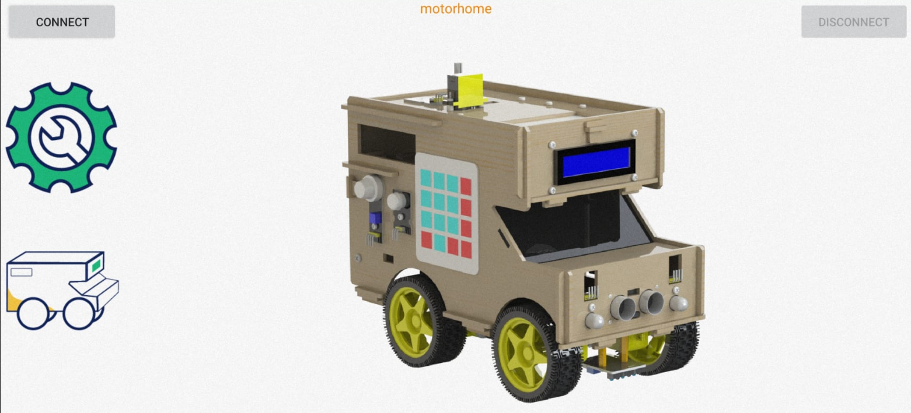
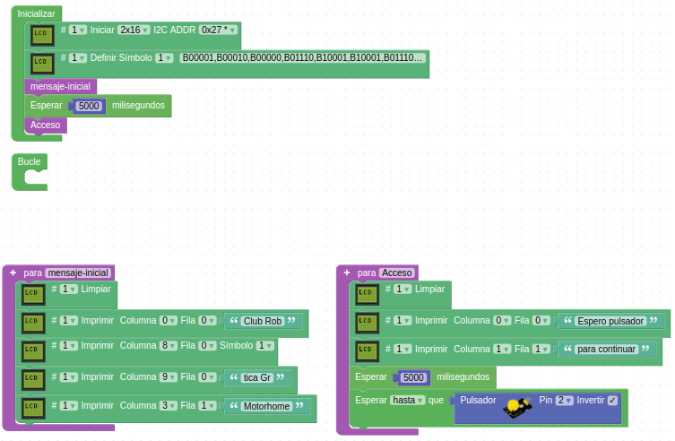

# Aplicación keyestudio motorhome

## **Introducción**
Resulta evidente que necesitamos de una aplicación en el móvil que nos permita enviar señales y Keyestudio nos la facilita tanto para iOS como para Android en la Google Play Store. En la imagen siguiente vemos el logotipo de la aplicación.

*Logotipo aplicación motorhome*

En nuestro caso solamente veremos como proceder en el caso de Android, donde tenemos las siguiente opciones para instalar la app en nuestro móvil o tablet.

1. Buscar en Google Play Store **keyestudio motorhome** e instalarla.
2. Descargarla desde el [enlace](https://play.google.com/store/apps/details?id=com.keyestudio.motorhome).
3. Copiar [Motorhome.apk](../app/APP/Android_APP/android%20APK/Motorhome.apk) e instalarla.

En cualquier caso, una vez instalada la aplicación en nuestro móvil se mostrará el icono que vemos en la figura siguiente:

*Icono de Motorhome*

## **Inicio de la APP Motorhome**
Nota: si al iniciar la aplicación nos los solicita debemos permitir que esta acceda a la ubicación o de lo contrario es posible que Bluetooth no esté conectado.

Iniciamos la aplicación haciendo clic en el icono de la aplicación y se nos abrirá la ventana que vemos en la figura siguiente:

´

*Ventana principal de Motorhome*

En la parte superior izquierda de la ventana de la app tenemos el botón "CONNECT", que si lo pulsamos nos va a mostrar una lista de todos los dispositivos Bluetooth que estén en el alcance del móvil. Teniendo alimentads la autocaravana y el módulo HC-10 conectado vemos que el LED que lleva incorporado parpadea. En esta situación pulsamos el botón "CONNECT" y en la lista que se muestra debemos encontrar un dispositivo de nombre HMSoft, tal y como vemos en la figura siguiente.

*Lista de dispositivos encontrados*

Una vez que pulsamos el botón "connect" de color naranja el LED del módulo deja de parpadear, la situación cambia a conectado, lo que se refleja sobre el naranja que ahora muestra el texto "is connected", indicando precisamente la situación de que la app y el módulo están conectados vía Bluetooth.

Una nueva pulsación sobre el botón naranja devuelve la situación al estado anterior tanto en el módulo como en el botón.

Si tocamos en cualquier parte de la pantalla fuera de la que abarcan los botones (zona en primer plano en blanco y naranja) estaremos en situación de trabajar con la app enviando datos a la placa. En la figura siguiente vemos el estado de la pantalla con los dispositivos conectados.

*App lista para enviar códigos*

En la figura anterior se han destacado dos botones de esta ventana principal que dan acceso a sendas ventanas con todos los botones necesarios para llevar a cabo las tareas que tienen encomendadas los diferentes botones y que vamos a describir seguidamente.

## **Descripción de los botones de la app**
En este apartado vamos a describir la funcionalidad de cada botón de la app, determinar el carácter o caracteres que envían y, basándonos en todos los ejemplos puestos a lo largo de la web, ir creando el programa de control completo que debemos grabar en la placa para comprobar estas funcionalidades. Es decir, el apartado "Control de la autocaravana con APP" lo vamos a ir desarrollando conforme hagamos su descripción y lo haremos en ArduinoBlocks

### ¿que carácter envía cada botón
Antes de hacer nada mas con la app necesitamos saber los código que envía cuando pulsamos cada uno de los botones y cuando cambiamos la posición de los deslizadores. En la documentación [KS0507 Keyestudio Smart RV Kit](https://wiki.keyestudio.com/KS0507_Keyestudio_Smart_RV_Kit) podemos encontrar la información, en inglés, referida al carácter de control y la función de cada parte de la app y un ejemplo para el IDE de Arduino.

En nuestro caso nos vamos a basar en el ejemplo visto en el apartado Bluetooth de esta misma sección, lo vamos a modificar en ArdinoBlocks para que nos muestre el comando que se ha enviado desde el móvil y que se ha recibido en la placa de control. Debemos cargar en nuestra placa "Mega" el programa [Motorhome-caracter-app](../programas/Motorhome-caracter-app.abp) que vemos en la figura siguiente y comprobar los código enviados por cada botón de ambas ventanas de la app.

*Programa para saber los códigos recibidos*

Vamos a ver cada ventana por separado para que resulte mas claro.

Debemos tener en cuenta que para poder cargar el programa en la placa en esta ocasión **NO** debemos desconectar los pines Tx o Rx del módulo Bluetooth ya que como se aprecia en el programa el módulo no se conecta a los pines Tx/Rx que se usan para grabar firmware, sino que se conecta a los pines Tx1/Rx1 existente en las placas tipo Mega. Una vez cargado el programa reconectamos el Bluetooth, abrimos la app, tocamos en "CONNECT" para conectarnos con el módulo HC-10 de nombre "HMSoft" y una vez conectados comenzamos a enviar códigos desde la app para ver su valor ASCII (letras) y/o numérico (deslizadores) enviado.

### Descripción botones de la interface de control
La ventana de control tiene el aspecto que vemos en la figura siguiente donde todos los botones y deslizadores o barras de progreso permanecen sin activar.

*Pantalla de la interface de control*

En la figura siguiente tenemos la descripción de cada botón y el carácter que envía tanto activado como desactivado.

AQUI DEBE IR UNA IMAGEN CUANDO SE VERIFIQUEN TODOS LOS COMANDOS Y UN ENLACE A ARCHIVO PDF CON LOS MISMOS

## **Control de la autocaravana con APP**
Antes de comenzar con la recepción de datos para realizar el control de la autocaravana vamos a configurar un mensaje de bienvenida que se muestre en la LCD cada vez que iniciamos el sistema y que se detenga hasta que no accionemos el pulsador, en cuyo caso se continua con el programa general que por ahora no hace nada. En la figura siguiente vemos el programa en este momento.

*Programa inicial*

## **Comandos para la interface de control**
Vamos a iniciar una función de nombre "comandos-interface-control" que va a tener dos tipos de funcionalidades, una primera es la que se encarga de preguntar si se están recibiendo datos por bluetooth, y si es cierto guarda el dato recibido en una variable que usaremos para determinar la acción a tomar en función del carácter recibido.  También se hace una llamada a otra función de nombre "comandos-PWM" que veremos posteriormente.

### Diodo LED interior
Vamos a comenzar por el control del diod LED interior. En la figura siguiente vemos el inicio de la función "comandos-interface-control" y unos mensajes, la parte del programa encargada de encender y apagar el LED y otras funciones para mostrar mensajes. En la figura siguiente vemos el aspecto del programa en este momento con los apartados nuevos destacados.

*Programa con inicio comandos de control*

### Tiras de LEDs RGB direccionables
Inicializamos los neopixels, añadimos una nueva función para definir variables y la parte de reconocimiento de comandos de encender y apagar las tiras. El encendido lo vamos a realizar haciendo que se enciendan los pixeles uno a uno con un pequeño retardo y en un determinado color y el apagado pues simplemente poniendo a negro todos los LEDs. En la figura siguiente vemos parte del programa donde se han omitido las funciones que no tienen ningún cambio y se destacan las nuevas instrucciones.

*Programa con tiras LEDs RGB*

### Sonidos
Simplemente cuando activemos el botón sonará una melodía y cuando lo desactivemos un sonido. La parte del programa que cumple la función es la de la figura siguiente:

*Programa con sonidos*

### Recepción de datos en la APP
Ahora vamos a ver los botones en los que la funcionalidad es totalmente diferente a la anterior ya que lo que se hace es enviar datos desde los sensores a la APP en el móvil para que los muestre junto al icono correspondiente. Todos ellos tienen en común que el dato que envía el botón cuando están activados (difuminados) es una 'Z' y simplemente se dejan de actualizar los datos recibidos.

