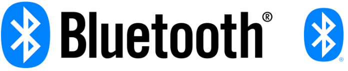
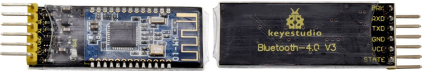
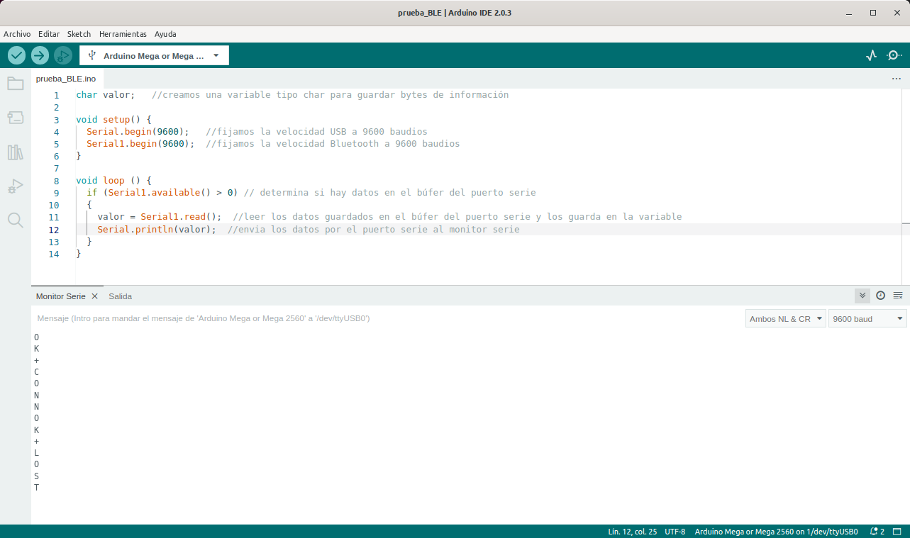
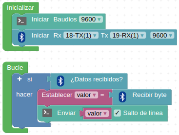
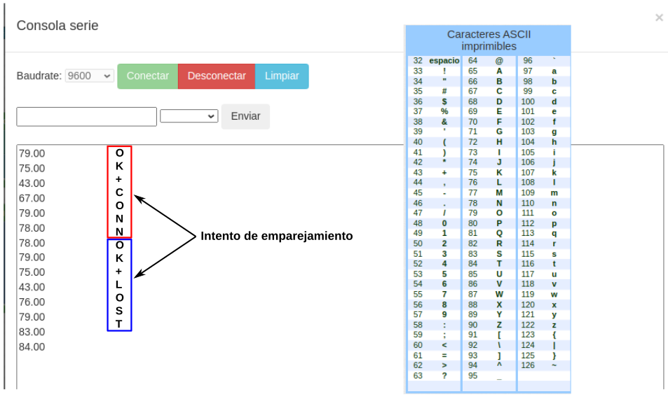

# Bluetooht
Los módulos Bluetooth permiten crear conexión inalámbrica serie punto a punto de forma que la forma de trabajar es muy similar a la comunicación serie por cable. A continuación vemos lo básico de los módulos más comunes.

## **Introducción**
Bluetooth es una especificación industrial para Redes Inalámbricas de Área Personal (WPAN) que posibilita la transmisión de voz y datos entre diferentes dispositivos mediante un enlace por radiofrecuencia en la banda ISM de los 2.4 a 2.485 GHz. Los principales objetivos que se pretenden conseguir con esta norma son:

* Facilitar las comunicaciones entre equipos móviles.
* Eliminar los cables y conectores entre estos.
* Ofrecer la posibilidad de crear pequeñas redes inalámbricas y facilitar la sincronización de datos entre equipos personales.

Se denomina Bluetooth al protocolo de comunicaciones diseñado especialmente para dispositivos de bajo consumo, que requieren corto alcance de emisión y basados en transceptores (dispositivos que cuentan con transmisor y receptor compartiendo parte de la circuiteria) de bajo costo.

El hardware que compone el dispositivo Bluetooth está compuesto por dos partes:

* un dispositivo de radio, encargado de modular y transmitir la señal.
* un controlador digital, compuesto por una CPU, un procesador de señales digitales (DSP – Digital Signal Processor) llamado Link Controller (o controlador de Enlace) y de las interfaces con el dispositivo anfitrión.

Su logotipo lo vemos en la figura siguiente:

*Logotipo Bluetooth con texto y sin texto*

## **Bluetooth V2**
Existe un procedimiento definido que se llama Pairing (o emparejamiento) que vincula a dos dispositivos Bluetooth. Cuando vinculamos dos dispositivos Bluetooth, se inicia un proceso en el que ellos se identifican por nombre y dirección interna y se solicitan la clave PIN para autorizar la conexión.

Si el emparejamiento se realiza con éxito, ambos nodos suelen guardar la identificación del otro y cuando se encuentran cerca se vuelven a vincular sin necesidad de intervención manual.

Para manejar los módulos Bluetooth se utilizan los comandos Hayes o AT, de los que se puede encontrar información en este [enlace](https://es.wikipedia.org/wiki/Conjunto_de_comandos_Hayes) y a continuación damos algunos básicos:

* AT+VERSION: Versión del Firmware. 
* AT+NAMEXXX: Para establecer el nombre que queremos presentar cuando otro dispositivo nos busque.
* AT+PINXXXX: permite establecer el número de identificación personal, que se requerirá para establecer la vinculación.
* AT+BAUDX: Permite fijar la velocidad de comunicación entre el modulo y la consola según los siguientes pares:

- 1 -> 1200 bps | -5 -> 19200 bps
- 2 -> 2400 bps | -6 -> 38400 bps
- 3 -> 4800 bps | -7 -> 57600 bps
- 4 -> 9600 bps | -8 -> 115200 bps

La velocidad por defecto es la de 9600 bps.

Los módulos mas conocidos son el HC-05 y HC-06 que son Bluetooth V2 y cuyo aspecto podemos ver en la figura siguiente:

*Módulos HC-05 y HC-06*

Con esto finalizamos el breve repaso a los módulo clásicos Bluetooth V2 y ahora vamos a describir brevemente los módulo Bluetooth 4.0 o low energy.

## **Bluetooth 4.0 o Low Energy**
Básicamente se trata de un nuevo protocolo diseñado para reducir en todo lo posible el gran consumo de energía de sus predecesores. Generalmente se le conoce como BLE (iniciales de Bluetooth Low Energy) o Bluetooth LE o también como Bluetooth Smart y tienen un consumo típico que podemos cifrar entre los 10 y 15 mA. Otra de sus principales novedades radica en que este módulo si es utilizables con dispositivos iOS.

El BLE es un subconjunto del estándar Bluetooth v4.0 que dispone de una pila de protocolos en referencia a la capa OSI (en inglés, Open Systems Interconnection) completamente nueva y orientada a conexiones sencillas en aplicaciones de muy baja potencia que suelen funcionar con pilas o baterías.

La pila de protocolos para Bluetooth Low Energy sigue la estructura definida en la figura siguiente.

*Pila de protocolos para BLE*El

El controlador aloja las capas inferiores de la pila del protocolo y también la radio. El Hots contiene las capas superiores de la pila de protocolos. Por encima de ambas estaría la aplicación de usuario que es la que interactúa con la pila de protocolos. La ventaja es que todas estas capas se pueden implementar en un solo chip o dividir en varios y conectarlos a través de una capa de comunicaciones como UART, USB o SPI.

* El controlador contiene las capas: Interfaz de controlador de host (HCI), Capa de enlace (LL) y Capa física (PHY)

    * En la capa física (physical layer) se implementa  toda la circuiteria de comunicaciones. La tecnología BLE puede usar hasta 40 canales de 2MHz en la banda ISM. El estándar emplea la técnica “frequency hopping” o “saltos en frecuencia”, siguiendo una secuencia de saltos pseudo-aleatorios entre los canales frecuenciales mencionados que ofrece un alto grado de robustez frente a interferencias.

    * La capa de enlace (link layer), se encarga de gestionar características como los requerimientos temporales del estándar, chequeo de mensajes y reenvío de mensajes erróneos recibidos, gestión, filtrado de direcciones etc. Además ofrece la definición de roles (Advertiser, Scanner, Master and Slave) que permiten identificar de forma lógica el rol de cada dispositivo en el proceso de coElmunicación. El nivel LL es del mismo modo responsable de procesos de control como el cambio de parámetros de la conexión o la encriptación.

    * el Host Controller o HCI es un protocolo estándar que permite que la comunicación entre un host y un controlador se lleve a cabo a través de un interfaz serie. A modo de ejemplo, en la mayoría de smartphones u ordenadores el host y la aplicación corren en la CPU principal mientras que el controlador está situado en hardware específico y separado, conectado mediante UART o USB. El estándar Bluetooth define HCI como el conjunto de comandos y eventos para la interacción de ambas partes (host y controlador).

* El host contiene las siguientes capas: Perfil de acceso genérico (GAP), Perfil de atributo genérico (GATT), Protocolo de adaptación y control de enlace lógico (L2CAP), Protocolo de atributos (ATT), Gerente de seguridad (SM) y la Interfaz de controlador de host (HCI).

    * La capa L2CAP (Logic Link Control and Adaptation Protocol), se responsabiliza de dos tareas fundamentales en un proceso de comunicación. En primer lugar, el proceso de multiplexación, es decir, la capacidad de dar formato a mensajes provenientes de las capas OSI superiores y encapsularlos en paquetes estándar BLE así como el proceso inveMódulrso. 

    * Para BLE, la capa L2CAP es la encargada de dar acceso y soporte a los dos protocolos fundamentales. Por un lado, ATT (Attribute Protocol), un protocolo basado en atributos presentados por dispositivo, con arquitectura cliente-servidor, que permite el intercambio de información. Por otro lado, SMP (Security Manager Protocol), protocolo que proporciona un framework para generar y distribuir claves de seguridad entre dos dispositivos.

    * En el nivel más alto de la capa de protocolos, encontraremos de forma paralela las capas GAP y GATT. Esta primera, GAP (Generic Acces Profile), permite que un dispositivo sea visible hacia el resto de dispositivos y además determina como puede interactuar un dispositivo entre otro. Establece distintas normas y conceptos para estandarizar las operaciones de más bajo nivel como:

        - Roles de interacción
        - Modos de operación y transición entre ellos
        - Procedimientos para establecimiento de comunicación
        - Modos de seguridad y procedimientos

    * Al otro lado, GATT (Generic Attribute Profile), que define como dos dispositivos BLE transfieren información. Este proceso tiene lugar cuando dos dispositivos han superado la fase de establecimiento de comunicación (controlada por GAP) y comienza la transferencia de información pudiendo ser de forma bidireccional.

### Comandos AT en BLE
Para enviar comandos AT vamos a utilizar una placa tipo Arduino cómo interfaz serie y la consola de ArduinoBlocks para el envio de comandos. También se puede utilizar un convertidor USB a TTL para establecer las comunicaciones. Las conexiones que hay que hacer entre el Arduino y el Bluetooth HM-10 son las siguientes:

* VCC a 5V
* GND a GND
* TX a TX (no se cruzan las conexiones)
* RX a RX (no se cruzan las conexiones)

No es necesario que la placa tenga ningún código subido y por supuesto no debe tener ninguno que utilice la comunicación serie.

Una vez realizadas las conexiones abrimos la consola y establecemos 9600 baudios y NL + LF y comprobamos si está funcionando enviando el comando AT al que el módulo debe responder con un OK.

A continuación tenemos una tabla con un listado de comandos AT que se pueden enviar al Bluetooth HM10.

| Comando AT | Efecto |
|:-:|---|
| AT | Compruebe si el terminal de comando funciona normalmente.|
| AT+RESET |Reinicio del software.|
| AT+VERSION |Obtener la versión de firmware, bluetooth, HCI y LMP.|
| AT+HELP |Lista de todos los comandos.|
|AT+NAME|Obtener / establecer el nombre del dispositivo local.|
|AT+PIN|Obtener / establecer el código pin para el emparejamiento.|El
|AT+PASS|Obtener / establecer el código pin para el emparejamiento.|
|AT+BAUD|Obtener / establecer velocidad en baudios.|
|AT+LADDR|Obtener la dirección bluetooth local.|
|AT+ADDR|Obtener la dirección bluetooth local.|
|AT+DEFAULT|Restaurar valores predeterminados de fábrica.|
|AT+STATE|Obtener el estado actual.|
|AT+PWRM|Obtener / Establecer modo de encendido (bajo consumo).|
|AT+POWE|Obtener / establecer la potencia de transmisión de RF.|
|AT+SLEEP|Modo de sueño.|Módul
|AT+ROLE|Obtener / establecer el rol actual.|
|AT+PARI|Obtener / establecer el bit de paridad UART.|
|AT+STOP|Obtener / establecer el bit de parada de UART.|
|AT+START|El sistema comienza a funcionar.|
|AT+IMME|El sistema espera el comando cuando se enciende.|

### Módulo HC-10
Los principales parámetros del módulo son:

* **Pin BRK**. Es un pin de entrada que responde a un pulso de menos de 100 ms para activas las siguientes funciones:

    1. Cuando el módulo está en modo sleep se pone en estado normal.
    2. Cuando el estado es conectado, el módulo activa la desconexión.
    3. Cuando está en modo espera, el módulo vuelve a su estado inicial.

* **Pin RXD**. Entrada de datos serie.
* **Pin TXD**. Salida de datos serie.
* **Pin GND**. Masa de alimentación.
* **Pin VCC**. Polo positivo de alimentación a 5V.
* **Pin STATE**. Como pin de salida muestra el estado de trabajo del módulo* VCC a 5V
* GND a GND
* TX a TX (no se cruzan las conexiones)
* RX a RX (no se cruzan las conexiones)
* Protocolo Bluetooth: Especificación Bluetooth V4.0 BLE
* Sin límite de bytes en el puerto serie Transceptor
* En un entorno abierto, realice una comunicación de ultra distancia de 100 m con iphone4s
* Protocolo USB: USB V2.0
* Frecuencia de trabajo: banda ISM de 2,4 GHz
* Método de modulación: GFSK (clave de desplazamiento de frecuencia gaussiana)
* Potencia de transmisión: -23dbm, -6dbm, 0dbm, 6dbm, se puede modificar mediante el comando AT.
* Sensibilidad: ≤-84dBm a 0,1% BER
* Tasa de transmisión: Asíncrona: 6K bytes; Síncrono: 6k Bytes
* Característica de seguridad: Autenticación y encriptación
* Servicio de soporte: UUID central y periférico FFE0, FFE1
* Consumo de energía: modo de reposo automático, corriente en espera 400uA~800uA, 8,5 mA durante la transmisión.
* Fuente de alimentación: 5V CC
* Temperatura de trabajo: –5 a +65 Centígrados

Los pines RXD1, TXD1, GND y VCC del módulo Bluetooth están interconectados con los pines TX1, RX1, -(GND) y +(VCC) de la placa de control mega2560. Los pines STATE y BRK no necesitan conexión.

El aspecto del módulo lo vemos en la figura siguiente:

*Módulo Bluetooth 4.0*

### Ejemplo de prueba del módulo HC-10
Vamos a realizar un ejemplo sencillo que permite leer las señales recibidas desde un móvil vía Bluetooth. El ejemplo consiste en inicializar tanto la consola serie como las comunicaciones por bluetooth, definir una variable donde se almacenarán los datos recibidos desde un móvil y estos serán enviados a la consola. Una vez subido el programa a la placa y colocado el módulo en su lugar, lo que va a ocurrir es que cuando hagamos un intento de emparejar desde un móvil con el dispositivo **HMSoft** se imprimirán una serie de caracteres relativos a un intento de emparejamiento fallido.

* Desde el IDE 2.0 el programa es el siguiente:

~~~
char valor;   //creamos una variable tipo char para guardar bytes de información

void setup() {
  Serial.begin(9600);   //fijamos la velocidad USB a 9600 baudios
  Serial1.begin(9600);  //fijamos la velocidad Bluetooth a 9600 baudios
}

void loop () {
  if (Serial1.available() > 0) // determina si hay datos en el búfer del puerto serie
  { 
    valor = Serial1.read()# Comunicación serie por cable
Vamos a repasar brevemente la forma de establecer la comunicación entre una placa tipo Arduino y nuestro PC a través de un cable.

## **Introducción**;  //leer los datos guardados en el búfer del puerto serie y los guarda en la variable
    Serial.println(ble_val);  //envia los datos por el puerto serie al monitor serie
  }
}
~~~

En la figura siguiente tenemos el programa y el resultado obtenido en el Monitor serie.

*Programa + resultado de prueba del módulo BLE*

* Desde ArduinoBlocks el programa es el que vemos en la figura siguiente:

*Programa de prueba del módulo BLE*

En la figura siguiente vemos que el resultado en la consola se recibe como números y por ello se ha puesto la tabla de caracteres ASCII imprimibles que permiten realizar la conversión a texto de forma rápida.

*Resultado del programa de prueba del módulo BLE*

