# Comunicación serie por cable
Vamos a repasar brevemente la forma de establecer la comunicación entre una placa tipo Arduino y nuestro PC a través de un cable.

## **Introducción**
Históricamente Arduino disponía de un puerto serie tipo RS232 para conectarse al PC, hoy en día ese puerto está prácticamente extinguido en los ordenadores y en su lugar se utiliza el USB que es un puerto serie mucho más avanzado. En la figura siguiente vemos la imagen de varios tipos de placas que nos muestran la evolución de las mismas de forma muy resumida.

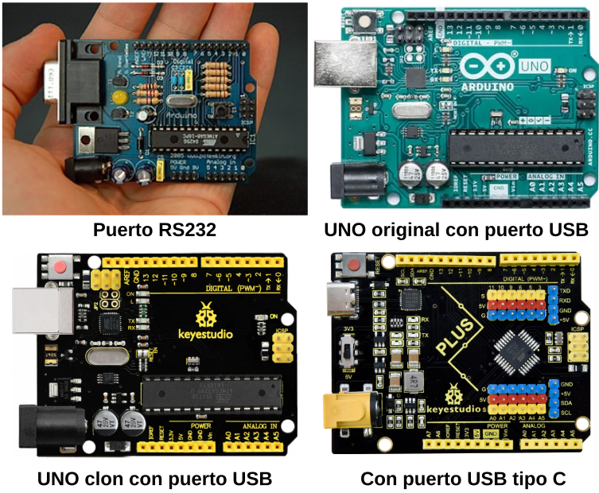

*Tipos de placas*

Para incorporarse al estándar UART TTL a USB las placas tipo Arduino incorporan un chip que lo convierte. El puerto USB también es una comunicación de datos serie a través de la conversión UART TTL a USB que se realiza con chips del tipos FTDI, CH340G, CP2102, etc.

UART (del inglés Universal Asynchronous Receiver-Transmitter) es el protocolo mas usado en la domunicación dispotivo-a-dispositivo. Este [artículo de Eric Peňa y Mary Grace Legaspi](../datasheet/uart-a-hardware-communication-protocol.pdf) muestra cómo usar UART como un protocolo de comunicación de hardware siguiendo el procedimiento estándar.

## **Propósito de la comunicación serie por cable**
En la figura siguiente tenemos la imagen de una tarjeta UNO con las principales partes de la comunicación serie destacadas.

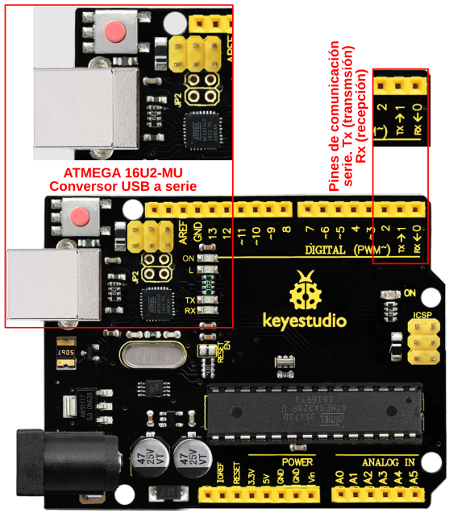

*Elementos principales de la comunicación serie*

El primer próposito de la comunicación serie es poder realizar el envío de un programa a la memoria interna de la placa, lo cual se realiza a través de un firmware pregrabado en el microcontrolador que se denomina "uploader".

El segundo propósito es el de establecer el intercambio de información a través entre la placa y el ordenador a través del terminal o consola serie.

En ArduinoBlocks ambos propósitos se llevan a cabo dentro de la aplicación Connector.

## **Intercambio de información vía serie**
Se puede realizar el intercambio de información entre nuestra placa Arduino, ESP32, etc con cualquier dispositivo capaz de conectarse con esta a través de una conexión serie como por ejemplo con un ordenador o con un smartphone. Se trabaja a nivel de bytes o caracteres ASCII imprimibles, ya sean individuales o de forma encadenada para formar textos. A continuación vamos a ver los diferentes casos a partir de ejemplos.

En el apartado [El terminal o consola serie](../Tactividades/T_teclado.md) se describe la consola serie de ArduinoBlocks.

### Placa tipo Arduino a ordenador
Veamos un ejemplo sencillo de envío de datos de tipo numérico y de texto desde la placa al ordenador. Se trata de implementar el programa de la figura siguiente:

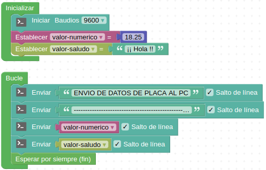

*Envío de datos: placa a consola*

El resultado lo vemos en la figura siguiente:

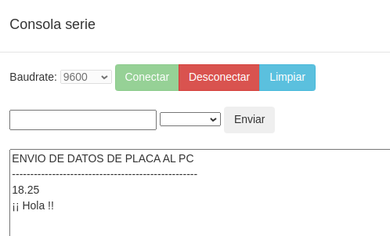

*Resultado de envío de datos: placa a consola*

### Ordenador a placa tipo Arduino
Ahora vamos a ver el ejemplo contrario al anterior, es decir vamos a enviar un dato de cada tipo desde el ordenador a la placa y para comprobar el funcionamiento lo confirmaremos enviando el dato recibido de nuevo a la consola. Se trata de implementar el programa de la figura siguiente:

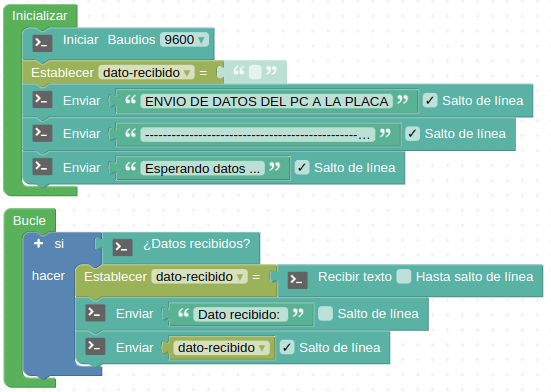

*Envío de datos: consola a placa*

El resultado lo vemos en la figura siguiente:

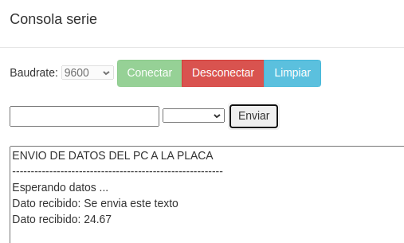

*Resultado de envío de datos: consola a placa*

Observamos como el segundo dato enviado es un número.

Si transformamos el programa para recibir datos de tipo numérico tendremos algo similar a la figura siguiente:

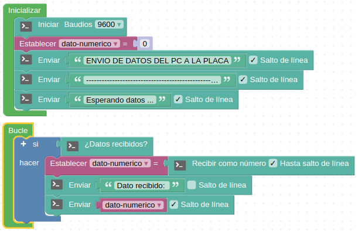

*Envío de datos: consola a placa*

El resultado lo vemos en la figura siguiente:

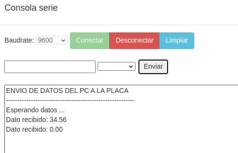

*Resultado de envío de datos: consola a placa*

Podemos observar que al intentar enviar un texto el resultado es 0.00 y por lo tanto vemos que no podemos enviar datos tipo texto de esta forma.

Quizá una forma mas correcta de hacer el programa para trabajar con número sea la de la figura siguiente:

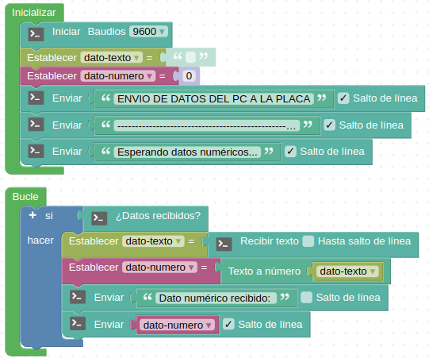

*Envío de datos: consola a placa*

El resultado lo vemos en la figura siguiente:

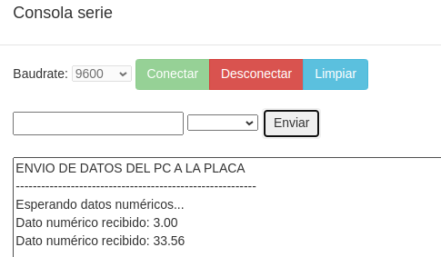

*Resultado de envío de datos: consola a placa*

### **Ejemplo de intercambio de información vía serie**
Desde ArduinoBlocks nos ofrecen el ejemplo de uso de estos conceptos [Adivina el número](http://www.arduinoblocks.com/web/project/2004) que podemos importar a nuestros proyectos y estudiar como está programado. En la imagen siguiente vemos el aspecto del programa. El programa también lo tenemos disponible en este enlace [Adivina el número](../programas/Adivina_el_numero.abp).

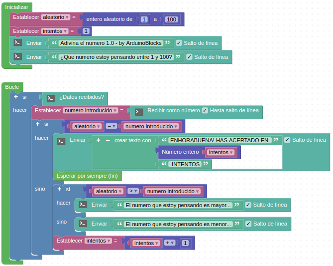

*Adivina el número*

El resultado lo vemos en la figura siguiente:

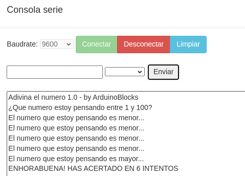

*Resultado de Adivina el número*

