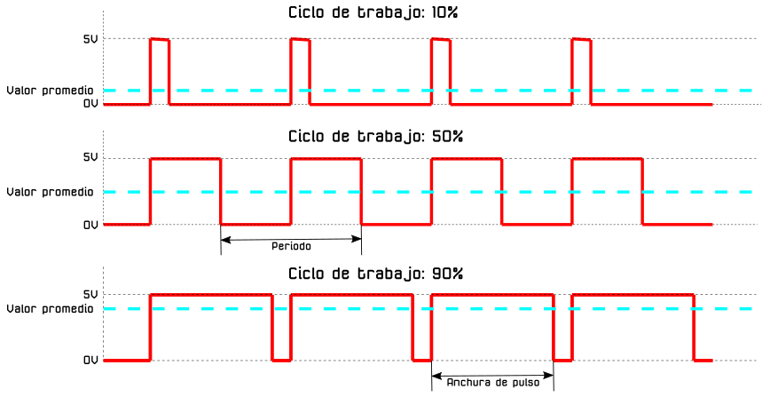

# Diodos LED

## **Conceptos de programación incluidos**

<b>

* PWM
* Concepto de variable y de contador
* Bucles y contadores

</b>

## **El diodo LED**
El diodo LED (Light Emitting Diode) es un diodo semiconductor capaz de emitir luz, lo mas usuales dentro del espectro visible aunque también pueden ser de infrarrojos, laser, etc. Su uso mas habitual es como indicador y, últimamente cada vez mas frecuentes en iluminación. Sus principales ventajas frente a luces incandescentes son:

* Menor consumo de energía
* Mayor vida útil
* Menor tamaño
* Gran durabilidad y fiabilidad
* En la imagen siguiente vemos el aspecto físico que tiene y su símbolo electrónico.

*Aspecto y símbolo del LED*

El color de la cápsula es simplemente orientativo de la longitud de onda que define realmente el color de la luz emitida. Por ello el LED con la cápsula transparente puede emitir en cualquiera de los colores del espectro visible.

La forma de la capsula mas habitual es cilíndrica de 3 o 5 mm de diámetro, aunque existen otras formas menos usuales como las que vemos en la imagen siguiente:

*Tipos de encapsulados*

El LED es un dispositivo que tiene polaridad siendo su comportamiento el siguiente: En polarización directa (ánodo a positivo y cátodo a negativo) el LED emite luz y en polarización inversa (ánodo negativo y cátodo positivo) se comporta prácticamente como un interruptor abierto.

Para su correcto funcionamiento el diodo LED se polariza poniéndole en serie una resistencia que limita la corriente que pasa a través del mismo y, por tanto, determina el nivel de brillo de la luz emitida.

Sin entrar en detalles en la tabla siguiente se dan los valores de tensión directa (VF) y corriente directa (IF) para los colores mas habituales de LEDs. A partir de estos valores y el valor de tensión de alimentación de nuestro LED podemos calcular el valor de la resistencia serie sin mas que aplicar la formula indicada.

*Tensión y corriente para distintos colores*

El módulo [KS0016 Keyestudio White LED](https://wiki.keyestudio.com/KS0016_Keyestudio_White_LED_Module) tiene el aspecto de la imagen siguiente, donde también podemos ver el esquema del circuito que se monta en el mismo.

*Aspecto y esquema del circuito del LED blanco*

## **PWM**
PWM son siglas en inglés que significan Pulse Width Modulation y que lo podemos traducir a español como Modulación de ancho de pulso. Los pines PWM permiten generar una señal analógica mediante una salida digital mapeada con 8 bits, o lo que es lo mismo, valores del 0 al 255, es decir mediante una salida PWM podemos emular una señal analógica.

En realidad una placa tipo UNO no es capaz de generar una salida analógica y lo que se hace es emplear un truco que consiste en activar una salida digital durante un tiempo y el resto del tiempo del ciclo mantenerla desactivada. El valor promedio de la salida es el valor analógico. En el tipo de modulación PWM mantendremos constante la frecuencia, o lo que es lo mismo, el tiempo entre pulsos y lo que se hace es variar la anchura del pulso.

La proporción de tiempo que está encendida la señal, respecto al total del ciclo, se denomina ciclo de trabajo o Duty cycle, y generalmente se expresa en tanto por ciento. En la imagen siguiente vemos señales con distintos ciclos de trabajo.

*Distintos Duty cicle*

Es importante recordar que en una salida PWM el valor de la tensión es 5V por lo que si alimentamos un dispositivo de 3V a partir de una salida de 5V lo dañaremos de forma irreversible.

Las señales PWM emulan una señal analógica para aplicaciones como variar la luminosidad de un LED y variar la velocidad de motores de corriente continua.

La placa KS0509 Keyestudio Mega 2560 dispone de quince salidas PWM (D2 - D13 y D44 - D46).

## **Concepto de variable y de contador**
El concepto de variable en programación consiste simplemente en asignarle un nombre significativo a un espacio de memoria donde almacenar determinada información durante la ejecución normal del programa. El concepto es muy amplio y complejo y en nuestro caso no vamos a entrar en detalles sobre el mismo, pero si indicar que no se debe confundir con el concepto de variable matemática, ya que una expresión como x = x + 1 que es una aberración en matemáticas tiene todo el sentido en programación. Lógicamente en matemáticas no se puede cumplir pero en programación significa que a la variable x se le sume uno y el resultado se vuelva a guardar en la misma variable.

En ArduinoBlocks podemos crear tres tipos de variables, numéricas, de texto o booleanas. En la animación siguiente podemos ver como se pueden crear, eliminar y renombrar variables.

*Crear, renombrar y eliminar variables*

En programación, llamamos contador a una variable cuyo valor se incrementa o decrementa en un valor fijo para cada iteración del bucle para el que se ha definido. El uso habitual de un contador es simplemente contar el número de veces que itera un bucle en general o de forma mas extensa contar, solamente, aquellas iteraciones en las que se cumpla una determinada condición.

Por ejemplo, supongamos que tenemos una variable de nombre Estado de valor inicial cero y que se incremente cada vez que accionamos un pulsador, de esta forma si en un bucle vamos incrementando la variable de uno en uno, tenemos:

<B><BLOCKQUOTE> Estado = 0 // valor inicial

Estado = 1 // Estado = Estado + 1

Estado = 2 // Estado = Estado + 1

... </BLOCKQUOTE></B>

## **Concepto de variable y de contador**
Vamos a ver como se hacen los ciclos de repetición o bucles en ArduinoBlocks.

* **Repetir**. En el menú de Control existe el bloque 'Repetir (valor) veces hacer…', como el de la imagen siguiente:

*Bucle repetir*

Lo que pongamos en hacer se va a repetir tantas veces como indiquemos en el número de veces, que por defecto estará a 10.

En realidad lo que estamos haciendo es lo que en programación se conoce como bucle for.

* **Repetir según condición**. En la imagen siguiente vemos dos bloques que repiten su interior mientras, o hasta, que se cumpla una condición.

*Bucle repetir según condición*

* **Contador**.  Realiza un bucle contando con un variable índice (normalmente i o j). Se define un valor de inicio, una valor de fin y los incrementos que se realizarán en cada iteración del bucle. Dentro del bucle podremos usar esta variable índice.

*Bucle contador*

