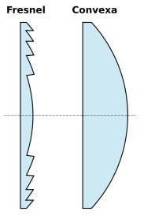
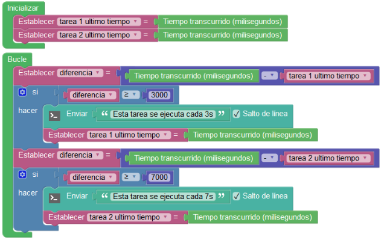
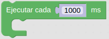
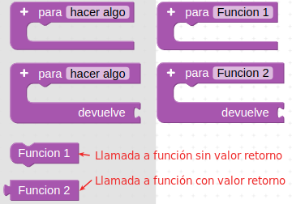
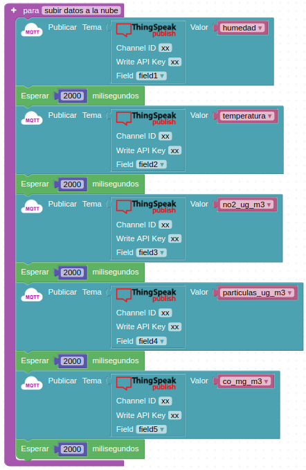

# Sensor de movimiento PIR

## **Conceptos incluidos**

<b>

* Bloques de tiempo
* Funciones

</b>

## **PIR**
Los detectores PIR (del ingés Passive Infrared), se caracterizan por su reducido tamaño, bajo costo, no ser influenciados por la luz natural, tener un bajo consumo de energía y ser de muy fácil manejo. Reaccionan sólo ante determinadas fuentes de energía tales como la generada por el calor del cuerpo humano o de los animales. Basan su funcionamiento en que todos los cuerpos (especialmente los vivos) emiten una cierta cantidad de energía infrarroja, mayor cuanto mayor es su temperatura que la capta un sensor piro eléctrico y la convierte en una señal eléctrica.

Los detectores PIR son dispositivos que detectan variaciones de la radiación infrarroja en su área de cobertura, por lo que son especialmente útiles para detectar la presencia de personas o animales a través del calor que emiten sus cuerpos.

Aunque en el enunciado del apartado pone "Sensor de movimiento PIR", el concepto PIR es solamente uno de los métodos posibles de detección de movimiento, pero es el que nos ocupa y en proyectos con placas tipo Arduino es muy común asociar ambos conceptos.

Los sensores PIR son mas complicados de explicar que la mayoría de sensores (fotocélulas, sensores de golpe, etc) porque hay muchas variables que afectan a la entrada y salida del sensor. Para explicar de forma sencilla como trabaja el sensor nos vamos a basar en el diagrama de la figura siguiente:

*Explicación sensor PIR*

El sensor PIR en sí tiene dos ranuras, cada ranura está hecha de un material especial que es sensible a los infrarrojos. La lente utilizada aquí realmente no está haciendo mucho, por lo que vemos que las dos ranuras pueden 'ver' más allá de cierta distancia (básicamente, la sensibilidad del sensor).

Cuando el sensor está inactivo, ambas ranuras detectan la misma cantidad de infrarrojos, la cantidad ambiental radiada desde la habitación, las paredes o el exterior. Cuando pasa un cuerpo caliente como por ejemplo una persona o un animal, primero intercepta la mitad del sensor PIR, lo que provoca un cambio diferencial positivo entre las dos mitades. Cuando el cuerpo caliente sale del área de detección, ocurre lo contrario, por lo que el sensor genera un cambio diferencial negativo. Estos pulsos de cambio son lo que se detectan.

El sensor IR en sí está dentro de una caja metálica sellada herméticamente para mejorar la inmunidad al ruido/temperatura/humedad. Esta caja dispone de una ventana hecha de material transmisor de infrarrojos (típicamente silicona recubierta) que protege el elemento sensor con los dos sensores equilibrados.

La mayor parte de la verdadera magia ocurre con la óptica, una lente de Fresnel que permite cambiar la amplitud, el rango y el patrón de detección muy fácilmente. Según la [Wikipedia](https://es.wikipedia.org/wiki/Lente_de_Fresnel) es un diseño que permite construir lentes de gran apertura y distancia focal corta con materiales ligeros y económicos. En la figura siguiente vemos un corte transversal de una lente de Fresnel comparada con una plano-convexa tradicional.

*Lentes de Fresnel y convexa*

En la figura siguiente vemos gráficamente el funcionamiento del sistema y como la lente Fresnel condensa la radiación infrarroja al sensor.

*Funcionamiento de una lente Fresnel*

Explicación del funcionamiento basada en en el documento de [Adafruit](https://www.adafruit.com/) titulado [PIR Motion Sensor - Created by lady ada](https://cdn-learn.adafruit.com/downloads/pdf/pir-passive-infrared-proximity-motion-sensor.pdf)

En la figura siguiente vemos la ventana del sensor PIR en el módulo que incorpora la autocaravana al que se le ha retirado la lente.

*Ventana del sensor PIR en el módulo de Keyestudio*

Las características del módulo de keyestudio son:

* Tensión de alimentación: de 3.3 a 5V DC
* Consumo 15 uA
* Temperatura de trabajo: de -20 a 85 ºC
* Salidas: 3V = nivel alto y 0V = nivel bajo
* Tiempo de retardo en la salida para el nivel alto: 2.3 a 3 segundos
* Ángulo de detección: 100º
* Distancia de detección: 3 a 4 metros
* LED indicador: Si la salida está en nivel alto el LED se enciende.
* Corriente límite por el pin de señal: 100 mA

Algunas aclaraciones que nos hace el fabricante:

1. La distancia máxima es de 3-4 metros.
2. Antes de probar la primera vez quitamos la lente blanca, se puede ver la ventana de detección rectangular. Cuando el lado mayor del rectángulo es paralelo al suelo, la distancia de detección es la mejor.
3. Para comenzar a probar el sensor debe cubrirse con la lente blanca; de lo contrario, afectará a la distancia.
4. La distancia de detección óptima se da a 25 ℃ y se acorta cuando supera los 30 ℃.
5. Cuando carguemos nuestro código debemos esperar de 5 a 10 segundos para que el módulo sea sensible y luego comenzar a probar.

## Bloques de tiempo
Aunque ya los hemos utilizado en este momento vamos a explicar los bloques de tiempo que se implementan en ArduinoBlocks. Las funciones de tiempo o retardo nos permiten realizar pausas y obtener información sobre el tiempo transcurrido dentro del microcontrolador.

**1.- Bloques esperar**. Realizan una pausa del tiempo que establezcamos hasta seguir con la ejecución del siguiente bloque. Se corresponden con las instrucciones *delay(1000)* y *delayMicroseconds(1000)*. Tenemos disponibles los dos de la imagen siguiente:

*Bloques esperar*

Debemos tener siempre muy presente que estos bloques detienen la ejecución del programa y dejan al microcontrolador bloqueado haciéndole pensar que está haciendo algo útil, cuando en realidad no es así porque durante el tiempo que dura el bloqueo ni se envían ni se reciben órdenes. Por esto hay que tener cuidado al utilizarlo aunque nos resulte muy fácil y cómodo. Ya hemos visto alternativas como la multitarea, donde si los utilizamos, el sistema multitarea querrá asignarle tiempo de procesamiento a la tarea, aunque sea para eso, ¡para no hacer nada!

**2.- Tiempo transcurrido**. Obtiene un valor con el tiempo transcurrido desde el inicio o reset del microcontrolador de la placa. Se trata de las funciones millis() y micros(). El valor puede ser en milisegundos o microsegundos, tal y como vemos en la imagen siguiente:

*Bloques tiempo transcurrido*

En la imagen siguiente tenemos un ejemplo de uso sacado del [manual del programa](https://docs.google.com/document/u/1/d/e/2PACX-1vQSrOKHpbLQHVbGFdAvp7DcndoftoHDI20nvwGMaxu_7bGc1bUCmi4U6DZrJWRSudc2iXBg43QMuzCT/pub): Ejecutar la Tarea1 cada 3 segundos y la Tarea2 cada 7 segundos ** sin bloquear la ejecución del programa **:

*Ejemplo de uso del bloque tiempo transcurrido*

**3.- Esperar por siempre**. Bloquea indefinidamente la ejecución finalizando por tanto el programa. Vemos el bloque en la imagen siguiente:

*Bloque esperar por siempre*

**4.- Ejecutar cada**. Es un bloque que **NO** bloquea la ejecución del programa y que implementa automáticamente la función millis(). En la imagen siguiente vemos su aspecto:

*Bloque ejecutar cada*

Este bloque es equivalente a establecer la variable diferencia a 1000ms en el ejemplo visto sobre *tiempo transcurrido*. Cuando necesitemos realizar distintas tareas periódicas y que parezca que se ejecuten paralelamente sin bloquearse unas a otras utilizaremos este tipo de bloque “ejecutar cada”.

El tiempo que pongamos en cada tarea 'Ejecutar cada' determina la precisión de la ejecución de tareas, de forma que si una tarea 'tarda' mucho bloqueará y 'retrasará' al resto. Para un funcionamiento correcto debemos aseguarnos de que: 

* Cada tarea se ejecuta en el menor tiempo posible
* No usar **nunca** bloques de tipo esperar dentro de las tareas.
* No implmentar bucles que puedan quedarse en ejecución por tiempo indefinido.

En la figura siguiente vemos dos ejemplos comentados de lo que no debemos hacer.

*Dos errores comunes en el uso del bloque ejecutar cada*

Hay dispositivos, y por tanto bloques, que no admiten utilizar las esperas siendo obligado evitar los bloques 'esperar'. A continuación vemos cuales son estos bloques ***incompatibles*** con bloqueos de tiempo en ArduinoBlocks.

* **Bloques GPS**. Estos necesitan leer periódicamente los datos desde el módulo para obtener la información actualizada. Si utilizamos bloqueos en nuestro programa los datos GPS no serán válidos.
* **Bloques MQTT**. Estos gestionan la comunicación a través de la red Ethernet (TCP/IP) de forma continua en segundo plano, si bloqueamos la ejecución del programa no se realizará correctamente la comunicación.

Por lo tanto en estos casos hay seguir siempre un método de programación por tareas utilizando bloques del tipo “ejecutar cada”.

**5.- Cronómetro**. Es un bloque que permite obtener el tiempo transcurrido en milisegundos o en segundos a partir de la función millis(), y es fácilmente puesto a 0 con el bloque reiniciar cronometro. En la figura siguiente vemos los dos bloques mencionados.

*Bloques para utilizar el cronómetro*

**6.- Dormir**. Este bloque nos permite poner la placa de control tipo Arduino en modo bajo consumo durante unos milisegundos. Se trata de poner en modo sleep o hibernación para reducir el consumo al mínimo mientras no estamos haciendo nada. En el caso de ArduinoBlocks se utiliza la librería snooze.

## Funciones
Una función permite crear un grupo de bloques de código que realizan una determinada tarea y que se repite a lo largo del programa principal en varias ocasiones. Con la creación de una función evitamos repetir todos esos bloques y simplemente tendremos que invocar a la función. Es muy conveniente que los nombre que usemos sean lo mas descriptivos posibles de lo que hace la función. Existen dos tipos de funciones: las que no retornan un valor y las que si lo hacen. En la imagen siguiente vemos los bloques correspondientes a las mismas:

*Bloques para crear funciones en ArduinoBlocks*

Cuando creamos funciones automáticamente se crea el bloque con su nombre que permite invocarla, tal y como vemos en la imagen siguiente:

*Bloques para llamada a funciones*

También es posible crear funciones a las que se le envían datos o parámetros haciendo uso del signo + que aparece en los bloques. En la imagen siguiente vemos como le hemos añadido un par de parámetros a cada tipo de función y como se han modificado sus respectivos bloques de invocación.

*Bloques para llamada a funciones con parámetros*

Un ejemplo típico descriptivo del funcionamiento de las funciones es el de calculo del área de un triángulo. Para ello definimos la función que realiza el cálculo, le pasamos dos parámetros, la base y la altura, realizamos los cálculos pitagóricos y nos devuelve el área del triángulo para esos datos. En la imagen siguiente tenemos la idea de resolución con la función creada y el bloque para llamarla.

*Ejemplo de calculo del área de un triángulo*

En las imágenes siguiente vemos como se han creado diferentes funciones y la forma de llamarlas. En concreto se corresponden con la base del programa de [Educacont](http://educacont.org/) para configurar y grabar en la correspondiente estación. La primera función es "leer sensores" y la vemos en la imagen siguiente:

*Función leer sensores de Educacont*

En la imagen siguiente podemos ver la función encargada de subir los datos leídos a la nube.

*Función subir datos a la nube de Educacont*

La siguiente función permite detener las mediciones durante 15 minutos.

*Función detener medición nn minutos de Educacont*

El bucle principal tiene la configuración que vemos en la imagen siguiente:

*Llamada a las funciones definidas*

