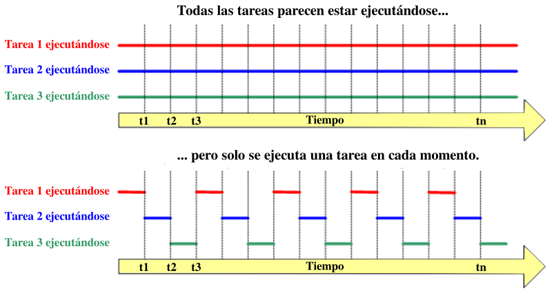

# El diodo LED RGB

## **Conceptos incluidos**

<b>

* Multitarea
* Números aleatorio

</b>

## **LED RGB**
Un LED RGB es en realidad un encapsulado que incorpora tres diodos LED, uno por cada color fundamental. Los colores primarios en óptica son el rojo, el verde y el azul y la correcta combinación, en términos de intensidad, de ellos originará cualquiera de los colores secundarios. Las siglas RGB son el acrónimo de Red, Green y Blue. En el caso de la autocaravana, a modo de faros, se utilizan dos LEDs RGB de 10mm de diámetro con los tres LEDs unidos por su cátodo o terminal negativo, es decir son de cátodo común. En la imagen siguiente vemos el modelo aditivo de los colores rojo, verde y azul.

*RGB*

Existen dos tipos de LEDs RGB según como se conectan internamente y pueden ser de cátodo común o de ánodo común. El símbolo y la representación de este componente lo vemos en la imagen siguiente, correspondiendo la pareja de la izquierda a los de cátodo común y la pareja de la derecha a los de ánodo común:

*Símbolo y representación*

Los que se utilizan en la autocaravana son de ánodo común.

Teóricamente en Arduino, cada uno de esos LEDs podría adoptar 256 (valores entre 0 y 255) colores diferentes, es decir, un total de 16.777.216 posibles colores diferentes con un LED RGB.

## **Multitarea**
Este apartado se extrae de ArduinoBlocks - FreeBook disponible en [Free Book (online & updated)](https://docs.google.com/document/u/1/d/e/2PACX-1vQSrOKHpbLQHVbGFdAvp7DcndoftoHDI20nvwGMaxu_7bGc1bUCmi4U6DZrJWRSudc2iXBg43QMuzCT/pub).

ArduinoBlocks nos permite utilizar una capa para implementar un sistema multitarea avanzado basado en FreeRTOS (del inglés Real Time Operating System), que es un sistema operativo de tiempo real kernel para dispositivos embebidos para plataformas de microcontrolador que se distribuye bajo licencia MIT. Este sistema permite crear tareas que se ejecutarán de forma paralela (virtualmente). En microcontroladores modestos como el Arduino UNO, Nano o incluso MEGA la multitarea con FreeRTOS es bastante limitada y consume gran parte de los recursos de nuestro Arduino, en caso de necesitar de un sistema multitarea más potente podemos optar por usarlo en placas basadas en ESP8266 o ESP32 con mucha más potencia y recursos (especialmente el ESP32 con doble núcleo y gran potencia de procesamiento y memoria interna)

*Los sistemas software de multitarea utilizan un planificador o scheduler que se encarga de repartir el tiempo de procesamiento entre las distintas tareas, de forma que a cada una le toca un tiempo de microcontrolador para ejecutar un poquito de su parte de programa.*

En las web de [freeRTOS](https://www.freertos.org/implementation/a00002.html), en su entrada de menú Kernel podemos encontrar los conceptos básicos de multitarea y de programación que vamos a extractar seguidamente.

### Conceptos básicos de multitarea
Un procesador convencional como el de Arduino UNO solo puede ejecutar una tarea a la vez, pero al cambiar rápidamente entre tareas, un sistema operativo multitarea puede hacer que parezca que cada tarea se ejecuta simultáneamente. Esto es lo que se representa en el diagrama de la Figura siguiente que muestra el patrón de ejecución de tres tareas con respecto al tiempo. Los nombres de las tareas están codificados por colores y escritos a la izquierda. El tiempo se mueve de izquierda a derecha y las líneas de colores muestran qué tarea se está ejecutando en un momento determinado. El diagrama superior demuestra el patrón de ejecución concurrente percibido, y el inferior el patrón de ejecución multitarea real.

*Patrón de ejecución de tres tareas con respecto al tiempo*

### Programación
El programador es quien debe decidir qué tarea debe ejecutarse en un momento determinado. El kernel o núcleo puede suspender y luego reanudar una tarea muchas veces durante el tiempo de vida de la tarea.

Además de ser suspendida involuntariamente por el núcleo o kernel, una tarea puede optar por suspenderse a sí misma. Hará esto si desea retrasar (**dormir**) por un período fijo o esperar (**bloquear**) a que un recurso (por ejemplo, un puerto serie) esté disponible, o que ocurra un evento (por ejemplo, presionar una pulsador). Una tarea bloqueada o inactiva no se puede ejecutar y no se le asignará ningún tiempo de procesamiento.

En la Figura siguiente vemos un posible diagrama de ejecución de tres tareas analizado punto por punto en distintos instantes de tiempo. En los círculos se representan los instantes de tiempo t1 a t10.

*Diagrama de ejecución de tres tareas en el tiempo*

* **t1:** la tarea 1  se está ejecutando.
* **t2:** en el kernel se suspende, o mejor dicho se intercambia, la tarea 1 .
* **t3:** se reanuda la tarea 2.
* **t4:** mientras se ejecuta la tarea 2 el procesador bloquea el puerto serie para su acceso exclusivo.
* **t5:** el kernel suspende la tarea 2.
* **t6:** el kernel reanuda la tarea 3.
* **t1:** la tarea 3 intenta acceder al puerto serie y lo encuentra bloqueado por lo que no puede continuar y se suspende.
* **t8:** el kernel reanuda la tarea 1 .
* **t9:** al ejecutarse de nuevo la tarea 2 se desbloquea el puerto serie.
* **t10:** la tarea 3 ahora si puede acceder al puerto serie y se ejecuta al completo

### Planificadores
Los planificadores de multitarea permiten asignar a cada tarea una prioridad, para así darle preferencia a las tareas más críticas o que necesitan más tiempo de procesamiento. Si creamos muchas tareas con “alta” prioridad puede que afectemos a las demás dejando poco tiempo de procesamiento para ellas. En la Figura siguiente vemos un esquema de varias tareas con distintas prioridades, variando así su tiempo de microprocesador asignado.

*Distintas prioridades en tres tareas*

Cada tarea tiene su propio espacio de memoria, por lo que crear demasiadas tareas también puede dejarnos el procesador sin memoria. Si la memoria asignada a las tareas tampoco es suficiente para almacenar los datos se podría reiniciar de forma inesperada el Arduino, o funcionar incorrectamente, es decir que como siempre, hay que ser consciente de los limitados recursos de los que disponemos.

### Semáforos
Con la introducción teórica a la multitarea vista, debemos hacernos otra pregunta: ¿Qué pasa si una tarea accede a un recurso o variable, y el sistema multitarea le da el control a otra tarea y por tanto ese proceso falla o quizás otra tarea acceda al mismo recurso y se solapen?

Para ese problema de convivencia entre tareas se inventaron los “semáforos”, en concreto el que más nos interesa es el semáforo “mutex” o de exclusión mutua, que permite que bloqueemos el sistema multitarea, hagamos lo que tengamos que hacer crítico, y luego liberemos el control. Por supuesto estas tareas críticas deben ser lo más cortas y atómicas posibles: una escritura crítica en una variable, un envío de un dato, una actualización de una pantalla LCD,... siempre cosas simples. Los semáforos debemos usarlos en casos que tengamos claro que se pueden crear conflictos, pues su abuso puede hacer que el sistema multitarea empiece a fallar.

En la Figura siguiente vemos el esquema de acceso a un recurso desde dos tareas diferentes.

*Esquema de acceso a un mismo recurso por parte de 2 tareas diferentes*

### Bloques esperar
¿Qué pasa con los bloques tipo “esperar” que estaban tan prohibidos en la programación de Arduino cuando queríamos simular una multitarea antes de tener estos bloques? Pues seguimos teniéndoles bastante tirria. Aunque en teoría podríamos usarlos, un bloque esperar hace pensar al microcontrolador que está haciendo algo útil, cuando en realidad no es así, por lo que el sistema multitarea querrá asignarle tiempo de procesamiento a la tarea, aunque sea para eso, ¡para no hacer nada!

Tenemos una solución, tenemos un nuevo bloque de esperar “task friendly” que en lugar de esperar sin hacer nada le dice al sistema: ¡voy a estar un rato sin hacer nada, permite ejecutar otras tareas mientras y luego vuelves!  ….Mucho más “friendly”, claro que sí.

### Bloques
Con toda esta información pasamos a ver los bloques disponibles para poner todo ésto en marcha.

| Bloque | Descripción |
|:-:|---|
|  |Permite crear una nueva tarea con su bloque de “inicializar” y su “bucle” al igual que la tarea original de Arduino.   Debemos asignar una prioridad a cada tarea, por defecto dejaría todas a “baja” y luego iría ajustando si hace falta.    Para gestionar mejor las prioridades, es recomendable en algunos casos no utilizar el “inicializar” y “bucle” propio de Arduino que suele tener preferencia sobre todas estas tareas y es más difícil de equilibrar las prioridades.  |
|  | El bloque esperar óptimo para tareas, pues deja funcionar al resto de tareas de forma más óptima mientras se espera en ésta.  Este bloque tiene menos precisión que el bloque “esperar” original, si necesitamos hacer esperas muy precisas (o de menos de 20 ms) debemos usar el “esperar” tradicional. Pero nos servirá en la mayoría de casos.  |
|  |Si tenemos que hacer alguna acción crítica que no queremos que sea interrumpida internamente por el planificador del sistema multitarea podemos poner este bloque y dentro los bloques críticos. (no utilizar si no es estrictamente necesario) |
|  |Cada tarea tiene su propio espacio de memoria reservado, esta es la cantidad por defecto para las tareas (192 bytes), si necesitamos ajustarla podemos utilizar este bloque en el “inicializar” principal y se ajustará para todas las tareas.  Un mal ajuste puede provocar reinicios del microcontrolador o mal funcionamiento. |
|  |Las tareas en principio, igual que el bucle de Arduino, están pensadas para ejecutarse de forma indefinida, si en un caso una tarea deja de ser necesaria la forma de terminarla es con este bloque que parará la ejecución y liberará la memoria de la tarea en la que se ejecuta.|

## **Números aleatorios**
En ArduinoBlocks existe un bloque en el menú 'Matemáticas' que es capaz de generar números enteros aleatorios entre los valores que establezcamos en sus parámetros. Este bloque es el que vemos en la figura siguiente:

*Bloque número aleatorio*

Este bloque se basa en la función *random(m, M)* que devuelve un numero seudoaleatorio entre el mínimo 'm' y el máximo 'M'. Esta función por si sola genera siempre la misma secuencia de números si los parámetros no se cambian. Para solucionar esto se implementa la función "semilla" como *randomSeed(semilla)* que lo que hace es iniciar la función 'random' con el parámetro 'semilla' que debe estar incluida en la función inicializar o 'Setup'. Pero si el valor de 'semilla' no cambia ocurre exactamente lo mismo que con 'random'. La solución que se adopta es asignarle a 'semilla' el valor de una entrada analógica no utilizada, dado que un pin analógico no utilizado no tiene ninguna tensión de referencia y devolverá un valor de ruido que será diferente cada vez que se lea. Aunque no es propósito de estas notas explicar código C++ si se entiende necesario al menos hacer referencia a la forma en que se generan números aleatorio en Arduino y por extensión n ArduinoBlocks. En la figura siguiente vemos el código asociado al programa de generación de un número aleatorio que guardamos en la variable 'a'.

*Código para generar un número aleatorio*

