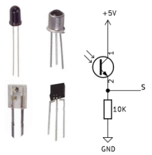
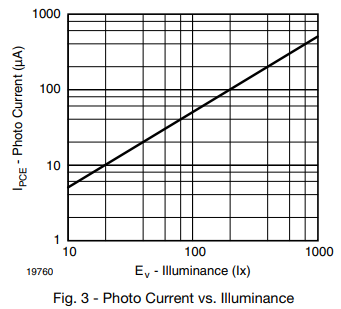

# El sensor de luz ambiental TEMT6000

## **Conceptos incluidos**

<b>

* Detección de luz con fototransistor

</b>

## **Detección de luz con fototransistor**
El TEMT6000 es un fototransistor de tipo NPN que presenta sensibilidad al espectro visible (390 a 700 nm). Un fototransistor no es mas que un transistor cuya base se expone a la luz a través de una lente cambiando su corriente de base en función de esta luz. En la figura siguiente vemos el aspecto de un fototransistor estándar y el esquema de conexión que se utiliza en el sensor TEMT6000.

*Encapsulados típicos y circuito de aplicación*

El fototransistor actúa como una de las dos resistencias en el divisor de tensión. A medida que la luz incide sobre la superficie del fototransistor, el valor de su resistencia cambia, lo que hace cambiar la tensión en el pin 'S'. A partir de esto se puede utilizar un Arduino o cualquier otro microcontrolador para leer el valor y así medir la iluminancia y la intensidad de la luz.

## **Sensor TEMT6000**
Se trata de un sensor analógico uya salida puede conectarse a cualquier entrada analógica de una placa de control. El sensor luz ambiental TEMT6000 es sensible al espectro visible y se supone que está adaptado a la sensibilidad del ojo humano. El módulo puede ser utilizado cuando se requiere mas precisión que la que ofrece la LDR sin añadir complejidad. No reacciona bien a la luz infrarroja ni ultravioleta.En la figura siguiente vemos su aspecto.

*Aspecto del sensor*

Ya sabemos que muchos dispositivos utilizan sensores de luz para ajustar automáticamente el brillo según la intensidad de la luz. Entre estos dispositivos se incluyen pantallas de teléfonos móviles y cámaras digitales para ajustar la exposición. También estamos acostumbrados a que las luces de nuestras ciudades se enciendan y apaguen automáticamente en función del nivel de luz y ello gracias a este tipo de sensores.

El sensor de luz ambiental TEMT6000 mide la iluminancia, que es una medida de la cantidad total de luz visible emitida por una fuente.

¿Por qué el TEMT6000 solo mide la iluminancia? La respuesta es que medir la intensidad de la luz sin tener en cuenta la distancia es muy difícil. Por ejemplo, si tiene una fuente brillante lejos y una fuente tenue muy cerca, puede parecer que tienen el mismo brillo. Esto se debe a que la luz de la fuente más brillante tendrá que disiparse en un volumen mayor en comparación con la luz menos brillante. Esta es la razón por la cual el sensor leerá un valor más pequeño si aleja la misma fuente de luz, lo que esencialmente aumenta la cantidad de espacio que la misma cantidad de luz tiene que llenar entre la fuente y el sensor. En la figura siguiente tenemos una relación gráfica entre la corriente (en µA) y la iluminancia percibida por el sensor del entorno cercano:

*Corriente de base en función de la iluminancia*

La curva se ha sacado del [datasheet del sensor](https://www.vishay.com/docs/81579/temt6000.pdf).
