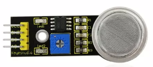
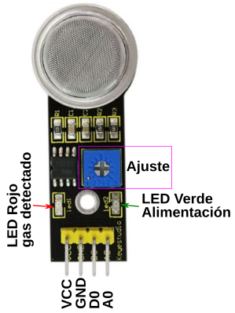
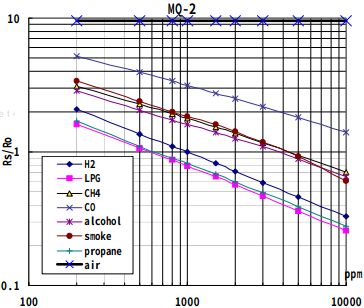
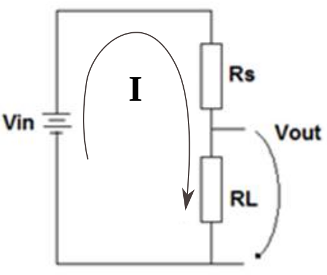

# El sensor de gases MQ-2

## **Sensores MQ**
Toda la serie MQ son sensores electroquímicos y varían su resistencia cuando se exponen a determinados gases, internamente poseen un calentador (es normal que los toquemos y notemos el calor) encargado de aumentar la temperatura interna y con esto el sensor pueda reaccionar con los gases provocando un cambio en el valor de la resistencia. En la figura siguiente tenemos diagramas básicos de como están constituidos estos sensores.

*Diagramas sensores MQ*

El material sensible es el dióxido de estaño (SnO2) que tiene menor conductividad cuando el aire está limpio y aumenta esta cuando detecta un aumento de la concentración de gases.

Los sensores MQ requieren esperar un tiempo de calentamiento para que la salida sea estable y tenga las características que el fabricante muestra en sus datasheet, dicho tiempo, dependiendo del modelo, puede variar entre 12 y 48 horas. En concreto en el [datasheet del MQ-2](../datasheet/MQ2.pdf) podemos ver que para este sensor se requieren alrededor de 24 horas.

En la tabla siguiente se relaciona la serie de sensores MQ junto con su gas objetivo o principal.

| Modelo | Gas |
|:-:|---|
|MQ-2|Gas combustible en general|
|MQ-3|Alcohol|
|MQ-4|Gas natural y metano|
|MQ-5|GLP, gas natural y gas de hulla|
|MQ-6|GLP y propano|
|MQ-7|Monóxido de carbono|La terjeta del sensor cuenta con dos salidas de datos, una digital (DO)y otra analogica (AO). La salida digital manda una señal en estado alto cuando el sensor llega a un nivel deseado, el cual puede ser ajustado por medio del potenciometro. La salida analogica va aumentado el valor del voltaje en  proporcion al nivel de gas que se detecta.
|MQ-8|Hidrógeno|
|MQ-9|CO y gas combustible|
|MQ131|Ozono| 
|MQ135|Control de calidad del aire|datasheet/MQ2.pdf)
|MQ136|hidrógeno sulfurado - H2S|
|MQ137|Amoníaco - NH3|
|MQ138|Compuestos volátiles orgánicos como benceno, acetona, éter, aldehído,etc|

## **Sensor MQ-2**
El sensor MQ-2 es adecuado para detectar hidrógeno, GLP, metano (CH4), Monóxido de carbono (CO), alcohol, humo y propano (C3H8). Presenta su mayor sensibilidad a los GLP y al propano. En la figura siguiente vemos su aspecto.

*Aspecto MQ-2*

El sensor dispone de 4 pines, que son:

* VCC: Alimentación positiva de 5V
* GND: Masa o 0V
* D0: Señal de salida digital del sensor. La salida digital manda una señal de estado alto cuando el sensor alcanza un nivel establecido, el cual puede ser ajustado por medio del potenciómetro Cuando el valor de la salida supera el nivel establecido se ilumina el LED rojo que incorpora la placa y que vemos en la figura siguiente:

*Partes del sensor MQ-2*

* A0: Salida analógica del sensor. La salida analógica va aumentado el valor del voltaje en proporción al nivel de gas que se detecta.

En la figura siguiente (extraida del [datasheet del MQ-2](../datasheet/MQ2.pdf)) vemos la característica de sensibilidad del sensor, donde se observa en escalas logarítmicas la variación de la sensibilidad Rs/Ro en función de la concentración de los gases a sensar. Dada la cantidad de gases que detecta el MQ-2 su selectividad es pequeña, ya que el mismo valor de la relación Rs/Ro puede corresponder a diferentes gases, sin poder determinar a cual de ellos se debe el resultado.

*Curva característica de sensibilidad del MQ-2*

La curva de sensibilidad presenta el valor de Rs/Ro medido para:

* aire limpio
* Temperatura: 20 ºC
* Humedad: 65%
* Concentración de oxígeno: 21%
* RL = 5K
* R0 es la resistencia del sensor en aire limpio con 1000 ppm de H2
* Rs es la resistencia del sensor a varias concentraciones de gases

Antes de proceder a medir gases con el sensor este debe ser calibrado para obtener el valor de R0. En concreto y siguiendo el artículo [Simultaneous measurement of gases with MQ sensors](http://scielo.sld.cu/scielo.php?script=sci_arttext&pid=S1815-59282020000100034) se indica que utilizando  como gas de referencia el monóxido de carbono (CO) en aire limpio, a la temperatura de 24 ºC, cuyos valores típicos entre 30 a 50 ppm. El valor obtenido de R0 para CO es válido para el resto de los gases. En este caso, utilizando una resistencia de carga RL = 5 kΩ en el divisor de voltaje de la figura siguiente:

*Divisor de tensión de la interfaz electrónica*

Podemos escribir que:

$Vout = R_{L}\cdot\frac{Vin}{R_{s} + R{L}} \Rightarrow R_{s} = R_{L}\cdot\frac{Vin - Vout}{Vout}$

Con lo que para un determinado valor de RL podemos averiguar la relación Rs/R0 que buscamos.

# El sensor de gases MQ-2