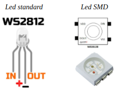
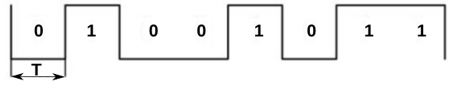
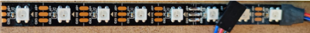
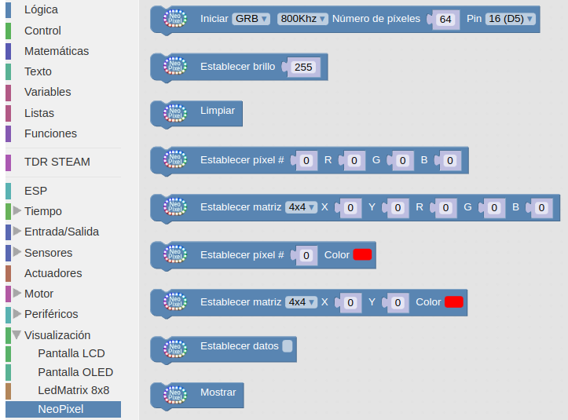
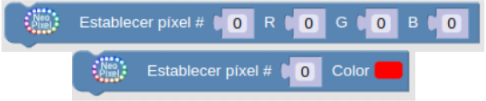
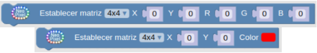
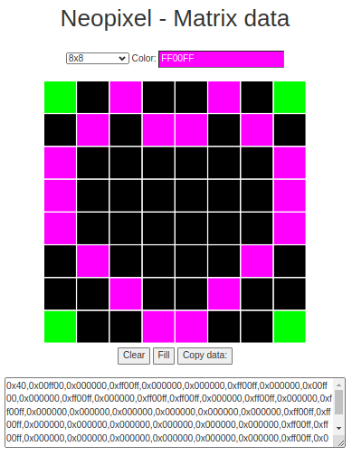
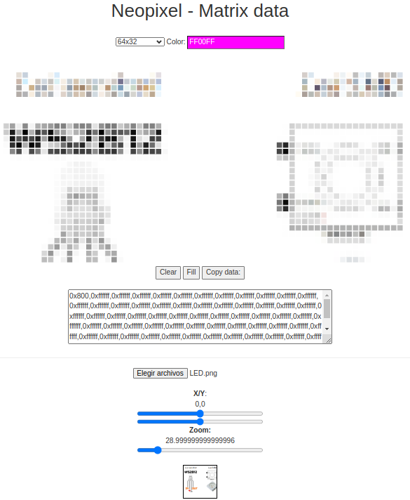

# LEDs RGB direccionables
Comunmente se les conoce como Neopixel, que es una marca registrada por [Adafruit Industries](https://www.adafruit.com/). Cada LED que componen la tira o matriz tiene los siguientes cuatro pines:

* Alimentación VDD: 5V
* Tierra: GND
* DI (Date Input): pin para recibir información
* DO (Date Output): pin para enviar inforamción

Cada uno de los LEDs es direccionable de manera individual gracias al circuito electrónico que incluyen que, con una memoria de un byte por color, que es un circuito lógico. Los tipos mas comunes son el SK6812, WS2811 o, el mas habitual de todos, el WS2812 cuyo [datasheet](./Datasheet/WS2812B.pdf) tenemos en el enlace.

El WS2812B incluye un oscilador interno de precisión y un circuito de control de corriente constante programable de 12 V, lo que garantiza de manera efectiva qimgue la intensidad del color sea consistente. El protocolo de transferencia de datos utiliza un único modo de comunicación de multiplexado NZR.

En la figura siguiente vemos el aspecto de un diodo LED RGB individual en formato inserción y SMD.
img

*Aspecto de un diodo LED RGB*

## **Aspectos previos**
Para transmitir información digital esta se debe sincronizar mediante una convención especial, la codificación. Dos dispositivos llevan una comunicación por cable convirtiendo la información a transmitir en un flujo de bits (0 y 1) o "Dates" que se suele nombrar con la letra D y que va acompañada de una señal de reloj para sincronizar las transmisiones. La forma convencional de transmisión digital se componen de una línea de datos mas una línea de reloj. Ahora bien, cualquier ligera desviación en la longitud de estas líneas hará que eimgl receptor no cumpla con el tiempo de establecimiento del muestreo de datos, originando errores en los datos. La forma de asegurar que esas líneas son idénticas es que sean la misma línea, lo que hace que aparezcan códigos que fusionan los datos y el reloj, entre los que están los código RZ, NRZ y NRZI que vamos a ver someramente a continuación.

* **Codificación RZ**. El acrónimo de de "Return Zero" o retorno cero y su característica es que se transmiten bits de datos dentro de cada periodo de la señal. En la figura siguiente los datos se representan en rojo y vemos que ocupan una parte del periodo T, siendo cero el resto del tiempo. Este sistema se denomina RZ unipolar o retorno a cero unipolar y como se observa en la figura un nivel bajo indica 0 y un nivel positivo indica 1.

*Código RZ unipolar*

El código de retorno a cero se divide en un código de retorno a cero unipolar y un código de retorno a cero bipolar en el que el nivel alto indica 1 y el nivel negativo o, tal y como vemos en la figura siguiente:

una
*Código RZ bipolar*

* **Codificación NRZ**. El acrónimo es de "Not Return Zero" o código sin retorno a cero y se diferencia del RZ en que no necesita retornar a cero. En la figura siguiente vemos gráficamente el código.img

*Código NRZ*

En el datasheet estos código se denominan T0H y T0L.

El funcionamiento de una agrupación en cascada como la de la figura siguiente se puede resumir diciendo que: el circuito integrado de cada LED puede almacenar 3 bytes (24 bits), un byte para cada color. Solo el primer LED está conectado al Pin de control, en este caso, un pin digital de nuestra placa, que enviará la cadena de todos los colores según el número de pixeles que estén conectados y a su vez el primer LED recibirá la información de todos los colores uno tras otro. La información se transmite de un LED a otro porque cuando un LED recibe 3 bytes nuevos de información entrega al siguiente LED los 3 bytes que contenía anteriormente, de esta manera cuando la placa con el programa termina de mandar todos los colores por el pin de datos el primer LED habría recibido y enviado todos los colores para quedarse finalmente con el color que le corresponde y así el resto de LEDs. De esta forma una tira de LEDs RGB direccionables es un dispositivo digital de salida, es decir su funcionamiento consiste en recibir la información del color a mostrar y mostrarlo.

*Conexión en cascada*
img

## **Aspectos técnicos**
Los LEDs RGB direccionables se suelen suministrar en tiras de diferentes longitudes y con distinto número de LEDs y a veces se dispone la tira en forma de matriz. En la figura siguiente vemos el aspecto de algunos tipos.

*Tira y matriz de LEDs RGB*una

Tienen 3 cables asociados a un conector y dos cables extra para añadir alimentación externa cuando es necesario porque la placa de control no entrega suficiente corriente para alimentar al conjunto. Cuando se trabaja con una tira de pocos LEDs no es necesario añadir esta alimentación externa, ya que placas como Arduino UNO o la ESP32 STEAMakers pueden suministrar la corriente que necesitan.

Para los ejemplos mas básicos vamos a utilizar tiras de 8 LEDs como la que vemos en la figura siguiente:

*Tira de ocho LEDs RGB*

Cualquier tira de LEDs RGB (sea cual sea su disposición en línea, como matriz, etc) debe utilizarse siempre en la dirección que marca el terminal hembra como entrada y el conector macho como salida. Las podemos ir conectando entre sí pero siempre respetando este sentido de la tira. Junto a cada led RGB está indicada la dirección de la tira mediante un triángulo y también a qué pin debe ir conectado cada cable. Vemos +5V que corresponde a Vcc, GND, y en medio que pone Din o D0 que corresponde al pin digital de entrada de datos que debemos conectar al pin de salida de la placa de control.

También las podemos cortar por cualquiera de las líneas existentes entre cada uno de los LEDs y que está marcado con la línea de corte. El corte debe hacerse dejando la mitad del pad de cobre a un lado y otro de la línea y así poder unir después entre ellas con conectores especializados o soldándolas.

*Dirección y línea de corte*

## **Bloques en ArduinoBlocks**
En la figura siguiente vemos el menú bloques disponible en 'Visualización' en su entrada 'NeoPixel'.

*Bloques LEDs RGB direccionables*

* **Iniciar**: Este bloque se debe definir dentro del bloque “inicializar” o “setup” para indicar la configuración los LEDs conectados. Tenemos que indicar los siguientes parámetros:
    - *Frecuencia*: 800Khz / 400Khz, es la velocidad del “bistream” con los datos que se envían a través del pin DIN con los datos para cada neopíxel. Una tasa de 400khz ya permitiría controlar más de 1000 leds con un refresco de 30fps.
    - *Número de píxeles*: indica el número de píxeles conectados en serie, si conectamos una tira de 100 LEDs lo indicaremos en este valor.
    - *Pin*: es el pin a través el cual la placa de control enviará y controlará los datos de los LEDs.

En el código que corresponde a este bloque se encierra la librería [Adafruit_NeoPixel](https://github.com/adafruit/Adafruit_NeoPixel) que tiene el formato siguiente:

***Adafruit_NeoPixel pixels(NUMPIXELS,PIN,NEO_GRB + NEO_KHZ800);***

donde:

  - El argumento NUMPIXELS es el número de pixeles de la tira.
  - El argumento PIN es el número de pin digital de la placa de control.
  - El argumento NEO_GRB + NEO_KHZ800 se refiere al indicador del tipo de pixel que seleccionamos según nuestra tira:
      - NEO_KHZ800. Flujo de bits de 800 KHz (la mayoría de los productos NeoPixel con LED WS2812)
      - NEO_KHZ400. Flujo de 400 KHz (clásica 'v1' (no v2) de pixeles FLORA y drivers WS2811
      - NEO_GRB. Los píxeles están cableados para un flujo de bits GRB (la mayoría de los productos NeoPixel)
      - NEO_RGB.  Los píxeles están cableados para un flujo de bits RGB (v1 FLORA, no v2)
      - NEO_RGBW. Los píxeles están cableados para un flujo de bits RGBW (productos neopixels RGBW)

* **Establecer brillo**: Valor entre 0 y 255 que establece con que potencia emiten luz los LEDs.

* **Limpiar**: Apaga todos los LEDs conectados en serie.

echo pulse - 100 to 25. Times out after 30 ms if no object detected

* **Establecer píxel**: Permite fijar un píxel (LED) en concreto de toda la serie a un color, indicando el número del mismo (el primero es el 0) y los valores R,G y B (0...255) o seleccionando el color.

* **Establecer matriz**: Funciona de forma similar al anterior, pero en caso de usar una matriz de LEDs podemos indicar el píxel a modificar mediante sus coordenadas X,Y y los valores R,G,B (0...255).

* **Establecer datos**: Permite rellenar una matriz de LEDs a partir de un “bitmap” de datos. Con el botón derecho nos dirigimos a la opción “Ayuda” para abrir el editor para obtener los datos del “bitmap”.

En la figura siguiente se observa como crear una imagen en una matriz de 8x8.

Y en la siguiente vemos una imagen de estas notas cargada para una matriz de 64x32.

* **Mostrar**: Actualizar los datos enviados a los LEDs. Cualquier operación no se reflejará hasta que se ejecute el bloque “mostrar”. Esto se realiza por una cuestión de optimización, así podemos realizar varias operaciones internamente y mostrarla a la vez en una sola operación.

