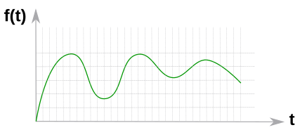
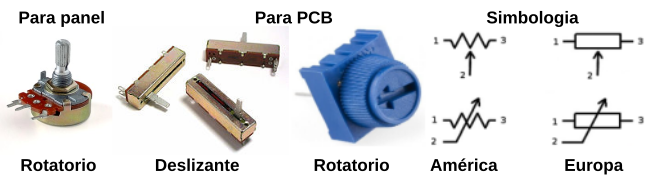

# El potenciómetro

## **Conceptos incluidos**

<b>

* Circuitos digitales y analógicos
* Serial Plotter - Datalogger
* Mapeo

</b>

## **Circuitos digitales y analógicos**
Una clasificación de los circuitos electrónicos es dividirlos en dos grandes categorías: digitales y analógicos.

* La electrónica digital utiliza magnitudes con dos valores discretos conocidos como 0 - 1, alto - bajo, on - off, etc, y que se corresponden con la presencia o no de tensión en un determinado punto. Estos valores discretos pueden sufrir pequeñas variaciones  en alguna variable del circuito pero, si no cambia el valor discreto no se produce ningún cambio en el comportamiento del circuito por lo que podemos decir que este no depende del valor exacto de la señal. En la figura siguiente vemos una señal digital típica.

*Señal digital*

* La electrónica analógica emplea magnitudes con valores continuos o variables continuas. Una pequeña variación en una variable puede producir un gran cambio en el comportamiento del circuito. En las placas tipo Arduino, ESP, etc esta terminología se utiliza para referirse a entradas y las placas suelen disponer de un número variable de entradas analógicas. Por ejemplo Arduino UNO y Mini disponen de 6 y Arduino mega de 16.

En el mundo real se puede afirmar que cualquier señal es analógica y un valor digital es una abstracción conceptual. En placas tipo Arduino la medición que realiza una entrada analógica en realidad se realiza a partir de un conversor analógico a digital de un determinado número de bits que definen la precisión de dicha conversión. Es decir, con una placa de este tipo no medimos valores analógicos con todos sus decimales, sino que obtenemos su conversión en $2^{n}$ niveles. Cuanto mayor sea el número de bits mayor será la precisión de la medición.

En concreto a continuación expresamos esta precisión para algunas placas:

* Tipo Arduino Uno, Mini y Mega. La resolución es de 10 bits por lo que el número de valores digitales posibles es: $2^{10} = 1024$. Para una tensión de 5V esto se traduce en que la precisión de la medida es de $5/1024 = 4.88mV = \pm2.44mV$
* Tipo Arduino Due y ESP32 Plus STEAMakers. La resolución es de 12 bits por lo que el número de valores digitales posibles es: $2^{12} = 4096$. Para una tensión de 5V esto se traduce en que la precisión de la medida es de $5/4096 = 1.22mV = \pm0.61mV$.

En la imagen siguiente vemos el aspecto de una señal analógica:

*Señal analógica*

## El potenciómetro
En la imagen siguiente vemos el aspecto de un modelo concreto de potenciómetro así como los símbolos habituales del mismo. La numeración indica lo siguiente:

* Terminales 1 y 3 son los contactos unidos a los extremos de la resistencia fija o resistencia total del potenciómetro.
* Terminal 2 es el contacto que va unido al cursor o parte móvil que se desliza sobre la resistencia fija haciendo que la resistencia entre un terminal y el cursor varíe en función de la posición de este.

*Aspecto y símbolo del potenciómetro*

La posición del cursor se determina de forma mecánica y son adecuados para usarlos como elementos de control de tensión (conexión en serie) o de corriente (conexión en paralelo). Los potenciómetros del tipo que estamos viendo (existen de otros muchos tipos) tienen un funcionamiento en forma de rotación con un ángulo de unos 270 grados entre los puntos mas extremos.

## Serial Plotter - Datalogger
Es otra funcionalidad relacionada con la comunicación serie que nos permite visualizar información en forma de gráfica en tiempo real. Además el “Serial Plotter” implementa un sencillo datalogger con el que podemos ir grabando los datos para exportarlos posteriormente. En ArduinoBlocks existen bloques que nos permiten trabajar con el serial plotter. El serial plotter + datalogger se activa haciendo clic en la flecha a la derecha de Consola y tiene el aspecto que vemos en la imagen siguiente:

*Serial Plotter + Datalogger*

La función de datalogger (registro de datos) la podemos activar desde el panel superior derecho y veremos un icono de tipo comecocos que va “comiendo” datos mientras estamos recopilando los datos para su posterior exportación. En la figura siguiente vemos su aspecto.

*Aspecto del Datalogger*

Cuando detenemos la grabación o recopilación de datos podremos descargar los archivo de datos en formato CSV (Comma Separated Values), generandose un archivo por cada serie de datos recogida, es decir, un archivo por cada variable que representemos en la gráfica.

Si superamos el número de datos máximo seleccionado para registrar, se sobreescribirán los datos más antiguos.

## Mapeo
Hemos indicado que las entradas analógicas trabajan con 10 o 12 bits, o sea valores comprendidos entre 0 y 1023 ($2^{10}$) 0 y 4095 ($2^{12}$) y también sabemos que las salidas digitales trabajan con 8 bits, o sea valores entre 0 y 255, por lo que si queremos combinar en nuestro programa entradas analógicas con salidas digitales debemos realizar un ajuste de escala en los datos. A este ajuste se le conoce como "mapear" y es un bloque disponible en el menú 'Matemáticas' con el aspecto de la imagen siguiente:

*Bloque mapear*

