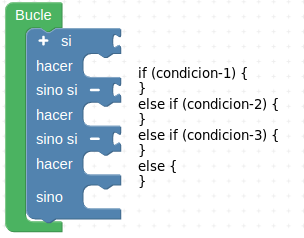

# Botón pulsador

## **Conceptos de programación incluidos**

<b>

* Sentencias condicionales

</b>

## **El pulsador**
En la tabla siguiente vemos la simbología y algunos ejemplos del aspecto físico de estos elementos.

*Símbolos y aspecto real de un pulsador*

Se trata de un dispositivo que es capaz de abrir o cerrar el paso de la corriente eléctrica mientras permanece accionado, es decir, su función no queda anclada como por ejemplo en los interruptores de la luz de casa, en donde el accionamiento permanece hasta que no se vuelve a accionar. En un pulsador, por contra, su activación dura mientras lo mantenemos pulsado y vuelve a su estado de reposo en cuanto dejemos de pulsarlo.

Mediante la configuración adecuada podemos convertir un pulsador en un elemento de entrada a algún pin de nuestra placa de control. Las configuraciones más básicas posibles con pulsadores las podemos ver en la imagen siguiente.

*Configuración circuito elemental con pulsador*

La aplicación de un pulsador para hacer algo requiere saber si este esta pulsado o no lo está y para ello vamos a necesitar de las sentencias condicionales.

## **Sentencias condicionales**
Las sentencias condicionales son aquellas que nos permiten tomar decisiones en función de si ocurre o no ocurre determinada cosa. En el caso de ArduinoBlocks estas las podemos encontrar en el bloque lógica. Este bloque contiene los elementos que vemos en la imagen siguiente:

*Bloques de lógica*

El funcionamiento es el siguiente: se evalúa la condición que ponemos en "si" y si el resultado es verdadero, o sea condición cierta, se realizan las acciones que pongamos en "hacer" y si no es cierta dichas acciones no se realizan. En el apartado condición se pueden poner infinidad de factores como pueden ser el estado de sensores, realizar comparaciones, hacer operaciones matemáticas, etc. Lógicamente el resultado de evaluar la condición debe ser verdadero o falso lo que se resuelve en el caso de la programación en Arduino diciendo que si el resultado es 0, el resultado de la evaluación es falso y si es 1 o cualquier otro valor es verdadero.

Si hemos sido observadores hemos visto en los bloques "si" de "Lógica" un signo mas (+) en la parte superior izquierda tanto del condicional "if" como la del "if ... else" tal y como se destaca en la imagen siguiente.

*Añadir opciones else if*

Cada vez que pulsemos sobre el signo mas se añadirá una cláusula "else if" a la principal y podemos añadir tantas como necesitemos. Esta cláusula nos va a permitir establecer una nueva condición.En la imagen siguiente vemos añadidas dos para el caso de "if ... else". En la imagen observamos el código equivalente y las distintas condiciones que se pueden establecer.

*Clausula if...else con dos else if*

El signo menos (-) que aparece en la imagen sirve para eliminar la correspondiente cláusula "else if".
