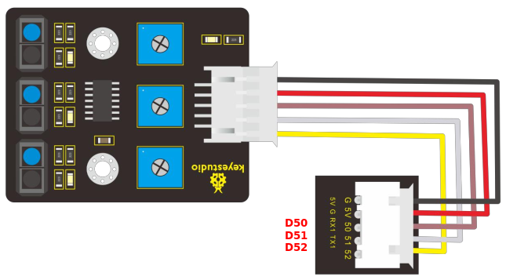

# Sensor seguidor de línea

## **¿que son los infrarrojos?**
Son una clase de radiación electromagnética con una longitud de onda que resulta superior a la longitud de onda de la luz visible, siendo su frecuencia superior a las microondas. Dentro del espectro electromagnético, la radiación infrarroja se encuentra comprendida entre el espectro de luz visible y las microondas. Tiene longitudes de onda mayores o más largas que el rojo. En la imagen siguiente, obtenida del blog de Mercedes González Mas vemos caracterizados los infrarrojos dentro del espectro.

*Espectro electromagnetico*

Como podemos observar en la imagen, los rayos infrarrojos son clasificados, de acuerdo a su longitud de onda, del siguiente modo:

* **infrarrojo cercano**, con longitud de onda entre 0.7 µm y 1.1 µm, es la parte del espectro infrarrojo que ese encuentra más próximo a la luz visible.
* **infrarrojo medio**, con longitud de onda entre 1,1 µm y 15 µm.
* **infrarrojo lejano** o región más cercana a las microondas, con longitud de onda entre 15 µm y 100 µm

En la imagen siguiente, obtenida de [wikipedia](https://es.wikipedia.org/wiki/Espectro_electromagn%C3%A9tico), sobre espectro electromagnético podemos ver más información del tema.

*Espectro electromagnetico*

Todos los cuerpos emiten una cierta cantidad de radiación, y aunque esta resulta invisible para el ojo humano, existen dispositivos electrónicos capaces de "verla" por estar diseñados para ello.

## **El sensor**
El sensor de seguimiento de línea está basado en el sensor de infrarrojos TCRT5000, que es un sensor óptico reflexivo con salida a transistor. En el [datasheet del TCRT5000](https://www.vishay.com/docs/83760/tcrt5000.pdf) se indica que está compuesto por un emisor de infrarrojos y un fototransistor empaquetados en un solo conjunto que bloquea la luz visible. En la figura siguiente vemos el aspecto del sensor TCRT5000.

*Aspecto y composición del TCRT5000*

El módulo más común basado en este sensor es el sensor infrarrojo seguidor de línea y obstáculos que monta un solo sensor junto a un comparador LM393 y un potenciómetro para ajustar la distancia de detección. El aspecto de este módulo lo vemos en la figura siguiente.

*Aspecto módulo seguimiento de línea de 1 canal*

El que nosotros vamos a utilizar en la autocaravana es un módulo de 3 canales como el de la figura siguiente:

*Aspecto módulo seguimiento de línea de 3 canales*

Su principio de funcionamiento es utilizar la reflectividad diferente de la luz infrarroja al color. Durante el proceso de detección, si se detecta negro está activo el nivel ALTO, y si se detecta el blanco está activo el nivel BAJO. La altura de detección va de 0 a 3 cm.

Cada potenciómetro permite ajustar la sensibilidad o distancia de detección del sensor que le corresponde.

Sus principales especificaciones son:

* Voltaje de funcionamiento: 3,3-5 V (CC)
* Interfaz: 5 pines
* Señal de salida: señal digital
* Altura de detección: 0-3 cm

Si por algún motivo necesitamos saber si los diodos IR de los sensores están emitiendo bastará con que los enfoquemos con la cámara de un móvil que hace que podamos apreciar la luz infrarroja que emiten.

Para regular la sensibilidad de cada sensor debemos actuar sobre su potenciómetro y debemos tener presente que el ajuste puede depender del nivel de iluminación que tengamos en ese momento y que los focos de mucha potencia o la luz fluorescente pueden influir. Junto a cada sensor TCRT5000 hay un LED rojo que se ilumina cuando el fondo es de color blanco y se apaga cuando el fondo es negro.

## **Fundamento del seguidor de línea**
Antes de entrar en el detalle de como debe comportarse el robot en función de lo que estén detectando los tres sensores TCRT5000 debemos tener claros los valores que envía cada uno de ellos. Para averiguarlo vamos a crear un programa con tres variables booleanas,una por sensor, y vamos a mostrar su estado en la consola serie.

En el conexionado de elementos se puede observar (figura siguiente) que el sensor izquierdo va conectado al pin 50, el central al 51 y el derecho al 52.

*Conexionado del módulo seguidor de línea*

Aplicando lo anterior podemos construir un programa como el de la figura siguiente:

*Comprobación conexionado sensores*

Lo que nos arroja el resultado que vemos en la figura siguiente:

*Conexionado sensores correcto*

Una vez que sabemos con seguridad cual es cada sensor vamos a aplicarlo para analizar el comportamiento de un robot seguidor de línea. Lo primero que debemos tener presente es el grosor de la línea negra o blanca, que para este sensor estará entre 2,5 y 3 cm de ancho que es suficiente para que los tres sensores detecten la línea. Nosotros vamos a analizar el caso de seguir una línea negra. Las situaciones posibles y la acción que debe realizar el robot lo tenemos en la tabla siguiente.

|Designación|Gráfico de situación| Acción a realizar|
|:-:|:-:|---|
|A||<b>Situación:</b> El robot está dentro de la línea       <b>Acción a tomar:</b> Avanzar recto |
|B||<b>Situación:</b> El robot se ha salido por la derecha con el sensor derecho       <b>Acción a tomar:</b> Efectuar giro a la izquierda hasta que el sensor derecho detecte la línea |
|C||<b>Situación:</b> El robot se ha salido por la derecha con el sensor central       <b>Acción a tomar:</b> Efectuar giro a la izquierda hasta que el sensor derecho detecte la línea. |
|D||<b>Situación:</b> El robot se ha salido por la izquierda con el sensor izquierdo       <b>Acción a tomar:</b> Efectuar giro a la derecha hasta que el sensor izquierdo detecte la línea |
|E||<b>Situación:</b> El robot se ha salido por la izquierda con el sensor central       <b>Acción a tomar:</b> Efectuar giro a la derecha hasta que el sensor izquierdo detecte la línea. |

Además existen otros dos casos mas extremos, cuando el robot saca el sensor siguelíneas totalmente de la línea, que son los que se reflejan en la figura siguiente:

*Sensor fuera de la línea*

## **Programación del seguidor de línea**

### Desde el IDE 2.0
Vamos a comenzar por la idea que nos presentan en el [manual en inglés del kit](https://wiki.keyestudio.com/KS0507_Keyestudio_Smart_RV_Kit#Project_20:_Install_Smart_Motorhome) que se encuentra en la wiki de keyestudio, concretamente en su proyecto número 21: Autocaravana sigue líneas (Project 21: Line Tracking Motorhome).

La propuesta se realiza a partir del siguiente diagrama de flujo:

*Diagrama de flujo de autocaravana sigue líneas*

A continuación tenemos el código del programa correspondiente al organigrama y lo tenemos disponible en el siguiente [enlace](../programas/autocaravana_siguelineas.zip).

~~~
//Sensor siguelineas
#define L_pin  50 // izquierdo
#define M_pin  51 // central
#define R_pin  52 // derecho

//define pines de motores A, B, C y D
const int MA1 = 35;
const int MA2 = 34;
const int PWMA = 12;

const int MB1 = 33;
const int MB2 = 32;
const int PWMB = 11;

const int MC1 = 29;
const int MC2 = 28;
const int PWMC = 9;
´
const int MD1 = 31;
const int MD2 = 30;
const int PWMD = 10;

volatile int speeds = 120;  //define la variable para establecer la velocidad
void setup() {
  pinMode(L_pin, INPUT); //configura como entradas los pines del sensor
  pinMode(M_pin, INPUT);
  pinMode(R_pin, INPUT);

  //configura como salidas los pines de los motores
  pinMode(MA1, OUTPUT);
  pinMode(MA2, OUTPUT);

  pinMode(MB1, OUTPUT);
  pinMode(MB2, OUTPUT);

  pinMode(MC1, OUTPUT);
  pinMode(MC2, OUTPUT);

  pinMode(MD1, OUTPUT);
  pinMode(MD2, OUTPUT);
}

void loop () {
  int L_val = digitalRead(L_pin); //leer valor sensor izquierdo
  int M_val = digitalRead(M_pin); //leer valor sensor centro
  int R_val = digitalRead(R_pin); //leer valor sensor derecho
  if (M_val == 1) { //el sensor central detecta línea negra
    if (L_val == 1 && R_val == 0) { //si solo el sensor izquierdo detecta negro, giro a izquierdas
      turnleft();
    }
    else if (L_val == 0 && R_val == 1) { //si solo el sensor derecho detecta negro, giro a derechas
      turnright();
    }
    else { //avanzar
      advance()void setup() {
  
void advance() {    //avance
  //Motor A rota sentido horario
  digitalWrite(MA1, HIGH);
  digitalWrite(MA2, LOW);
  analogWrite(PWMA, speeds);
  //Motor B rota sentido horario
  digitalWrite(MB1, LOW);
  digitalWrite(MB2, HIGH);
  analogWrite(PWMB, speeds);
  //Motor C rota sentido horario
  digitalWrite(MC1, LOW);
  digitalWrite(MC2, HIGH);
  analogWrite(PWMC, speeds);
  //Motor D rota sentido horario
  digitalWrite(MD1, HIGH);
  digitalWrite(MD2, LOW);
  analogWrite(PWMD, speeds);
}

void back() {   //retroceder
  //Motor A rota sentido antihorario
  digitalWrite(MA1, LOW);
  digitalWrite(MA2, HIGH);
  analogWrite(PWMA, speeds);
  //Motor B rota sentido antihorario
  digitalWrite(MB1, HIGH);
  digitalWrite(MB2, LOW);
  analogWrite(PWMB, speeds);
  //Motor C rota sentido antihorario
  digitalWrite(MC1, HIGH);
  digitalWrite(MC2, LOW);
  analogWrite(PWMC, speeds);
  //Motor D rota sentido antihorario
  digitalWrite(MD1, LOW);
  digitalWrite(MD2, HIGH);
  analogWrite(PWMD, speeds);
}

void turnleft() {   //giro izquierdas
  //Motor A rota sentido horario
  digitalWrite(MA1, HIGH);
  digitalWrite(MA2, LOW);
  analogWrite(PWMA, speeds);
  //Motor B rota sentido antihorario
  digitalWrite(MB1, HIGH);
  digitalWrite(MB2, LOW);
  analogWrite(PWMB, speeds);
  //Motor C rota sentido antihorario
  digitalWrite(MC1, HIGH);
  digitalWrite(MC2, LOW);
  analogWrite(PWMC, speeds);
  //Motor D rota sentido horario
  digitalWrite(MD1, HIGH);
  digitalWrite(MD2, LOW);
  analogWrite(PWMD, speeds);
}

void turnright() {    //giro derecha
  //Motor A rota sentido antihorario
  digitalWrite(MA1, LOW);
  digitalWrite(MA2, HIGH);
  analogWrite(PWMA, speeds);
  //Motor B rota sentido horario
  digitalWrite(MB1, LOW);
  digitalWrite(MB2, HIGH);
  analogWrite(PWMB, speeds);
  //Motor C rota sentido horario
  digitalWrite(MC1, LOW);
  digitalWrite(MC2, HIGH);
  analogWrite(PWMC, speeds);
  //Motor D rota sentido antihorario
  digitalWrite(MD1, LOW);
  digitalWrite(MD2, HIGH);
  analogWrite(PWMD, speeds);
}

void Stop() {   //parar
  //establecer la velocidad de los motores a 0
  analogWrite(PWMA, 0);
  analogWrite(PWMB, 0);´
  analogWrite(PWMC, 0);
  analogWrite(PWMD, 0);
}

~~~

### Desde ArduinoBlocks
Vamos a ir analizando cada una de las designaciones dadas según la posición del sensor respecto a la línea negra y para ello nos va a resultar especialmente útil recordar los conceptos de programación sobre sentencias condicionales vistos en el apartado [Botón pulsador](T_pulsador.md). El trabajo lo vamos a basar en los ajustes y funciones definidas en la actividad A056 y de la definición de la función 'leer-sensores' que vemos en la imagen siguiente.

*Función leer sensores*

También debemos tener en cuenta que en variables de tipo booleano cuando hablamos de que una condición es '**Cierta**' es asociar el valor a '**TRUE**' o '**1**' y que cuando hablamos de que una condición es '**Falsa**' asociamos el valor a '**FALSE**' o '**0**'.

Debemos recordar que cuando el sensor detecta blanco su respuesta es un '**0**' y cuando detecta línea negra su respuesta es '**1**'.

* **Designación A**. La situación de los sensores es I = 1, C = 1 y D = 1. Es el caso mas sencillos de todos y en el los tres sensores detectan el negro por lo que el robot deberá seguir avanzando. En la figura siguiente vemos la parte del programa correspondiente a esta comprobación.

*Función leer sensores*

* **Designación B**. La situación de los sensores es I = 1, C = 1 y D = 0. En este caso el robot comienza a salirse hacia la derecha de la línea por lo que debemos efectuar un giro a la izquierda hasta que el sensor vuelva a detectar negro. En la figura siguiente vemos la parte del programa correspondiente a esta comprobación.
