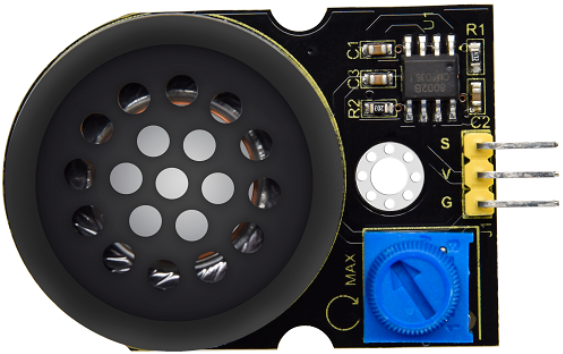
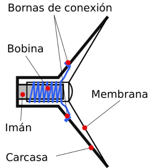
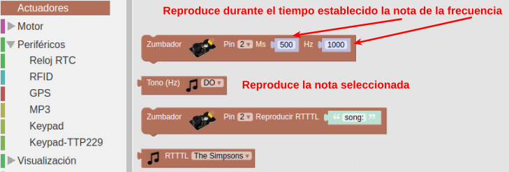
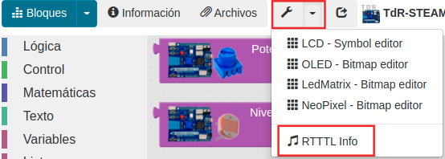

# El amplificador de potencia. Sonidos

## **Conceptos de programación incluidos**

<b>

* Sonidos en Arduino

</b>

## **El amplificador de potencia. Sonidos**
Antes de ver el amplificador propiamente dicho vamos a ver los tipos de zumbadores ya que arduino produce los sonidos en base a generar ondas cuadradas de diferentes frecuencia y el módulo trabaja de la misma forma pero incluyendo un amplificador y un altavoz, y al fin y al cabo un zumbador es un altavoz.

El buzzer, zumbador o altavoz es un transductor electroacústico (convierte una señal eléctrica en una onda de sonido) que produce un determinado zumbido o sonido. Existen de tres tipos:

* *Pasivos*: no disponen de electrónica interna, por lo que tenemos que proporcionar una señal eléctrica para conseguir el sonido deseado.
* *Activos*: disponen de un oscilador interno, por lo que únicamente tenemos que alimentar el dispositivo para que se produzca el sonido.
* *Módulos amplificados*: disponen de un pequeño amplificador que entrega su salida a un altavoz.

Uno de los parámetros que caracterizan a un sonido es su frecuencia de emisión, siendo la frecuencia el número de veces que se repite por unidad de tiempo (segundo). La transmisión del sonido se realiza por ondas a través en cualquier medio (sólido, líquido o gaseoso) excepto en el vacío. La frecuencia de un sonido nos indica cuantos ciclos por segundo tiene una onda.

En la imagen y la tabla siguientes vemos un dibujo con un fragmento de las teclas de un piano estando todo referido a una nota estándar, la nota "La" central que tiene una frecuencia de 440 Hz. Podemos ver la nota musical que reproduce, en las dos notaciones más comunes de los sonidos (Inglés: C D E F G A B, Alemán: C D E F G A H, Español, italiano y francés: Do Re Mi Fa Sol La Si) y además se encuentra la frecuencia que produce esa nota musical.

*Sección de piano y notas*

### Zumbador pasivo
Un zumbador o buzzer pasivo no es mas que un pequeño altavoz que nos sirve para convertir una señal eléctrica en una onda de sonido. Son dispositivos que no disponen de ningún tipo de electrónica interna, por lo que tenemos que proporcionar una señal eléctrica para conseguir el sonido deseado.

Normalmente estos dispositivos se incluyen en un módulo que incorpora un transistor y una resistencia de polarización del mismo para hacer funcionar al altavoz que actúa como carga.

Un buzzer se basa en un transductor piezoeléctrico que es capaz de variar su volumen con el paso de la corriente eléctrica, fenómeno que se aprovecha para hacer vibrar la membrana del altavoz. Esquemáticamente vemos esto en la figura siguiente:

*Funcionamiento de un buzzer*

### Zumbador activo
Existe otro tipo de zumbador que incluye un oscilador que genera una frecuencia audible fija y que se conoce como zumbador pasivo y en realidad es el que de forma correcta se puede denominar como zumbador. Este es mucho mas sencillo de usar ya que basta con conectarlo a un pin digital y cuando pongamos a nivel alto este pin el zumbador generará su zumbido característico durante el tiempo que establezcamos. Con este tipo de zumbador no se pueden generar melodías.

Cuando está nuevo se distingue del zumbador pasivo o altavoz por la pegatina de protección que lo acompaña, pero esta hay que quitarla para oir el zumbido y sin ella es difícil distinguir un tipo del otro, así que en este caso deberemos crear un programa con alguna melodía y si no se reproduce correctamente es que tenemos conectado el zumbador activo en lugar del pasivo. Lo mejor es marcar alguno de los dos cuando podemos distinguirlos. Una buena idea puede ser utilizar la propia pegatina en el lateral del mismo.

El zumbador activo tiene el aspecto que vemos en la figura siguiente:

*Aspecto del zumbador activo*

### Módulo amplificador
El módulo amplificador de potencia KS0374 de keyestudio integra un potenciómetro para ajuste del volumen, un altavoz y el amplificador de audio 8002B. El chip es un amplificador de 2W clase AB capaz de entregar los 2W de potencia a una carga de tres ohmios con una distorsión menor al 10% a partir de una alimentación de 5V. Típicamente el amplificador entrega en torno a los 2W para una carga de ocho ohmios.

Lo mas apropiado es ajustar el volumen del sonido al mínimo antes de usarlo, para luego aumentarlo a voluntad, evitando así sobresalto y que se estropee el altavoz.

Sus parámetros principales son:

* Chip amplificador: SC8002B
* Tensión de alimentación: 5V DC
* Consumo: ≥500MA
* Potencia máxima: 2W
* Temperatura de funcionamiento: de 0 a 40°
* Volumen de sonido del altavoz: 80db

En la figura siguiente vemos el aspecto que presenta el módulo.

*Aspecto del módulo*

Se puede observar que el altavoz es de membrana y bobina móvil por lo que es algo similar a lo que vemos en la figura siguiente:

*Altavoz de bobina móvil*

### Bloques de programación
En la figura siguiente podemos ver los bloques disponibles para generar sonidos.

*Bloques para generar sonidos*

Los dos primeros bloques son sencillos de usar y nos centraremos un poco mas en los otros dos que nos permiten reproducir cualquier melodía RTTTL (del inglés, Ring Tone Text Transfer Language) y es el que vemos en la imagen siguiente:

El bloque 'Reproducir RTTTL' bloque permite reproducir una melodía a partir de un texto con formato RTTTL, formato desarrollado por Nokia para ser usado para transferir tonos de llamada a teléfonos móviles. El formato RTTTL es una cadena dividida en tres secciones: nombre, valor predeterminado y datos. Por ejemplo, la siguiente cadena de texto se corresponde con la Intro de Donkey Kong:

 d=4,o=5,b=140:8a#,8p,8d6,16p,16f.6,16g.6,16f.6,8a#,8p,8d6,16p,16f.6,16g.6,16f.6,8a#,8p,8d6,16p,16f.6,16g.6,16f.6,8a#,8p,8d6,16p,16f.6,16g.6,16f.6

Lo único que tenemos que hacer para reproducir la melodía es pegar esta cadena en la zona de texto del bloque.

ArduinoBlocks nos suministra información y enlaces referentes al tema accediendo desde nuestro proyecto a herramientas y escogiendo RTTTL Info, tal y como vemos en la imagen siguiente:

*Acceso a RTTTL Info*

En la imagen siguiente tenemos desplegada la información que nos ofrece esta herramienta.

*Información RTTTL*

También podemos acceder a esta información haciendo clic derecho sobre el bloque y escogiendo la opción "Ayuda" de entre las mostradas en la ventana emergente.
