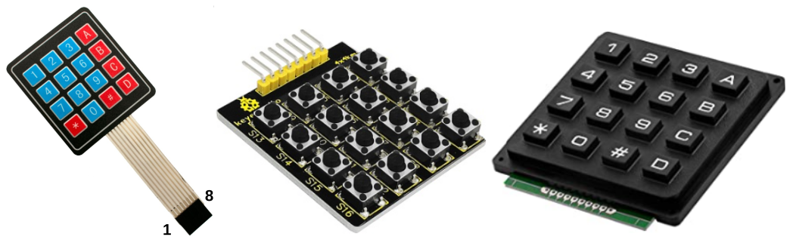
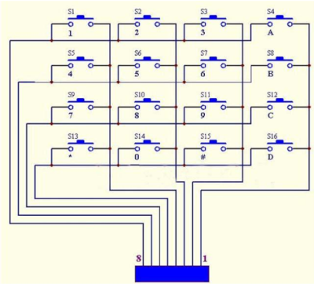
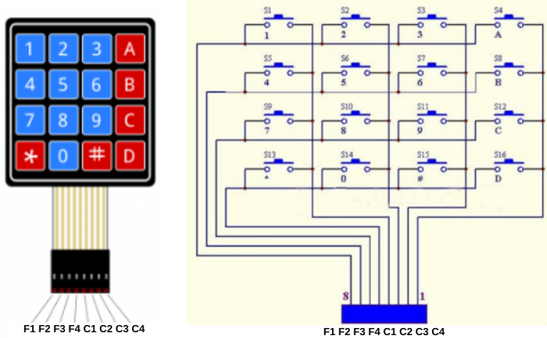
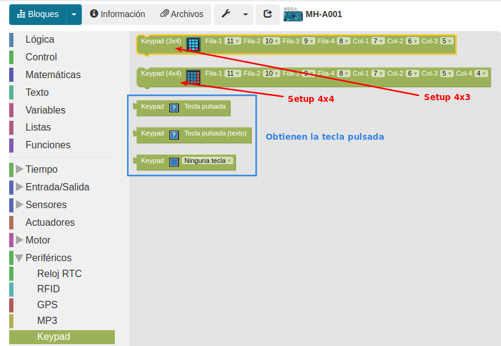
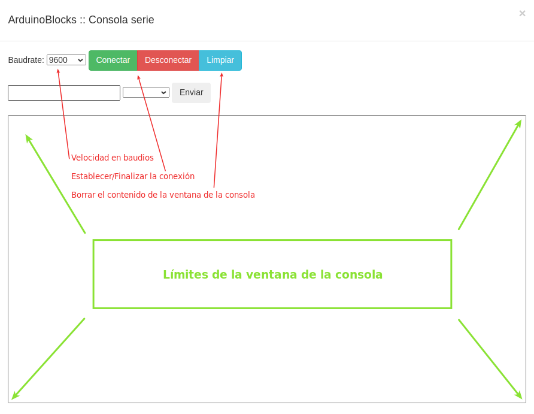
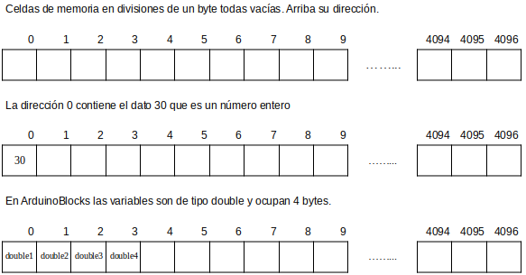
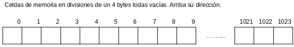

# El teclado matricial de 4x4

## **Conceptos incluidos**

<b>

* Consola o monitor serie

</b>

## **Teclado de 4x4**
También conocidos como keypad, generalmente nos vamos a encontrar con dos tipos de teclados de 4x4 matriciales, unos basados en botones clásicos y otros de tipo membrana. En la figura siguiente vemos ejemplos de los mismos.

*Teclados de 4x4 matriciales*

En el caso de la autocaravana se utiliza el de membrana, pero cualquiera de ellos se corresponde con un esquema de conexionado como el de la figura siguiente:

*Esquema conexiones teclados de 4x4 matriciales*

Detectar la pulsación de una tecla concreta es totalmente similar a la lectura simple de un pulsador. En nuestro caso las filas van determinadas por los pines 5, 6, 7 y 8 del conector del teclado y las columnas por los pines 1, 2, 3 y 4. Por otro lado en el conector del teclado los pines son de izquierda a derecha, F1-F2-F3-F4-C1-C2-C3-C4. La correspondencia de pines de conexión con el esquema de conexionado y la tecla que corresponde lo vemos en la tabla siguiente:

| Tecla | Pines en teclado | Fila | Columna | Pines placa de control |
|:-:|:-:|:-:|:-:|:-:|
| 1 | 8 / 4 | 1 | 1 | A15 / A11 |
| 2 | 8 / 3 | 1 | 2 | A15 / A10 |
| 3 | 8 / 2| 1 | 3 | A15 / A9 |
| 4 | 7 / 4 | 2 | 1 | A14 / A11 |
| 5 | 7 / 3 | 2 | 2 | A14 / A10 |
| 6 | 7 / 2 | 2 | 3 | A14 / A9 |
| 7 | 6 / 4 | 3 | 1 | A13 / A11 |
| 8 | 6 / 3 | 3 | 2 | A13 / A10 |
| 9 | 6 / 2 | 3 | 3 | A13 / A9 |
| 0 | 5 / 3 | 4 | 2 | A12 / A10 |
| A | 8 / 1 | 1 | 4 | A15 / A8 |
| B | 7 / 1 | 2 | 4 | A14 / A8 |
| C | 6 / 2 | 3 | 4 | A13 / A8 |
| D | 5 / 1 | 4 | 4 | A12 / A8 |
| * | 5 / 4 | 4 | 1 | A12 / A11 |
| # | 5 / 2 | 4 | 3 | A12 / A9 |

Vemos la correspondencia de pines en la figura siguiente:

*Distribución de pines en teclados de 4x4 matriciales*

En el menú 'Periféricos' tenemos los bloques necesarios para trabajar con este y otros teclados. En la figura siguiente vemos los bloques y una breve explicación de los mismos.

*Bloques para keypad*

En 'Inicializar' es obligatorio poner el bloque de configuración del teclado que estemos utilizando y poner correctamente los pines a los que lo conectamos.

## **El terminal o consola serie**
Sirve para visualizar en un ordenador los datos recibidos a través del puerto serie y en realidad es una aplicación que controla las comunicaciones bidireccionales a través de la UART integrada en el microcontrolador.

Es muy importante tener siempre presente que el puerto serie es el que se utiliza para "subir" el firmware o programa a la placa, tarea que se realiza a través de una aplicación pregrabada en el microntrolador y que se denomina "bootloader".

En ArduinoBlocks es posible usar la consola serie solamente si tenemos instalada y en funcionamiento la aplicación ArduinoBlocks-Connector que es la encargada de establecer las comunicaciones locales de nuestra placa con las remotas de la aplicación. En la imagen siguiente vemos el aspecto de la consola.

*Aspecto de la Consola en ArduinoBlocks*

<b>IMPORTANTE</b>

* A la hora de establecer una conexión serie los dos extremos que intervienen en la conexión (placa de control y ordenador) deben establecer el mismo valor en la velocidad de la conexión. Por defecto esta velocidad normalmente es de 9600 baudios o bits por segundo en el bloque inicializar y otras velocidades comunmente utilizadas son: 4800, 9600, 19200, 38400, 57600 y 115200. Es por lo tanto imprescindible incluir en el bloque "Inicializar" el bloque "Iniciar" y establecer la velocidad de comunicación.

* El “bootloader” de Arduino normalmente tiene configurada la opción de resetear el microcontrolador cuando se inicia una conexión serie, por tanto si conectamos con la consola serie del PC hay que tener en cuenta que se reiniciará el programa y se ejecutará el bloque “inicializar". En las placas tipo ESP32 esta función no está habilitada en el bootloader por lo que si es necesario el reset de la placa hay que hacerlo manualmente.

## **Memoria EEPROM**
EEPROM son las siglas de "Electrically Erasable Programmable Read-Only Memory" que significan que es una memoria de solo lectura programable y borrable eléctricamente. Es decir, una memoria EEPROM almacena bits de información mediante semiconductores y es capaz de mantener su estado entre ciclos de desconexión y conexión de la energía. La EEPROM soporta hasta cien mil ciclos de escritura.

Las placas tipo Arduino disponen de memoria EEPROM como memoria interna del microcontrolador que nos permite guardar información de configuración de la aplicación o valores de estado que se necesiten recuperar después de un corte de la alimentación eléctrica.

El microcontrolador de la placa de control de la autocaravana es un Arduino mega y tiene 4096 bytes (4 KB) de memoria EEPROM, sin embargo en ArduinoBlocks cada variable usada internamente es de tipo double y utiliza 4 bytes por lo que a la hora de almacenar o recuperar una variable de la memoria EEPROM sólo podemos almacenar en 1024 posiciones (1024 x 4 = 4096 bytes).

Vamos a pensar en esas posiciones de memoria como celdas de una tabla que pueden contener un valor de 8 bits, o sea entre 0 y 255. El aspecto lo podemos poner como en la gráfica de la figura siguiente:

*Celdas de memoria*

La forma de guardar información en las celdas es indicar su dirección y el contenido tal y como contempla el bloque que vemos en la imagen siguiente:

*Bloque guardar datos en EEPROM*

Trabajando en ArduinoBlocks esto es mejor contemplarlo como vemos en la figura siguiente:

*Celdas de memoria en ArduinoBlocks*

Quedando cada dirección de memoria que gestiona ArduinoBlocks como un grupo de 4 bytes.

Cuando guardamos información en memoria EEPROM tenemos que tener especial cuidado con gestionar correctamente las direcciones de memoria y evitar solapar información en las mismas.
