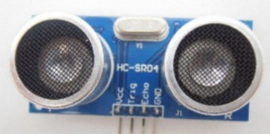
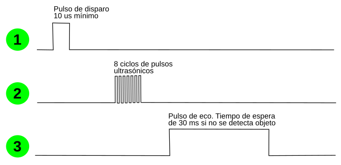

# El sensor de ultrasonidos HC-SR04

## **Sensor HC-SR04**
Los sensores ultrasónicos utilizan un sonar para determinar la distancia desde el sensor al objeto. Este módulo utiliza un chip CS100A que puede medir distancias entre 4 cm y 300 cm siendo la medida precisa y estable. El módulo incluye el transmisor y el receptor ultrasónicos y su circuito de control. El dispositivo debe conectarse a dos pines, por lo que utilizaremos el conector etiquetado con D3 y D4. Esto se debe a que para el funcionamiento del sensor necesita dos pines, uno para emitir el ultrasonido (Trigger) y otro para recibirlo (Echo).
El principio de funcionamiento es el de la figura siguiente:

*Principio de funcionamiento del sensor*

El sensor lo que hace es medir el tiempo (t) en microsegundos que tarda en recibir el eco del sonido emitido y como la velocidad (v) es conocida, se trata de la velocidad del sonido, que es de 340 m/s o 0.034 cm/$\mu$ s, la distancia vendrá dada por la siguiente ecuación:

$d=v \cdot t=0.034(\dfrac{cm}{\mu s})\cdot t(\mu s)=0.034 \cdot t(cm)$

Aunque nosotros no debemos preocuparnos por esto puesto que el bloque ya no devuelve esta distancia medida en cm. Su aspecto lo vemos en la figura siguiente:

*Aspecto del sensor*

El módulo detector ultrasónico proporciona una distancia de detección sin contacto que va de 2 cm a 450 cm, con una precisión de 3 mm y un ángulo de 15º. El módulo incluye un transmisor y un receptor de ultrasonidos, así como el circuito de control correspondiente y basa su funcionamiento en la secuencia de trabajo que vemos en la figura siguiente.

*Secuencia de trabajo*

1. Partiendo de un nivel bajo de trigger lo mantenemos activado o en estado alto al menos durante 10 us.
2. Tras el disparo el módulo emitirá una ráfaga de pulsos cuadrados de 40 KHz y detectará automáticamente si hay unaseñal de regreso.
3. Si hay una señal de retorno, se emite un nivel alto a través de ECHO. El tiempo de duración de este nivel alto es en realidad el tiempo transcurrido desde la emisión hasta la recepción del ultrasonido.

En el apartado de bloques de programación, se encuentra en "Sensores" y tiene el aspecto de la figura siguiente:

*Bloque para lectura del sensor HC-SR04*

