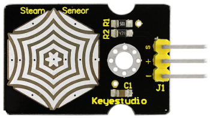
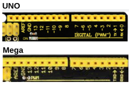
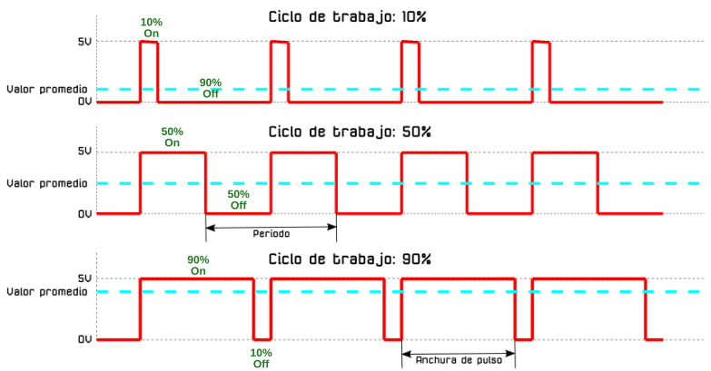
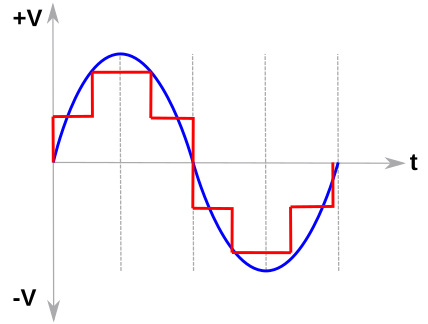
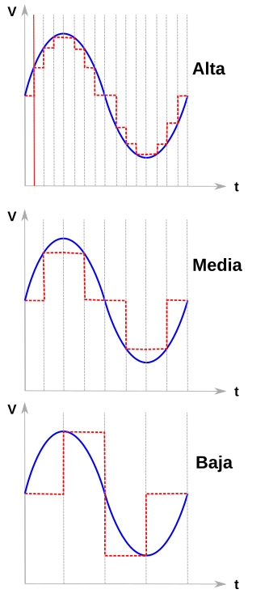

# El sensor de Sensor de vapor (steam)

## **Conceptos incluidos**

<b>

* Analógico en placas tipo Arduino

</b>

## **Sensor steam**
El sensor de vapor (steam en inglés) es un sensor analógico y puede utilizarse como un simple detector de agua de lluvia, interruptor de nivel de líquido e incluso como sensor táctil. Cuando aumenta la humedad en la superficie del sensor, aumenta el voltaje en su salida.

En la figura siguiente vemos el aspecto que tiene este dispositivo.

*Aspecto del sensor de vapor (steam)*

<b>Precaución: las piezas de conexión no son impermeables, luego no debemos sumergirlo en agua</b>

Su principio de funcionamiento se base en detectar la cantidad de agua mediante pistas paralelas de la PCB que están estañadas pero expuestas. Cuanta más agua haya, más pistas (cables) se conectarán entre si. El sensor es capaz de detectar vapor de agua y se puede utilizar como sensor de lluvia.

Sus principales especificaciones son:

* Voltaje de funcionamiento: 3,3 V o 5 V.
* Consumo: <20mA
* Rango de temperatura de trabajo: －10 ℃ a ＋ 70 ℃
* Tipo de salida: señal analógica
* S: señal de salida analógica
* +: Alimentación positiva (VCC)
* -： Alimentación negativa o masa (GND)

## **Analógico en placas tipo Arduino**
Las placas que basan su funcionamiento en microcontroladores trabajan solamente con valores digitales por lo que para trabajar con valores analógicos se deben utilizar técnicas que ya hemos ido introduciendo en apartados anteriores.

### Salidas analógicas
Las placas tipo Arduino no tienen salidas analógicas, aunque si podemos en una salida digital imitar a una salida analógica mediante la técnica PWM (Pulse Width Modulation = Modulación en Anchura de Pulso). Para el control PWM por hardware estas placas utilizan los Timers del microcontrolador junto con un registro comparador de forma que cuando el timer alcance el valor del registro se cambie el estado (valor de salida) para detener los Duty Cycles (ciclos de trabajo). Un timer puede atender a dos o tres salidas que pueden tener distintos Duty Cycles pero deben ser de la misma frecuencia. A continuación hacemos un resumen de placas y cuales son sus pines PWM.

- Placas tipo UNO, Mini y Nano: disponen de 6 salidas PWM de 8 bits en los pines 3, 5, 6, 9, 10 y 11, que tendrán un carácter ~ delante del número. Estas placas tienen 3 Timers de forma que el Timer0 atiendo a los pines 5 y 6, el Timer1 al 9 y 10 y el Timer2 al 3 y al 11.
- Placas tipo Mega: tiene 15 salidas PWM que están en los pines 2 al 13 y 46 al 44. La placa dispone 6 Timers de forma que el Timer0 atiende a los pines 4 y 13, el Timer1 al 11 y 12, el Timer2 al 9 y 10, el Timer3 al 2, 3 y 5, el Timer4 al 6, 7 y 8 y el Timer5 al 44, 45 y 46.

En el caso de las placas UNO estos pines se caracterizan con el carácter virgulilla (~) y en la Mega se indican explícitamente del 2 al 13 pero no los 44, 45 y 46, como vemos en la figura siguiente:

*Pines con salida PWM*

Ya hemos indicado que PWM tiene una base digital, aunque la forma de su señal se asemeja a una señal analógica "cuadrada". PWM Permite mediante pulsos digitales ir variando la señal para emular un sistema analógico, tal y como indica su nombre. Es decir, que PWM es el sistema por el que estas placas pueden trabajar con señales que no son totalmente analógicas, pero tampoco digitales de manera convencional. Para hacerlo posible mantienen una salida digital activa durante un tiempo específico o apagada, según interese en cada momento, lo que no se corresponde con un código binario cuyos pulsos duran el mismo tiempo.

En este tipo de señales PWM se mantiene una frecuencia constante de disparos de pulsos en el tiempo, pero se varía la anchura de estos pulsos. De hecho, se denomina Duty Cycle o ciclo de trabajo  al tiempo que se mantiene en estado alto una señal con respecto al total del ciclo. Es por ello que el parámetro Duty Cycle se proporciona en %. En la figura siguientes vemos esto expresado claramente.

*Duty Cycle o ciclo de trabajo*

### Pines de entrada analógica
Estos pines sólo se pueden utilizar como entradas. Las entradas analógicas leen un voltaje entre 0 y 5V y a través de un convertidor analógico a digital o ADC (Analog to Digital Converter) obtienen un valor proporcional a la señal de entrada con una resolución de 10 o 12 bits según la placa de que hablemos.

Como ya vimos en otro apartado esta precisión para algunas placas es:

* Tipo Arduino Uno, Mini y Mega. La resolución es de 10 bits por lo que el número de valores digitales posibles es: $2^{10} = 1024$. Para una tensión de 5V esto se traduce en que la precisión de la medida es de $5/1024 = 4.88 mV = ±2.44 mV$.
* Tipo Arduino Due, familia de placas MKR y ESP32 Plus STEAMakers. La resolución es de 12 bits por lo que el número de valores digitales posibles es: $2^{12} = 4096$. Para una tensión de 5V esto se traduce en que la precisión de la medida es de $5/4096 = 1.22 mV = ± 0.61 mV$.

De forma genérica podemos expresar que: $Resolucion = V_{ref}/(2^{N}-1)$ siendo $V_{ref}$ la tensión de referencia para el convertidor ADC de la placa, que por defecto es el valor de la alimentación y N el número de bits o precisión del convertidor.

Si necesitamos que el valor de $V_{ref}$ sea diferente al de la alimentación debemos recurrir al uso del pin **AREF** disponible en las placas.

Vamos a expresar de forma gráfica la conversión ADC y la relación con el número de bits. En la figura siguiente tenemos una señala analógica en forma de onda senoidal sobre la que se superpone un patrón digital.

*Muestreo de poca precisión*

En la figura anterior observamos como en realidad lo que el microcontrolador junto con el convertidor hacen es **aproximar** la señal digital a la analógica por medio de rectángulos o muestras.

Cuanto mayor sea el número de bits de resolución del convertidor mas pequeños serán los rectángulos que se forman y mas se aproximará la señal digital a la analógica. Es decir, cuanto mayor sea el número de muestras mayor será la aproximación. En la figura siguiente vemos diferentes resoluciones aplicadas a una misma señal analógica con indicación de la resolución.

*Muestreos de diferentes precisiones*

Resulta evidente que a mayor precisión o número de bits mejor señal convertida vamos a tener.
