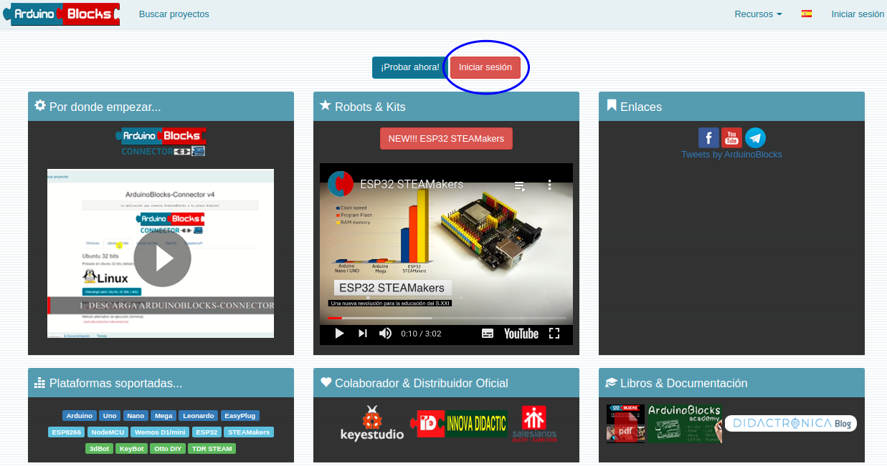
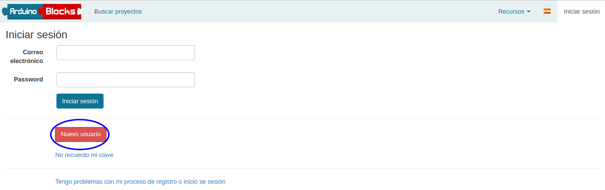
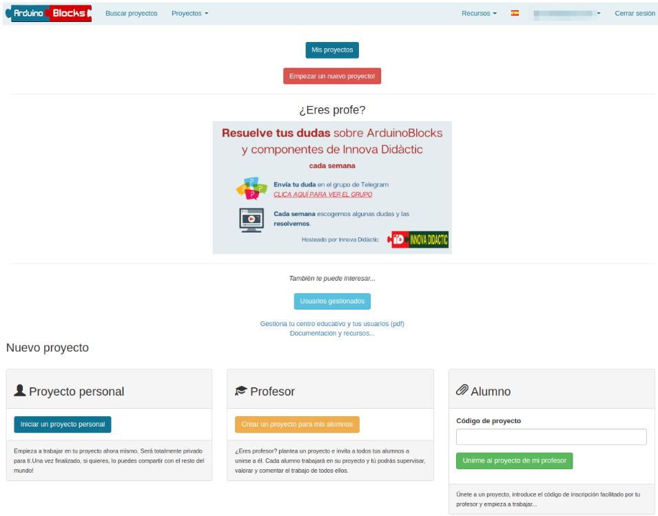
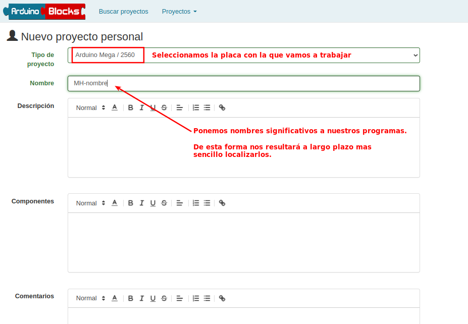
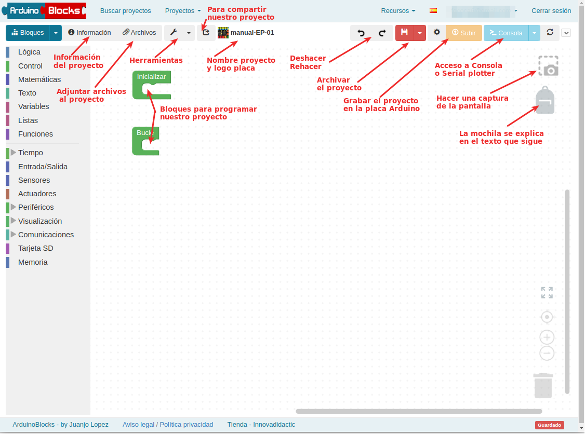
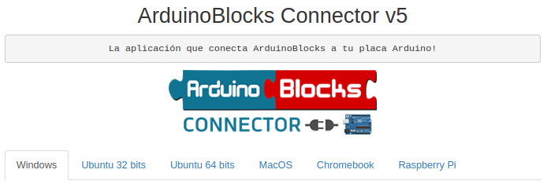

# Introducción
Aunque hemos realizado el montaje completo del kit no lo vamos a programar de una sola vez, sino que vamos a plantear una serie de actividades que comenzarán desde lo más básico hasta la programación de todos los elementos, incluido el control remoto desde un smartphone.

Nuestro lenguaje de programación va a ser ArduinoBlocks, un lenguaje visual por bloques muy potente y fácil de usar. También se puede trabajar con el kit utilizando el [IDE de Arduino](https://www.arduino.cc/en/software) o el lenguaje visual [Mixly](https://www.dropbox.com/sh/ar08yhfclup2uak/AAA_HGeBTqzMyfFsIa4ApYxya?dl=0) que podemos descargar de Keyestudio.

En los enlaces siguientes podemos encontrar mas información respecto al uso del programa.

* Descripción rápida del uso del [Software ArduinoBlocks](https://fgcoca.github.io/TdR-STEAM-and_UNO/soft/).
* Conceptos sobre el uso de [Operadores en C++](https://fgcoca.github.io/TdR-STEAM-and_UNO/operadores/).
* [Manuales de ArduinoBlocks](http://www.arduinoblocks.com/web/site/doc)
* [Teoría básica de IoT](https://fgcoca.github.io/TdR-STEAM-and_UNO/IoT_basico/).

## **¿Cómo se trabaja con ArduinoBlocks?**
Para empezar a trabajar con ArduinoBlocks, es necesario registrarse y crear un nuevo usuario. Debemos acceder haciendo clic en el botón "Iniciar sesión" para después, seleccionar la opción de nuevo usuario. En la figura vemos como acceder a la ventana de inicio de sesión.

*Acceso al inicio de sesión en ArduinoBlocks*

En la figura siguiente vemos la ventana de inicio de sesión.

*Inicio de sesión en ArduinoBlocks*

Seguidamente, se debe seleccionar "Empezar un proyecto nuevo". Como vemos en la Figura 3.1.3 nos aparecen tres opciones: proyecto personal, profesor o alumno.

*Empezar un proyecto nuevo*

Si escogemos el proyecto personal sólo podremos acceder nosotros, pero después lo podemos compartir si decidimos hacerlo público. En cambio, si seleccionamos el proyecto profesor, no se comienza un proyecto sino que se crea un código para que los alumnos puedan inscribirse en el proyecto. De esta forma, el profesor puede supervisar las programaciones de sus estudiantes. Por último, la opción de alumno es para unirnos al proyecto planteado por el profesor. Para aprender mas sobre [Usuarios Gestionados](https://drive.google.com/file/d/1uAhhYuQAzDbvmxJTRvDOK_rG4yPoQrxr/view?usp=drive_web) basta con acceder a la presentación del enlace anterior.

## **¿Cómo es la interfaz de programación de ArduinoBlocks?**
Una vez hemos escogido la opción de proyecto personal, nos pregunta qué placa estamos utilizando y qué nombre queremos dar a nuestro proyecto. A su vez, podemos añadir información, como: descripción del proyecto, componentes que necesitamos y otras especificaciones en el apartado de comentarios.

En nuestro caso escogeremos: Arduino Uno, tal y como vemos en la figura siguiente, donde se aconseja la forma de nombrar los proyectos relacionados con este tema.

*Tipo de placa y nombre del proyecto*

Una vez ponemos nombre, y aunque es opcional se recomienda cumplimentar los distintos apartados, y hacemos clic en el botón “Nuevo proyecto” entramos en el nuevo proyecto, nos encontramos con la pantalla que vemos en la siguiente figura.

*Pantalla inicial de un proyecto*

Ya es posible guardar nuestros bloques favoritos de ArduinoBlocks en la mochila y llevarlos siempre con nosotros o usarla para compartir bloques entre nuestros proyectos. En este [enlace](https://twitter.com/ArduinoBlocks/status/1506352610059689988?s=20&t=GzAqgtY4gySw5FPZgOOzjA) tienes un video que lo explica de forma gráfica.

## **ArduinoBlocks Connector**
ArduinobBloks genera el código de Arduino a partir de los bloques. El programa copia y sube nuestra programación a la placa gracias a la aplicación ArduinoBlocks Connector. Si no ejecutamos ArduinoBlocks Connector, podremos programar y acceder a la plataforma ArduionBlocks, pero no podremos subir nuestro programa a la placa. Así pues, es necesario instalarlo en nuestro ordenador, y ejecutarlo cuando hagamos uso de la plataforma.

Actualmente (octubre de 2022), está disponible la versión 5 para estos sistemas operativos: Windows, Ubuntu, MacOS, Chromebook y Raspberry Pi, tal y como se indica en la figura que sigue.

*Disponibilidad de ArduinoBlocks para distintos sistemas operativos*

