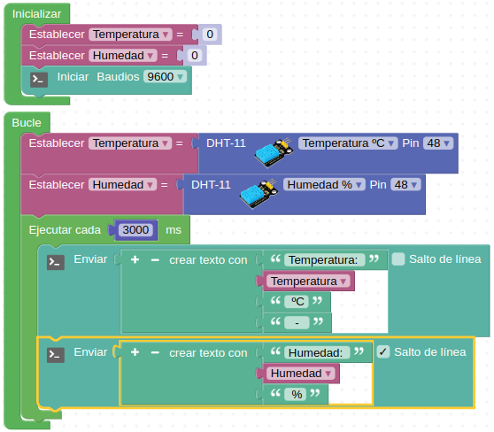
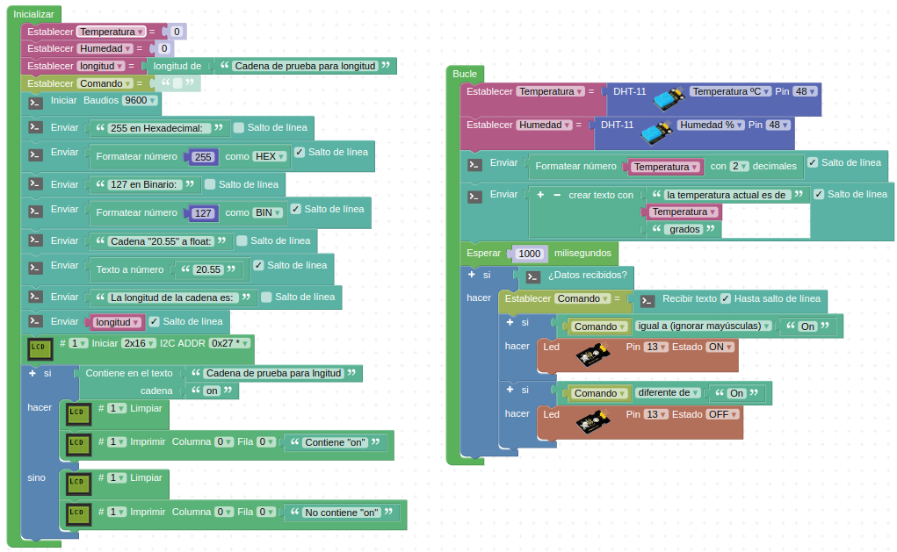
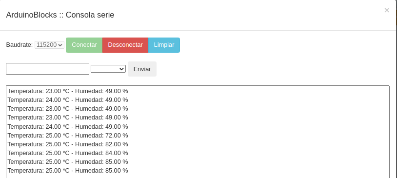
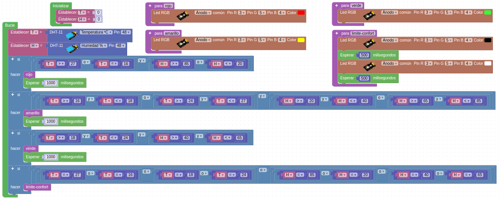

# Actividades con el sensor DHT11

## **Actividad A022**
Realizar un programa que muestre la temperatura y la humedad en el monitor serie. El programa final queda como vemos en la figura siguiente y lo tenemos disponible en el enlace [Actividad MH-A022](../programas/MH-A022.abp).

*Solución A022*

## **Actividad A023**
Realizar un programa que trabaje con el sensor DHT11 y algunos de los bloques de texto. El programa final queda como vemos en la figura siguiente y lo tenemos disponible en el enlace [Actividad MH-A023](../programas/MH-A023.abp).

*Solución A023*

Esto nos generará algo como lo de la imagen siguiente en la consola:

*Consola que produce la actividad A023*

## **Actividad A024**
Realizar un programa que nos muestre el estado de confort según las explicaciones vista y la idea de un semáforo que utilice los LEDs RGB para componer esos colores rojo, verde y amarillo.

Para resolver la actividad vamos a necesitar varios bloques del menú "Lógica" y especialmente combinando funciones AND y OR múltiples. Si necesitamos, por ejemplo, aumentar el número de operadores AND dentro de un bloque simplemente tenemos que combinarlo como vemos en la imagen siguiente, donde se han combinado cuatro bloques AND.

*Combinacion de 4 bloques AND*

El programa final queda como vemos en la figura siguiente y lo tenemos disponible en el enlace [Actividad MH-A024](../programas/MH-A024.abp).

*Solución A024*

## Propuestas

* Idear un método para probar de forma completa la funcionalidad del programa de la actividad A024, aunque se requiera modificarlo. También se pide explicar la misión de la función "limite-confort" creada.
