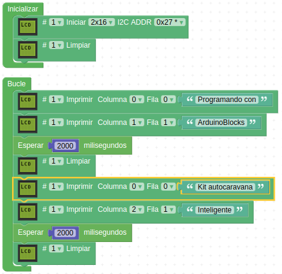
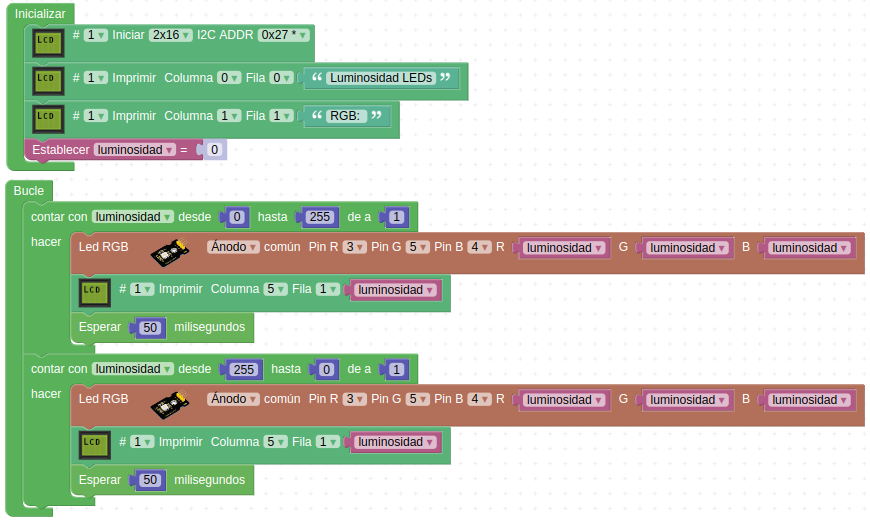

# Actividades con la LCD1602

## **Actividad A020**
En esta actividad vamos a mostrar una serie de texto en la LCD a modo de introducción a este elemento. El programa final queda como vemos en la figura siguiente y lo tenemos disponible en el enlace [Actividad MH-A020](../programas/MH-A020.abp).

*Solución A020*

## **Actividad A021**
Realizar un control de iluminación de los LEDs RGB de los faros mediante PWM y mostrar por pantalla el valor de la iluminación en cada instante. Se realizará el control desde el mínimo de iluminación al máximo y cuando se alcance el máximo bajamos otra vez a mínimo. El programa final queda como vemos en la figura siguiente y lo tenemos disponible en el enlace [Actividad MH-A021](../programas/MH-A021.abp).

*Solución A021*

## Propuestas

* Mostrar en la LCD los textos Robótica + domótica creando para ello el símbolo necesario para acentuar la letra o (ó).
* Repetir la actividad A021 cambian el color a otro cualquiera como rojo, verde o azul.
* Realizar la actividad anterior pero con colores que mezclan los básicos.
* Hacer un programa que la subida de brillo la haga en un color y la bajada en otro diferente.
