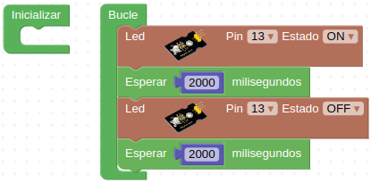
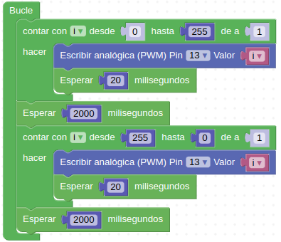
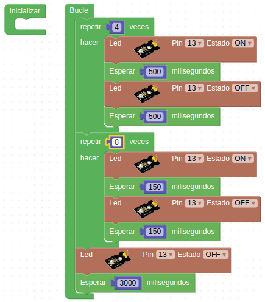

# Actividades con el diodos LED

## **Actividad A001**
En esta actividad encenderemos y apagaremos cada dos segundos el led blanco que tenemos conectado al pin D13. El programa final queda como vemos en la figura siguiente y lo tenemos disponible en el enlace [Actividad MH-A001](../programas/MH-A001.abp).

*Solución A001*

## Actividad A002
En esta actividad apagaremos y encenderemos de forma progresiva el LED blanco que tenemos conectado en D13. Utilizaremos la técnica del PWM que ya viene implementada para ese pin y que haremos con un contador y un decontador. El programa final queda como vemos en la figura siguiente y lo tenemos disponible en el enlace [Actividad MH-A002](../programas/MH-A002.abp).

*Solución A002*

## Actividad A003
Realizar 4 intermitencias con el LED con esperas de 500ms y 8 intermitencias con esperas de 150ms y tras esto apagar el LED durante 3 segundos para volver a iniciar el proceso. El programa final queda como vemos en la figura siguiente y lo tenemos disponible en el enlace [Actividad MH-A003](../programas/MH-A003.abp).

*Solución A003*

## Propuestas

* Cambiar los tiempos de la actividad A001 para que el parpadeo sea más rápido, mas lento y que los tiempos de encendido y apagado no coincidan.
* Cambiar el incremento en los bucles del la actividad A002 de forma que sea el mismo en ambos y diferente en cada caso.
