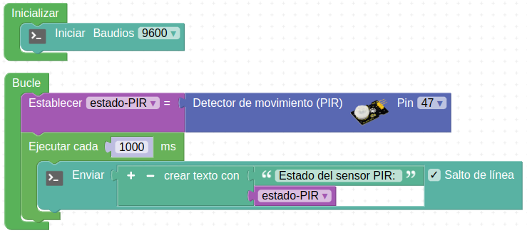
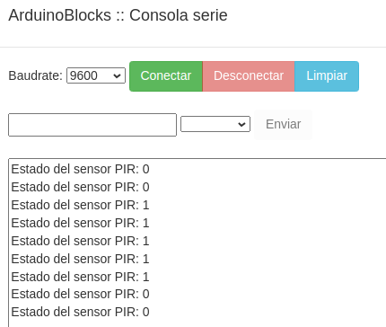
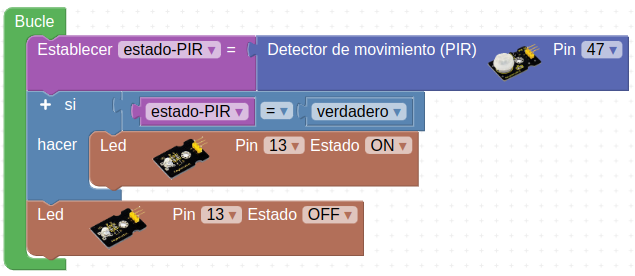
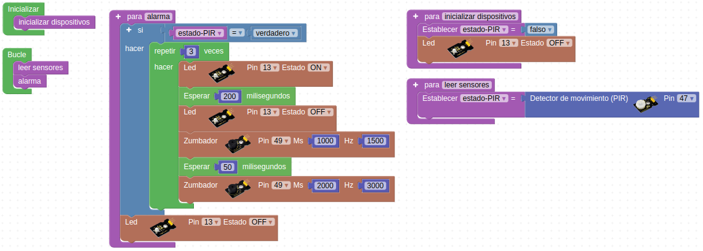

# Actividades con el sensor de movimiento PIR

## **Actividad A017**
Vamos a crear un sencillo programa en el que guardamos el estado del sensor PIR en una variable y lo mostramos en el monitor serie o consola. El programa final queda como vemos en la figura siguiente y lo tenemos disponible en el enlace [Actividad MH-A017](../programas/MH-A017.abp).

*Solución A017*

El resultado en consola lo vemos en la imagen siguiente, donde el 1 representa el estado True o verdadero e indica que el sensor ha detectado una presencia. El 0 representa el estado False o falso.

*Resultado en consola de A018*

## **Actividad A018**
Crear un programa que encienda la luz interior de la autocaravana cuando se detecta una presencia con el PIR. El programa final queda como vemos en la figura siguiente y lo tenemos disponible en el enlace [Actividad MH-A018](../programas/MH-A018.abp).

*Solución A018*

## **Actividad A019**
En esta actividad vamos a hacer que cuando el sensor PIR detecte una presencia suene una alarma acústica en el amplificador de sonido y que alternativamente parpadee el diodo LED interior. El programa final queda como vemos en la figura siguiente y lo tenemos disponible en el enlace [Actividad MH-A019](../programas/MH-A019.abp).

*Solución A019*

## Propuestas

* Hacer el programa del punto 2.- Tiempo transcurrido del apartado bloques de tiempo y comprobar su funcionamiento.
* Repetir el ejercicio anterior esta vez con bloques 'Ejecutar cada'.
* Repetir la actividad A019 haciendo parpadear los faros de la autocaravana.
* Crear un programa que active y desactive la alarma a partir de una contraseña memorizada y que introducimos por teclado.
