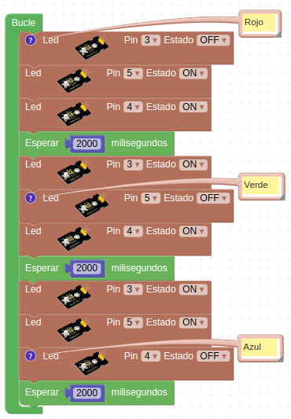
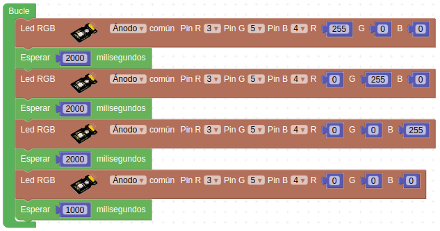
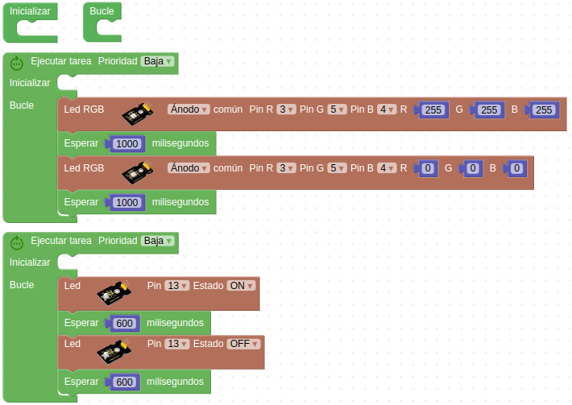
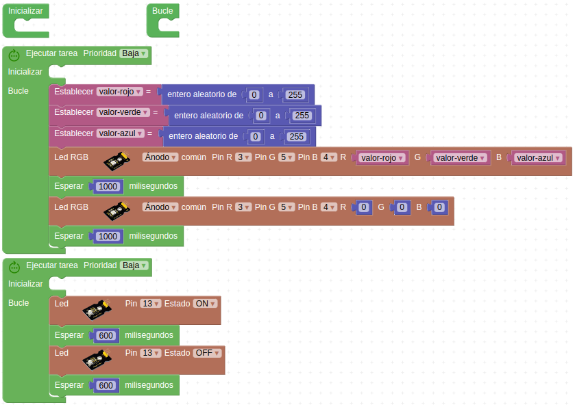

# Actividades con los LEDs RGB

## **Actividad A004**
En esta actividad encenderemos y apagaremos cada dos segundos cada uno de los LEDs conectados a los pines D3, D4 y D5 correspondientes a los colores rojo, azul y verde respectivamente. Recordemos que los LEDs RGB son en nuestro caso de ánodo común. El programa final queda como vemos en la figura siguiente y lo tenemos disponible en el enlace [Actividad MH-A004](../programas/MH-A004.abp).

*Solución A004*

## **Actividad A005**
Realizar un programa que nos muestre los tres colores primarios, rojo, verde y azul, a partir del bloque con el valor numérico de cada color y tras mostrar el azul que permanezcan un segundo apagados. El programa final queda como vemos en la figura siguiente y lo tenemos disponible en el enlace [Actividad MH-A005](../programas/MH-A005.abp).

*Solución A005*

## **Actividad A006**
Hacer un programa que haga parpadear el LED interior y los de los faros cada uno en una multitarea con tiempos de espera diferentes de un segundo y 600ms. El color de los faros lo establecemos com mas nos guste, en blanco en el ejemplo. El programa final queda como vemos en la figura siguiente y lo tenemos disponible en el enlace [Actividad MH-A006](../programas/MH-A006.abp).

*Solución A006*

## **Actividad A007**
Repetir la actividad A006 pero en esta ocasión el color de los faros será aleatorio. El programa final queda como vemos en la figura siguiente y lo tenemos disponible en el enlace [Actividad MH-A007](../programas/MH-A007.abp).

*Solución A007*

## Propuestas

* A partir de la idea de la actividad A004 hacer un programa que muestre sucesivamente los siguientes colores: magenta o violeta, cían o azul claro, amarillo y blanco. Ayúdate del gráfico que muestra el modelo aditivo de colores que hay al principio de la teoría.
* Repetir la actividad A004 utilizando los bloques específicos LED RGB que utiliza la paleta de colores.
* Realizar un programa que muestre de manera secuencial los colores del arcoíris en el orden que vemos en la imagen siguiente a intervalos de un segundo.

*Colores del arcoiris*

* Realizar un programa que en una secuencia infinita haga que cambien los faros de color de forma aleatoria estableciendo una pausa entre cambios lo mas pequeña posible pero que nos permita apreciar la psicodelia que se crea (100ms puede ser un valor aceptable).
