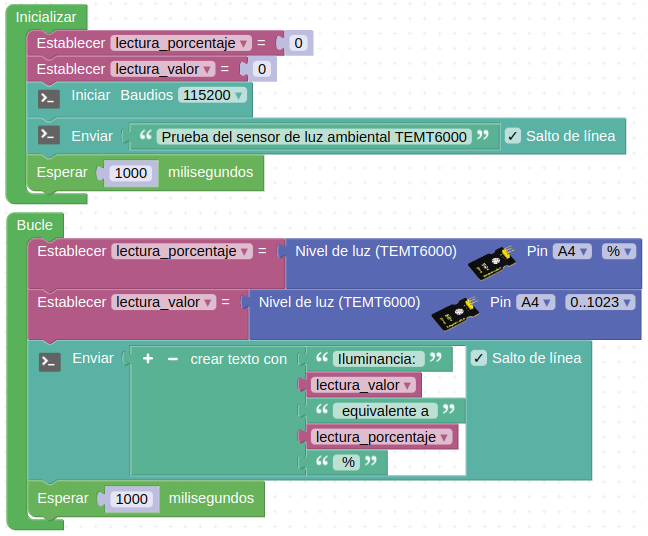
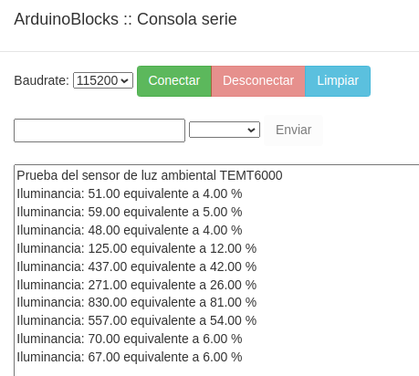
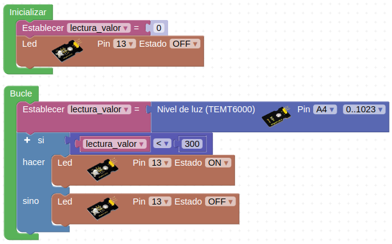

# Actividades con el sensor de luz ambiental

## **Actividad A026**
Vamos a leer los datos del sensor y mostrarlos a través de la consola serie. El programa final queda como vemos en la figura siguiente y lo tenemos disponible en el enlace [Actividad MH-A026](../programas/MH-A026.abp).

*Solución A026*

El programa genera una salida por consola como la de la figura siguiente:

*Consola A026*

## **Actividad A027**
Implementar el encendido automático del LED interior cuando el nivel de iluminación está por debajo del valor 300. El programa final queda como vemos en la figura siguiente y lo tenemos disponible en el enlace [Actividad MH-A027](../programas/MH-A027.abp).

*Solución A027*

## Propuestas

* Repetir la actividad A026 mostrando los valores en la LCD.

*Consola A028*

## **Actividad A029**
Leer y mostrar en la consola seri
* Repetir la actividad A027 trabajando con porcentajes.
