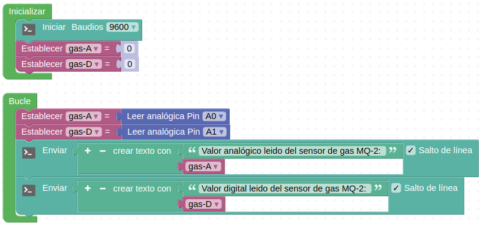
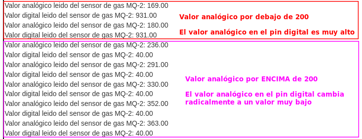
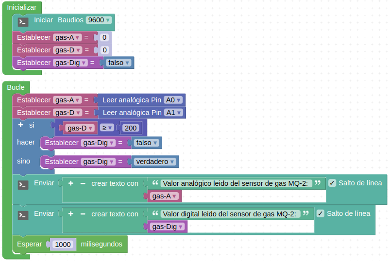
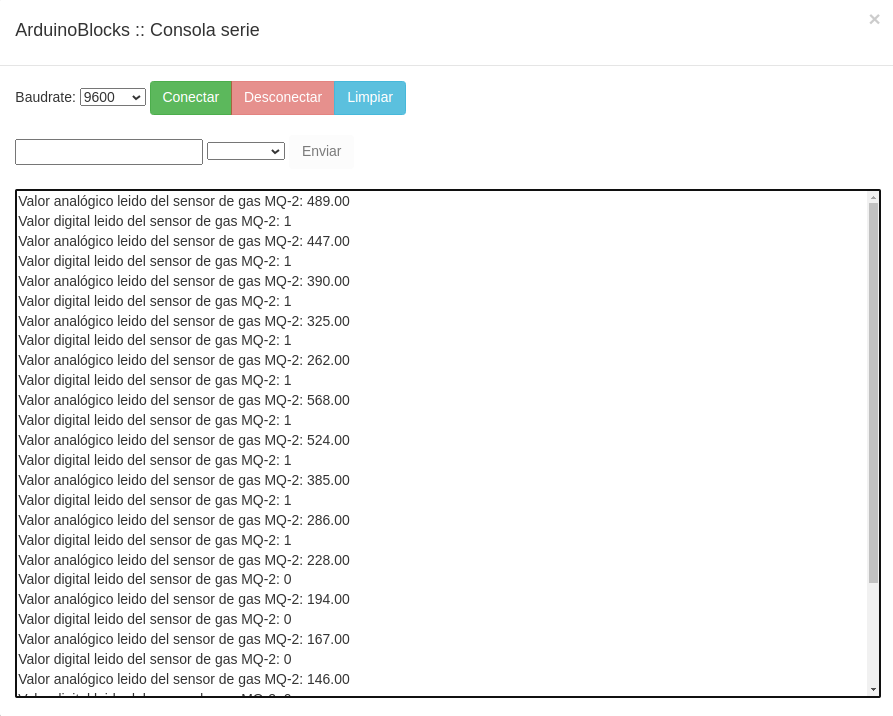
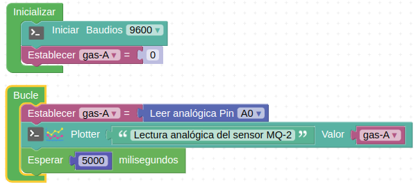
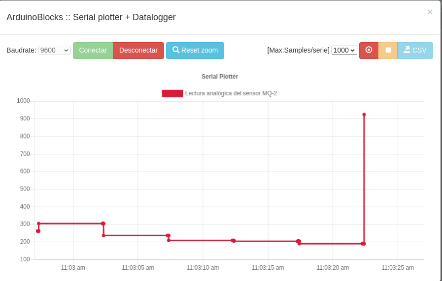
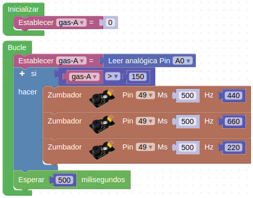

# Actividades con el sensor de gas MQ-2

## **Actividad A030**
Leer directamente el valor entregado por el sensor MQ-2 (pines A0 y A1) enviando los datos al terminal serie para detectar el ajuste del pin D0 (conectado al pin A1). El programa final queda como vemos en la figura siguiente y lo tenemos disponible en el enlace [Actividad MH-A030](../programas/MH-A030.abp).

*Solución A030*

El programa genera una salida por consola como la de la figura siguiente:

*Consola A030*

## **Actividad A031**
Vamos a convertir los datos obtenidos en el pin A1 en digitales a partir de las lecturas vistas en la actividad A030, de forma que si el valor leido en este pin es menor de 200 su valor digital será '0' y si es superior '1'. El programa final queda como vemos en la figura siguiente y lo tenemos disponible en el enlace [Actividad MH-A031](../programas/MH-A031.abp).

*Solución A031*

El programa genera una salida por consola como la de la figura siguiente:

*Consola A031*

## **Actividad A032**
Mostrar los datos entregados por el sensor MQ-2 (pines A0 y A1) en el serial plotter. El programa final queda como vemos en la figura siguiente y lo tenemos disponible en el enlace [Actividad MH-A032](../programas/MH-A032.abp).

*Solución A032*

El programa genera una salida en el plotter como la de la figura sigasguiente:

*Serial plotter A032*

## **Actividad A033**
Crear una alarma sonora para detección de gases. El programa final queda como vemos en la figura siguiente y lo tenemos disponible en el enlace [Actividad MH-A033](../programas/MH-A033.abp).

*Solución A033*

## Propuestas

* Repetir la actividad A030 mostrando los datos por la pantalla LCD.
* Convertir la alarma sonora de la actividad A033 en una alarma óptico-acústica utilizando los faros y la luz interior de la autocaravana.
* Reajustar la sensibilidad con el potenciómetro a otro valor y repetir las actividades resueltas.
