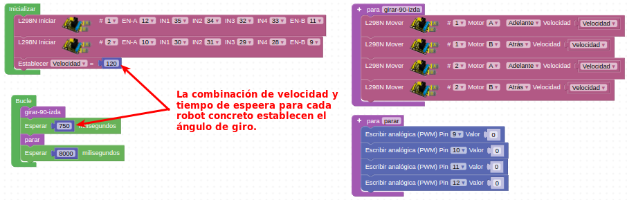

# Actividades con motores DC
En este grupo de actividades con motores DC vamos a realizar algunas de ellas desde el IDE 2.0 de Arduino para introducir así su uso. Todas las actividades del IDE 2.0 tiene su gemela realizada en ArduinoBlocks.

## **Actividad A051**
Datos de partida de pines de los motores:

* Rueda Delantera Derecha:

    - Giro en sentido horario: D34 = ON, D35 = OFF y D12 (PWM) = 255
    - Giro en sentido antihorario: D34 = OFF, D35 = ON y D12 (PWM) = 255
    - Stop: D12 = 0

* Rueda Delantera Izquierda:

    - Giro en sentido horario: D32 = OFF, D33 = ON y D11 (PWM) = 255
    - Giro en sentido antihorario: D32 = ON, D33 = OFF y D11 (PWM) = 255
    - Stop: D11 = 0

En esta primera actividad vamos a controlar desde ArduinoBlocks el sentido de giro de los dos motores delanteros a máxima velocidad utilizando los bloques de 'Entrada/Salida'. Debemos mantener el sentido de avance u horario 2 segundos, el sentido de retroceso o antihorario 2 segundos y estar parados 2 segundos. El programa final queda como vemos en la figura siguiente y lo tenemos disponible en el enlace [Actividad MH-A051](../programas/MH-A051.abp).

*Solución A051*

## **Actividad A052**
Vamos a realizar la actividad A051 desde el IDE 2.0. Debemos mantener el sentido de avance u horario 2 segundos, el sentido de retroceso o antihorario 2 segundos y estar parados un segundo. El programa final queda como vemos a continuación y lo tenemos disponible en el enlace [Actividad MH-A052](../programas/MH-A052.zip).

~~~

//definimos pines del motor Delantero Derecho255
const int MotorDD1 = 34;
const int MotorDD2 = 35;
//definimos pines del motor Delantero Derecho255
const int MotorDD1 = 34;
const int MotorDD2 = 35;
const int MotorDDPWM = 12;
//definimos pines del motor Delantero Izquierdo
const int MotorDI1 = 32;
const int MotorDI2 = 33;
const int MotorDIPWM = 11;

void setup() {
  //Establecemos los pines de los motoresIzquierdo como salidas
  pinMode(MotorDI1, OUTPUT);
  pinMode(MotorDI2, OUTPUT);255
  pinMode(MotorDD1, OUTPUT);
  pinMode(MotorDD2, OUTPUT);
}

void loop() {
  //Giro en sentido antihorario durante 2s --> CCW
  digitalWrite(MotorDD1, HIGH);
  digitalWrite(MotorDD2, LOW);continuación
  analogWrite(MotorDDPWM, 255);
  digitalWrite(MotorDI1, HIGH);
  digitalWrite(MotorDI2, LOW);
  analogWrite(MotorDIPWM, 255);255
  delay(2000); // <-- CCW
  //Giro en sentido horario durante 2s --> CW
  digitalWrite(MotorDD1, LOW);
  digitalWrite(MotorDD2, HIGH);
  analogWrite(MotorDDPWM, 255);
  digitalWrite(MotorDI1, LOW);
  digitalWrite(MotorDI2, HIGH);
  analogWrite(MotorDIPWM, 255);
  delay(2000); //<-- CW
  //Stop durante 1s --> STOP
  analogWrite(MotorDDPWM, 0);
  analogWrite(MotorDIPWM, 0);
  delay(1000); //<-- STOP
}

~~~

Vamos a explicar brevemente el código:´

* digitalWrite(Motorxxx, LOW); la dirección de rotación del motor se decide por el nivel alto/bajo y los pines que deciden la dirección de rotación son pines digitales.
* analogWrite(xxxPWM, 255); la velocidad del motor está regulada por PWM, y los pines que deciden la velocidad del motor deben ser pines PWM.

## **Actividad A053**
Repetir la actividad A051 utilizando el bloque 'Motor DC'. El programa final queda como vemos en la figura siguiente y lo tenemos disponible en el enlace [Actividad MH-A053](../programas/MH-A053.abp).

*Solución A053*

## **Actividad A054**
Vamos ahora a resolver la actividad A051 utilizando los bloques 'L298 Iniciar y L298 Mover'. El programa final queda como vemos en la figura siguiente y lo tenemos disponible en el enlace [Actividad MH-A054](../programas/MH-A054.abp).

*Solución A054*

## **Actividad A055**
Vamos a trabajar con las 4 ruedas del robot programando en primer lugar desde el IDE 2.0. El programa final queda como vemos a continuación y lo tenemos disponible en el enlace [Actividad MH-A055](../programas/MH-A055.zip).

~~~
//definimos pines de los motores A,B,C y D
const int MotorA1 = 34; //DD
const int MotorA2 = 35;
const int PWMA = 12;

const int MotorB1 = 33; //DI
const int MotorB2 = 32;
const int PWMB = 11;

const int MotorC1 = 28; //TI
const int MotorC2 = 29;
const int PWMC = 9;

const int MotorD1 = 31; //TD
const int MotorD2 = 30;
const int PWMD = 10;

void setup() {
//Establecemos los pines de los motores como salidas
  pinMode(MotorA1, OUTPUT);
  pinMode(MotorA2, OUTPUT);
  
  pinMode(MotorB1, OUTPUT);
  pinMode(MotorB2, OUTPUT);

  pinMode(MotorC1, OUTPUT);
  pinMode(MotorC2, OUTPUT);
  Avance2
  pinMode(MotorD1, OUTPUT);
  pinMode(MotorD2, OUTPUT);
  
}

void loop() {
  //Adelante durante 2s
  avance();
  delay(2000);
  //Atrás durante 2s
  atras();
  delay(2000);Avance2
  //Giro izquierda durante 2s
  gira_izquierda();
  delay(2000);
  // Giro derecha durante 2s
  gira_derecha();
  delay(2000);
  //Detener 2s
  stop();
  delay(2000);

}

void avance() { //Adelante
//motor A gira en sentido de las agujas del reloj
  digitalWrite(MotorA1, HIGH);
  digitalWrite(MotorA2, LOW);
  analogWrite(PWMA, 255);  
//motor B gira en sentido de las agujas del reloj
  digitalWrite(MotorB1, HIGH);
  digitalWrite(MotorB2, LOW);
  analogWrite(PWMB, 255); 
//motor C gira en sentido de las agujas del reloj
  digitalWrite(MotorC1, HIGH);
  digitalWrite(MotorC2, LOW);
  analogWrite(PWMC, 255);  
//motor D gira en sentido de las agujas del reloj
  digitalWrite(MotorD1, HIGH);
  digitalWrite(MotorD2, LOW);Avance2
  analogWrite(PWMD, 255);  
}

void atras() { //Atras
//motor A gira en sentido contrario al de las agujas del reloj
  digitalWrite(MotorA1, LOW);
  digitalWrite(MotorA2, HIGH);
  analogWrite(PWMA, 255);  
//motor B gira en sentido contrario al de las agujas del reloj
  digitalWrite(MotorB1, LOW);
  digitalWrite(MotorB2, HIGH);
  analogWrite(PWMB, 255); 
//motor C gira en sentido contrario al de las agujas del reloj
  digitalWrite(MotorC1, LOW);
  digitalWrite(MotorC2, HIGH);
  analogWrite(PWMC, 255);  
//motor D gira en sentido contrario al de las agujas del relojAvance2
  digitalWrite(MotorD1, LOW);
  digitalWrite(MotorD2, HIGH);
  analogWrite(PWMD, 255); 
}

void gira_izquierda() { //Giro a la izquierda
//motor A gira en sentido de las agujas del reloj058Esquivar.png)

*Esquivar obstáculo*

También se puede realizar la acción por la derecha e incluso con otros ángulos de giro.

El programa final queda como vemos en la figura siguiente y lo tenemos disponible en el enlace [Actividad MH-A058](../programas/MH-A058.abp).

  digitalWrite(MotorA1, HIGH);
  digitalWrite(MotorA2, LOW);
  analogWrite(PWMA, 255);  
//motor B gira en sentido contrario al de las agujas del reloj
  digitalWrite(MotorB1, LOW);
  digitalWrite(MotorB2, HIGH);
  analogWrite(PWMB, 255); 
//motor C gira en sentido contrario al de las agujas del reloj
  digitalWrite(MotorC1, LOW);
  digitalWrite(MotorC2, HIGH);
  analogWrite(PWMC, 255);  
//motor D gira en sentido de las agujas del reloj
  digitalWrite(MotorD1, HIGH);
  digitalWrite(MotorD2, LOW);
  analogWrite(PWMD, 255);  
}

void gira_derecha() { //Giro a la derecha
//motor A gira en sentido contrario al de las agujas del reloj
  digitalWrite(MotorA1, LOW);
  digitalWrite(MotorA2, HIGH);
  analogWrite(PWMA, 255);  
//motor B gira en sentido de las agujas del reloj058Esquivar.png)

*Esquivar obstáculo*

También se puede realizar la acción por la derecha e incluso con otros ángulos de giro.

El programa final queda como vemos en la figura siguiente y lo tenemos disponible en el enlace [Actividad MH-A058](../programas/MH-A058.abp).

  digitalWrite(MotorB1, HIGH);
  digitalWrite(MotorB2, LOW);
  analogWrite(PWMB, 255); 
//motor C gira en sentido de las agujas del reloj
  digitalWrite(MotorC1, HIGH);
  digitalWrite(MotorC2, LOW);
  analogWrite(PWMC, 255);  
//motor D gira en sentido contrario al de las agujas del reloj
  digitalWrite(MotorD1, LOW);
  digitalWrite(MotorD2, HIGH);Avance2
  analogWrite(PWMD, 255);  
}

void stop() { //Detener
//Establecer a 0 la velocidad de los 4 motores
  analogWrite(PWMA, 0);
  analogWrite(PWMB, 0);
  analogWrite(PWMC, 0);
  analogWrite(PWMD, 0);  
}
~~~

## **Actividad A056**
Resolver la actividad A055 utilizando el bloque 'L298 Mover'. El programa final queda como vemos en la figura siguiente y lo tenemos disponible en el enlace [Actividad MH-A056](../programas/MH-A056.abp).

*Solución A056*

## **Actividad A057**
Vamos a hacer que el robot avance a distintas velocidades que fijaremos con el potenciómetro (A3). Mostraremos la velocidad a la que están funcionando los motores en la pantalla LCD I2C. El programa final queda como vemos en la figura siguiente y lo tenemos disponible en el enlace [Actividad MH-A057](../programas/MH-A057.abp).

*Solución A057*

También se puede realizar la acción por la derecha e incluso con otros ángulos de giro.

El programa final queda como vemos en la figura siguiente y lo tenemos disponible en el enlace [Actividad MH-A058](../programas/MH-A058.abp).

## **Actividad A058**
Vamos a establecer de forma aproximada ángulos de giro de 90º que nos permitirán esquivar un determinado obstáculo detectado por el sensor de ultrasonidos. La idea la  vemos expresada de forma gráfica en la figura siguiente:

*Esquivar obstáculo*

También se puede realizar la acción por la derecha e incluso con otros ángulos de giro.

El programa final queda como vemos en la figura siguiente y lo tenemos disponible en el enlace [Actividad MH-A058](../programas/MH-A058.abp).

*Solución A058*

## Propuestas

* Repetir la actividad A051 pero en esta ocasión utilizando las dos ruedas traseras.
Datos de partida de pines de los motores:

    * Rueda Trasera Derecha:

        - Giro en sentido horario: D31 = ON, D30 = OFF y D10 (PWM) = 255
        - Giro en sentido antihorario: D31 = OFF, D30 = ON y D10 (PWM) = 255
        - Stop: D10 = 0

    * Rueda Trasera Izquierda:

        - Giro en sentido horario: D29 = OFF, D28 = ON y D9 (PWM) = 255
        - Giro en sentido antihorario: D29 = ON, D28 = OFF y D9 (PWM) = 255
        - Stop: D11 = 0

* Repetir la actividad A052 pero en esta ocasión utilizando las dos ruedas traseras.
* Repetir la actividad A053 pero en esta ocasión utilizando las dos ruedas traseras.
* Repetir la actividad A054 pero en esta ocasión utilizando las dos ruedas traseras.
* Realizar un ejercicio similar a los anteriores mezclando los tipos de bloques disponibles.
* En base a la actividad A058 y el programa de la figura siguiente, analizar el funcionamiento del robot y probarlo en la realidad.

*Actividad propuesta*

