# Actividades con las tiras de LEDs RGB direccionables

## **Actividad A036**
Utilizando los bloques 'Iniciar', 'Establecer pixel #' y ' Mostrar' encender dos LEDs diferentes. El programa final queda como vemos en la figura siguiente y lo tenemos disponible en el enlace [Actividad MH-A036](../programas/MH-A036.abp).

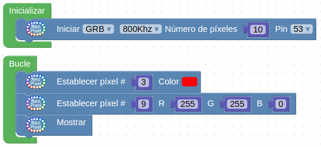

*Solución A036*

Recuérdese siempre que los LEDs se numeran empezando por 0, es decir índice 0. El bloque 'Mostrar' es imprescindible pues el bloque 'Establecer pixel #' lo único que hace es indicar el color en caso de que el LED se ilumine pero realmente quien lo enciende es 'Mostrar'.

## **Actividad A037**
Encender todos los LEDs de las tiras de un color ajustando su brillo a un nivel de 100. El programa final queda como vemos en la figura siguiente y lo tenemos disponible en el enlace [Actividad MH-A037](../programas/MH-A037.abp).

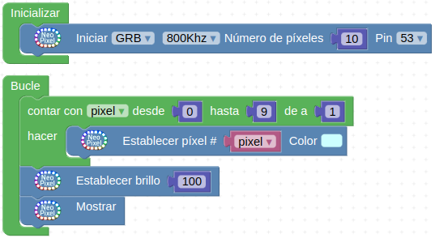

*Solución A037*

## **Actividad A038**
Vamos a hacer que los LEDs se enciendan de uno en uno con un pequeño retardo y que cuando estén todos encendidos, se apaguen y vuelva a empezar el ciclo. El programa final queda como vemos en la figura siguiente y lo tenemos disponible en el enlace [Actividad MH-A038](../programas/MH-A038.abp).

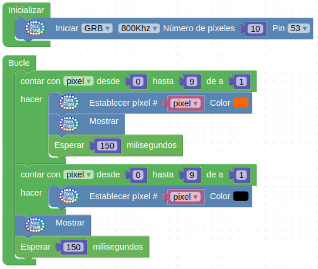

*Solución A038*

**Establecer el color en negro es equivalente a  apagar el LED.**

## **Actividad A039**
Vamos a hacer que los LEDs se enciendan de uno en uno con un pequeño retardo y que cuando estén todos encendidos, se apaguen en el orden inverso al de encendido también con un pequeño retardo. Una vez apagados permanecerán así durante tres segundos antes de iniciar el ciclo de nuevo. El programa final queda como vemos en la figura siguiente y lo tenemos disponible en el enlace [Actividad MH-A039](../programas/MH-A039.abp).

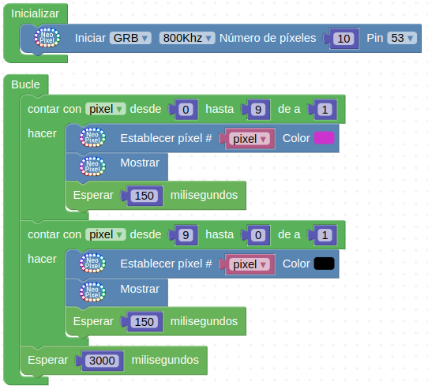

*Solución A039*

El apagado de los LEDs lo hacemos con un contador decreciente o decontador.

## **Actividad A040**
Vamos a hacer que los LEDs se enciendan de uno en uno pero desplazando el LED encendido, es decir apagando el anterior y esperando un segundo entre cambio de LED. El programa final queda como vemos en la figura siguiente y lo tenemos disponible en el enlace [Actividad MH-A040](../programas/MH-A040.abp).

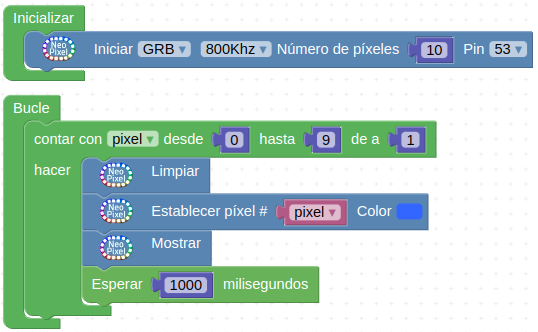

*Solución A040*

## **Actividad A041**
Vamos a hacer que los LEDs se enciendan de uno en uno pero desplazando el LED encendido, es decir apagando el anterior y cuando lleguemos al final recorremos la tira pero a la inversa. El programa final queda como vemos en la figura siguiente y lo tenemos disponible en el enlace [Actividad MH-A041](../programas/MH-A041.abp).

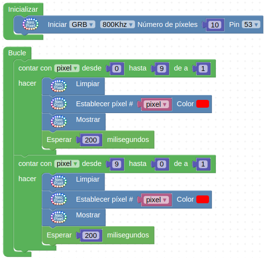

*Solución A041*

## **Actividad A042**
En este caso vamos a crear tres variables nombradas R, G y B. El bloque de generación de números aleatorios lo encontramos en 'Matemáticas' y haremos que cada variable pueda tomar valores entre 0 y 255 que son los posibles valores para cada color. Para que todos tengan el mismo color tenemos que definir el valor de las variables y luego encender los LEDs. El programa final queda como vemos en la figura siguiente y lo tenemos disponible en el enlace [Actividad MH-A042](../programas/MH-A042.abp).

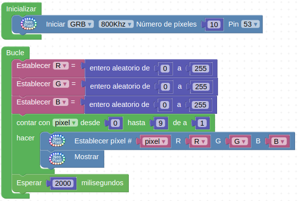

*Solución A042*

## **Actividad A043**
Hacer que cada LED se encienda de un color aleatorio diferente. El programa final queda como vemos en la figura siguiente y lo tenemos disponible en el enlace [Actividad MH-A043](../programas/MH-A043.abp).

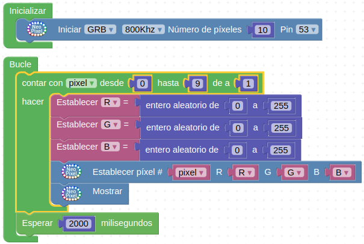

*Solución A043*

## **Actividad A044**
Encender en un determinado color un LED aleatorio cada segundo. El programa final queda como vemos en la figura siguiente y lo tenemos disponible en el enlace [Actividad MH-A044](../programas/MH-A044.abp).

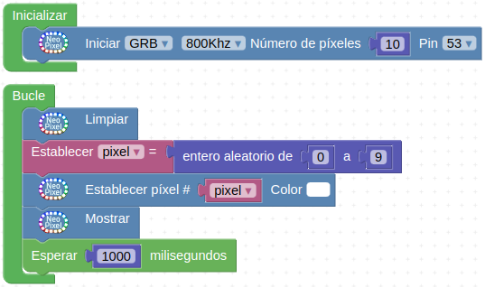

*Solución A044*

## **Actividad A045**
Encender en un color aleatorio un LED también aleatorio cada segundo. El programa final queda como vemos en la figura siguiente y lo tenemos disponible en el enlace [Actividad MH-A045](../programas/MH-A045.abp).

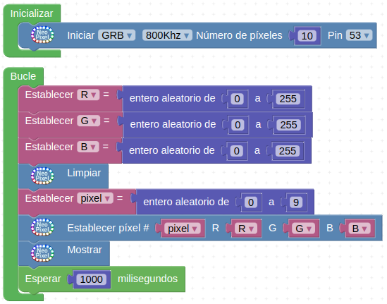

*Solución A045*

## **Actividad A046**
Se trata de hacer que el LED encendido cambie al siguiente cada vez que accionamos el pulsador (conectado a D2). También vamos a hacer que cuando los LEDs avancen lo hagan en grupo. Para ello lo que hacemos es que se iluminen al mismo tiempo los LEDs que corresponden a la variable, pero también los de la variable+1. El programa final queda como vemos en la figura siguiente y lo tenemos disponible en el enlace [Actividad MH-A046](../programas/MH-A046.abp).

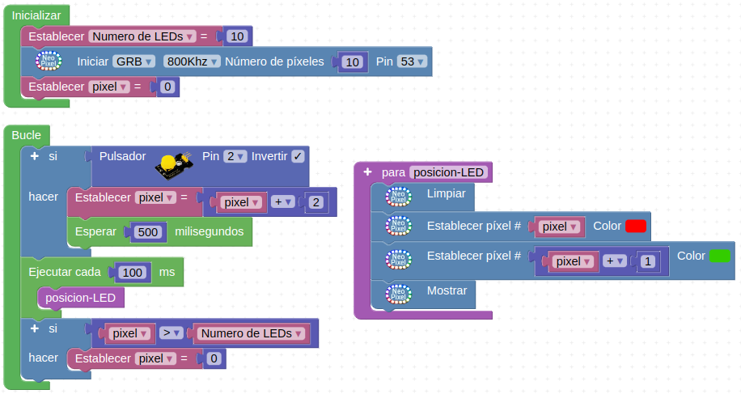

*Solución A046*

## **Actividad A047**
Vamos a hacer que todos los LEDs cambien su luminosidad o brillo en función de una variable analógica basada en el potenciómetro. El programa final queda como vemos en la figura siguiente y lo tenemos disponible en el enlace [Actividad MH-A047](../programas/MH-A047.abp).

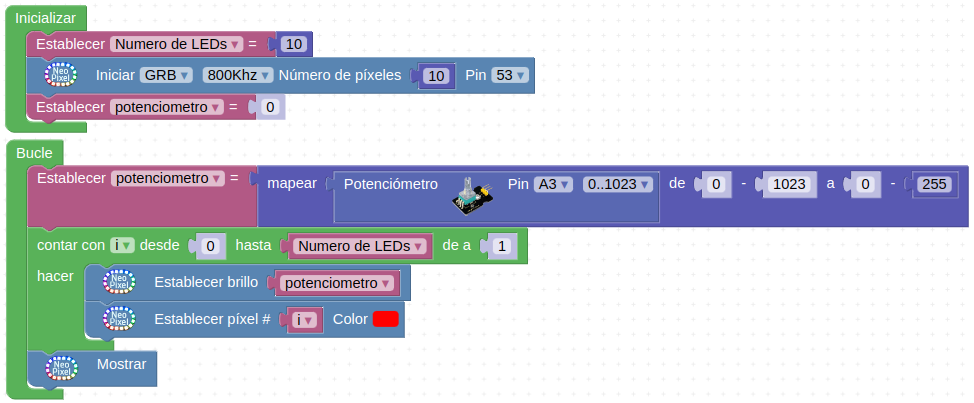

*Solución A047*

## Propuestas

* Retomar las actividades de crear un sistema de alarma con el sensor de movimiento PIR para añadirle un efecto luminoso creado con las tiras de LEDs.
* Retomar las actividades de crear un sistema de alarma con el sensor de gases MQ-2 para añadirle un efecto luminoso creado con las tiras de LEDs.
