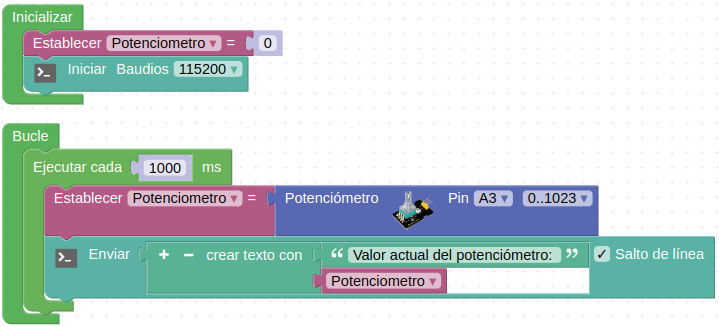
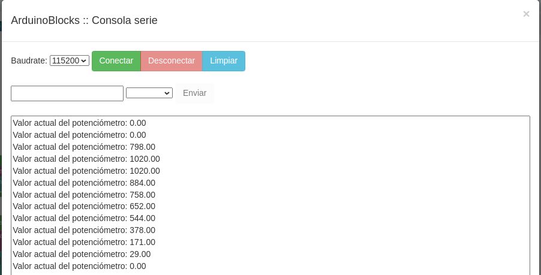
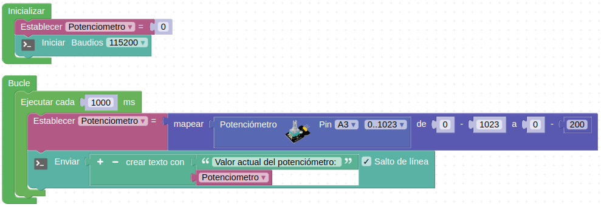
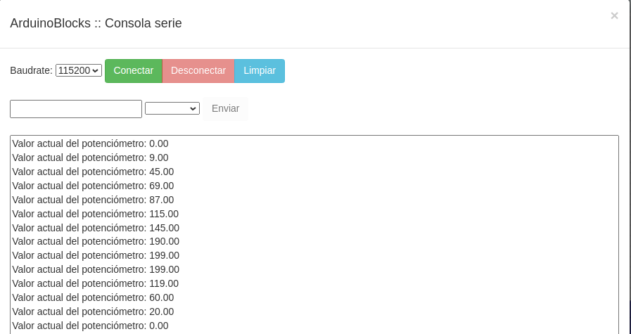
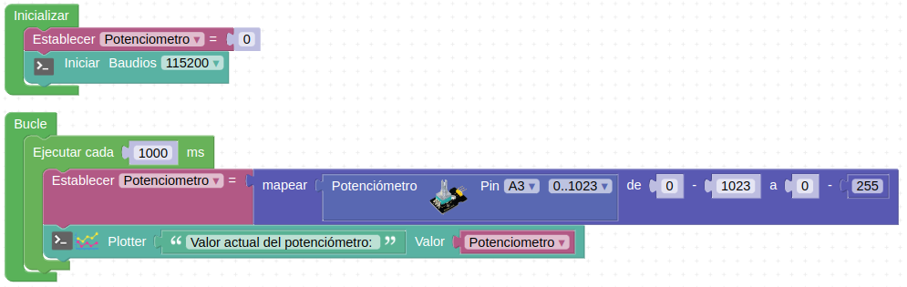
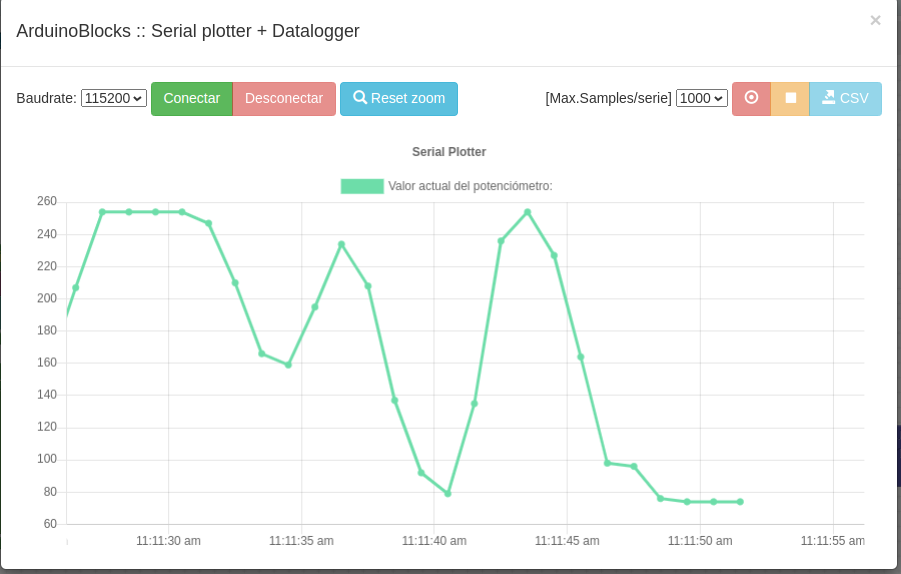
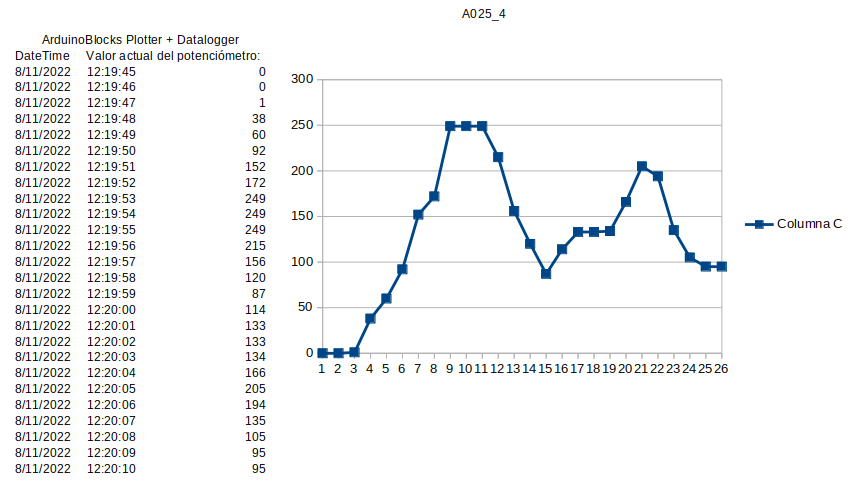

# Actividades con el potenciómetro

## **Actividad A025**

### 1. consola
Vamos a guardar los datos leídos del potenciómetro en una variable y mostrarlos a través de la consola serie. El programa final queda como vemos en la figura siguiente y lo tenemos disponible en el enlace [Actividad MH-A025. Consola](../programas/MH-A025_1.abp).

*Solución A025. Consola*

Si cargamos el programa en nuestra placa y posteriormente activamos la consola y conectamos ArduinoBlocks con nuestro ordenador podemos ver un resultado similar al de la imagen siguiente que se corresponde con variaciones de extremo a extremo del potenciómetro.

*Aspecto de la consola*

### 2. Mapeo de datos
Vamos a modificar el programa de la parte 1 del reto para mapear los datos antes de enviarlos a la consola serie. El programa final queda como vemos en la figura siguiente y lo tenemos disponible en el enlace [Actividad MH-A025. Mapeo de datos](../programas/MH-A025_2.abp).

*Solución A025. Mapeo de datos*

La consola mostrará un resultado similar al de la imagen siguiente que se corresponde con variaciones de extremo a extremo del potenciómetro.

*Aspecto de la consola*

### 3. Serial plotter
Vamos ahora a mapear y mostrar los datos leídos del potenciómetro en el Serial Plotter. El programa final queda como vemos en la figura siguiente y lo tenemos disponible en el enlace [Actividad MH-A025. Serial plotter](../programas/MH-A025_3.abp).

*Solución A025. Mapeo de datos*

Si activamos el Serial Plotter y vamos variando el potenciometro veremos el resultado en el mismo, obteniendo algo similar a la imagen siguiente:

*Aspecto del serial plotter*

### 4. Datalogger
Vamos ahora a activar el "comecocos" o datalogger, dejarlo unos instantes que registre datos, pararlo, guardar el archivo y abrirlo desde la hoja de cálculo LibreOffice Calc para ver los resultados. El programa final es el mismo que el de la actividad anterior. En la animación siguiente vemos el proceso de puesta en marcha y parada del datalogger. En el enlace tenemos el archivo CSV generado [Archivo CSV](../programas/A025_4.csv).

*Solución A025. Datalogger*

En la figura siguiente vemos el resultado de cargar ese archivo en Calc. Se ha añadido una gráfica para observar como es totalmente similar a la que vemos en el datalogger. Los datos y la gráfica se han dejado tal cual son de inicio y no se ha entrado en mas detalles de edición de los mismos.

*Archivo CSV en Calc*

## Propuestas

* Repetir la actividad A025 configurando el bloque potenciómetro en porcentaje.
* Realizar un control de los faros de la autocaravana mediante el potenciómetro dividiendo el rango total en 8 partes tal y como vemos en la tabla siguiente:

| Color | Rango | R | G | B |
|---|:|:|:|:|
| Rojo | 0 a 127 | 255 | 0 | 0 |
| Verde | 128 a 255 | 0 | 255 | 0 |
| Azul | 256 a 384 | 0 | 0 | 255 |
| Amarillo | 385 a 512 | 255 | 255 | 0 |
| Cian | 513 a 640 | 0 | 255 | 255 |
| Magenta | 641 a 768 | 255 | 0 | 255 |
| Blanco | 769 a 896 | 255 | 255 | 255 |
| Naranja | 897 a 1023 | 255 | 127 | 0 |

* Repetir la actividad anterior mostrando el resultado por la consola.
* Realizar un programa con el sensor DHT11 que muestre los datos de temperatura y humedad en el serial plotter. Hacer un registro de datos con el datalogger y exportar los registros realizados.
