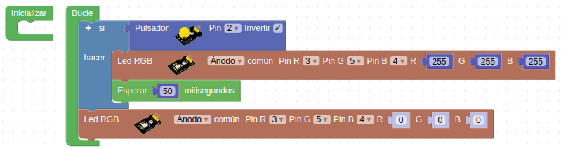
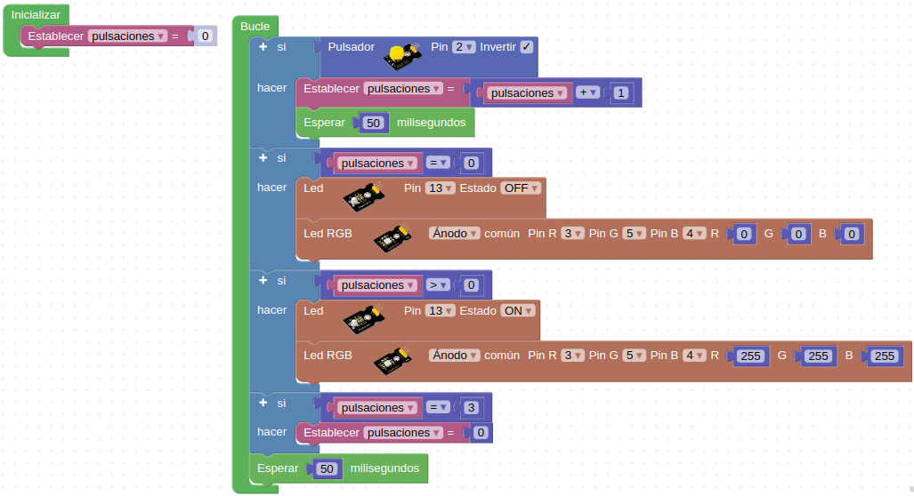
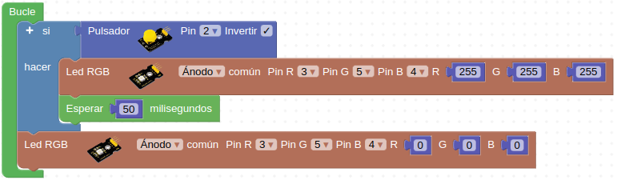

# Actividades con botón pulsador

## **Actividad A008**
Vamos a hacer que cuando accionamos el pulsador conectado al pin D2 se enciendan los faros de la autocaravana y cuando lo soltemos que se apaguen. El programa final queda como vemos en la figura siguiente y lo tenemos disponible en el enlace [Actividad MH-A008](../programas/MH-A008.abp).

*Solución A008*

## **Actividad A009**
Vamos a hacer un programa que al accionar el pulsador se enciendan los faros de la autocaravana y el LED blanco interior y que permanezcan encendidos hasta que no pulsemos dos veces mas (3 pulsaciones en total), en cuyo caso se apagarán. El programa final queda como vemos en la figura siguiente y lo tenemos disponible en el enlace [Actividad MH-A009](../programas/MH-A009.abp).

*Solución A009*

## **Actividad A010**
Partiendo del alfabeto Morse y haciendo el equivalente directo a señal con luz vamos a hacer un programa que al accionar el pulsador se enciendan los faros durante tiempos cortos y largos para emitir señales en este código. El programa final queda como vemos en la figura siguiente y lo tenemos disponible en el enlace [Actividad MH-A010](../programas/MH-A010.abp).

*Solución A010*

En la figura siguiente vemos el alfabeto Morse.

*Alfabeto Morse*

## Propuestas

* Resolver la actividad A008 de forma que el funcionamiento sea al contrario, es decir, que los faros estén siempre encendidos y al accionar el pulsador se apaguen.
* Hacer un programa que al accionar el pulsador los faros de la autocaravana emitan la señal SOS Morse de forma indefinida a intervalos de tres segundos hasta que se vuelva a accionar el pulsador.
