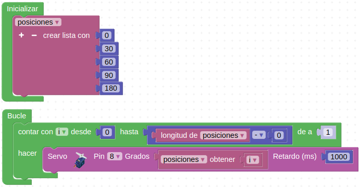
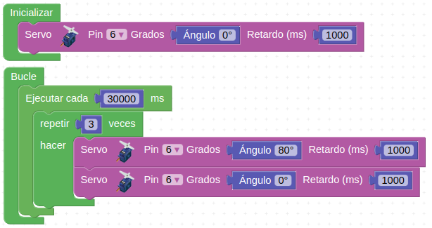
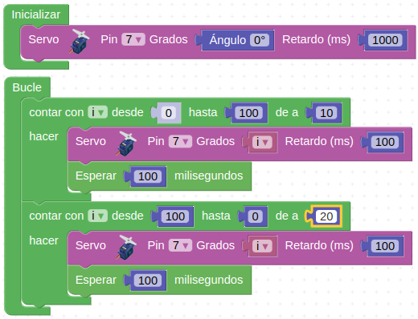

# Actividades con los servomotores
Antes de comenzar las actividades con los servos es muy importante asegurarnos de que hemos seguido los pasos descritos en el apartado [Preliminar](../preliminar.md) donde se describe detalladamente como posicionar cada uno de los tres servos que se montan, el de la puerta, el del portón abatible trasero y el del techo corredizo. El posicionado correcto de los servo se corresponde con las siguientes posiciones de cada elemento:

* Puerta lateral abierta
* Puerta abatible trasera abierta
* Techo corredizo cerrado

## **Actividad A048**
Esta primera actividad va a consistir en posicionar el **servo de la ventana corredera del techo** (pin D8) en posiciones prefijadas en una lista. El programa final queda como vemos en la figura siguiente y lo tenemos disponible en el enlace [Actividad MH-A048](../programas/MH-A048.abp).

*Solución A048*

Revisa el apartado mejora realizado en el [montaje de los tableros N y O](../parte5.md) para asegurar un correcto funcionamiento.

## **Actividad A049**
En esta actividad controlaremos la posición angular del **servo de la puerta lateral** (pin D6) de forma que la abriremos y cerraremos 3 veces a intervalos de 30 segundos. El programa final queda como vemos en la figura siguiente y lo tenemos disponible en el enlace [Actividad MH-A049](../programas/MH-A049.abp).

*Solución A049*

<b></b>Es muy posible que la puerta roce un poco con las aristas del panel vertical y por ello debemos tener cuidado las primeras veces que la accionamos</b>

## **Actividad A050**
En esta actividad controlaremos la posición angular del **servo de la puerta abatible trasera** (pin D7). El programa final queda como vemos en la figura siguiente y lo tenemos disponible en el enlace [Actividad MH-A050](../programas/MH-A050.abp).

*Solución A050*

## Propuestas

* Mover el techo abatible utilizando el potenciómetro.
* Abrir y cerrar la puerta lateral mediante el pulsador.
* Abrir y cerrar la puerta abatible trasera utilizando el pulsador.
