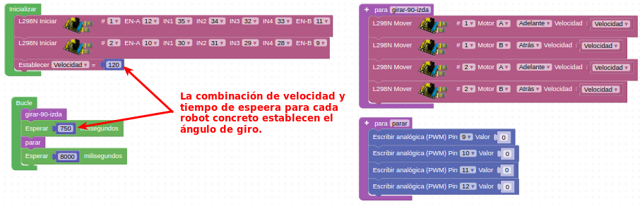

# Actividades sensor seguidor de línea

## **Actividad A059**
Vamos a establecer de forma aproximada ángulos de giro de 90º que nos permitirán esquivar un determinado obstáculo detectado por el sensor de ultrasonidos. El programa final queda como vemos en la figura siguiente y lo tenemos disponible en el enlace [Actividad MH-A058](../programas/MH-A058.abp).

*Solución A058*

## Propuestas

* xx