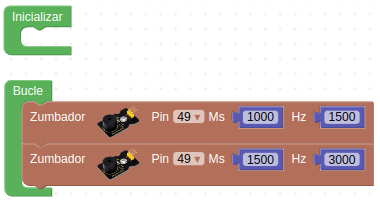
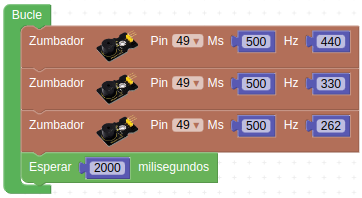
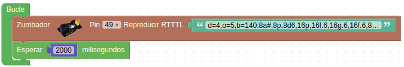
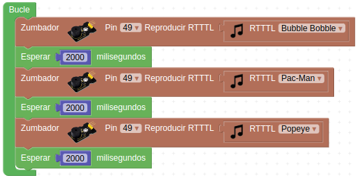

# Actividades con el amplificador de potencia

## **Actividad A013**
Vamos a crear una simple sirena utilizando los bloques de sonido. El programa final queda como vemos en la figura siguiente y lo tenemos disponible en el enlace [Actividad MH-A013](../programas/MH-A013.abp).

*Solución A013*

## **Actividad A014**
Reproducir las notas La (440 Hz), Mi (330 Hz) y Do (262 Hz) utilizando el bloque de la actividad A013 con una duración de 500ms. El programa final queda como vemos en la figura siguiente y lo tenemos disponible en el enlace [Actividad MH-A014](../programas/MH-A014.abp).

*Solución A014*

## **Actividad A014**
Reproducir la introducción de Donkey Kong a partir del dato de la teoría. El programa final queda como vemos en la figura siguiente y lo tenemos disponible en el enlace [Actividad MH-A015](../programas/MH-A015.abp).

*Solución A015*

## **Actividad A015**
Reproducir tres de las melodías incluidas en ArduinoBlocks. El programa final queda como vemos en la figura siguiente y lo tenemos disponible en el enlace [Actividad MH-A016](../programas/MH-A016.abp).

*Solución A016*

## Propuestas

* Repetir la actividad A013 cambiando las frecuencias y los tiempos para mejorar la sirena.
* Repetir la actividad A014 utilizando el bloque 'Tono' en lugar de especificar el valor de la frecuencia y completando la escala musical.
* Reproducir la melodía de la imagen siguiente sabiendo que las negras tienen una duración de 500ms, las negras con un puntito 750ms y las blancas 1000ms.

*Himno a la alegria*

* Reproducir diferentes melodías a partir de los bloques RTTTL (Ring Tone Text Transfer Language o lenguaje de tonos de llamada) que descarguemos de las páginas web propuestas.
