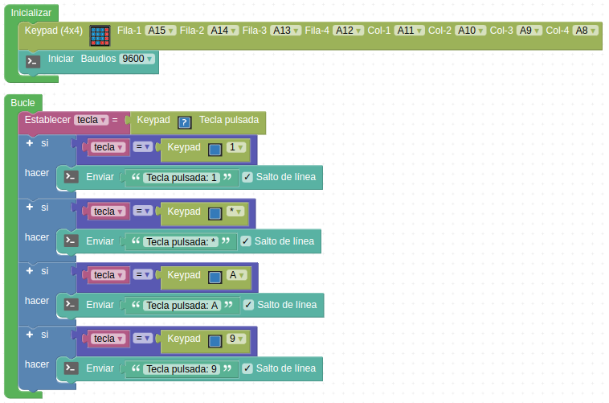
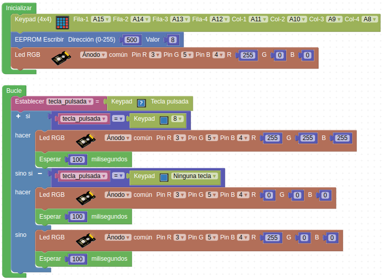

# Actividades con teclado matricial de membrana de 4x4

## **Actividad A011**
En esta actividad configuramos el teclado matricial y la consola serie para leer las teclas 1, *, A y 9 y si se pulsa algo distinto no se envía nada. El programa final queda como vemos en la figura siguiente y lo tenemos disponible en el enlace [Actividad MH-A011](../programas/MH-A011.abp).

*Solución A011*

## **Actividad A012**
Vamos a hacer un sencillo control de clave por teclado guardando previamente la clave en la memoria EEPROM y leyendo la misma, pero la introducida por teclado, la comparamos con la de la memoria. Si la clave es correcta iluminamos los faros en blanco, si no lo es en rojo y si no pulsamos ninguna tecla deben permanecer apagados. El programa final queda como vemos en la figura siguiente y lo tenemos disponible en el enlace [Actividad MH-A012](../programas/MH-A012.abp).

*Solución A012*

## Propuestas

* Hacer un programa que nos envíe a la consola la tecla pulsada en el teclado de 4x4.
* Repetir la actividad A012 utilizando mas de un carácter de los posibles con el teclado.
