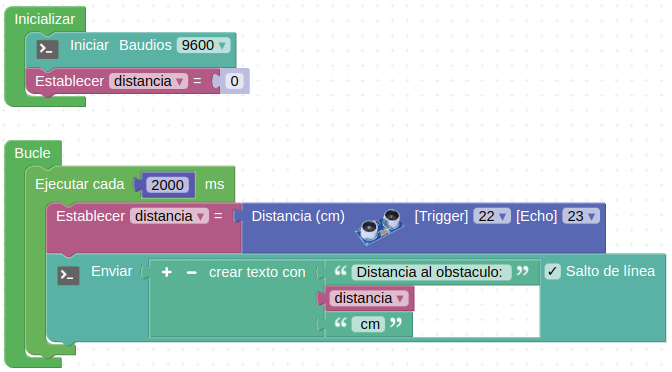
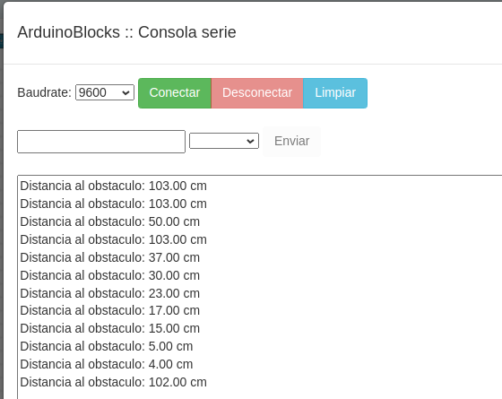
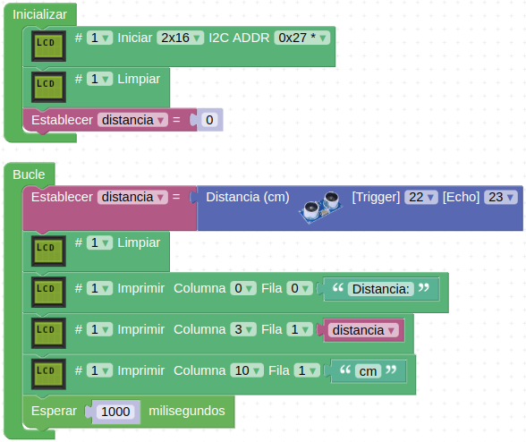

# Actividades con el sensor de ultrasonidos

## **Actividad A034**
Mostrar por consola la distancia medida por el sensor de ultrasonidos enviando un dato cada dos segundos. El programa final queda como vemos en la figura siguiente y lo tenemos disponible en el enlace [Actividad MH-A034](../programas/MH-A034.abp).

*Solución A034*

El programa genera una salida por consola como la de la figura siguiente:

*Consola A034*

## **Actividad A035**
Mostrar en una LCD la distancia que nos devuelve el sensor de ultrasonidos al poner frente al mismo un objeto. El programa final queda como vemos en la figura siguiente y lo tenemos disponible en el enlace [Actividad MH-A035](../programas/MH-A035.abp).

*Solución A035*

## Propuestas

* Encender los faros de la autocaravana cuando se detecte un objeto a menos de 10cm.
* Añadir a la actividad propuesta anterior un sonido de aviso.
