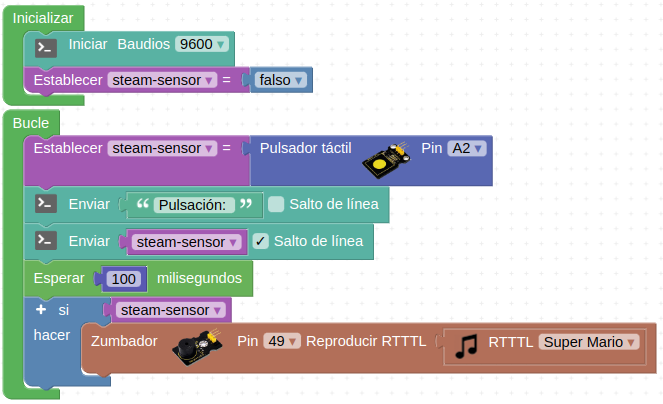
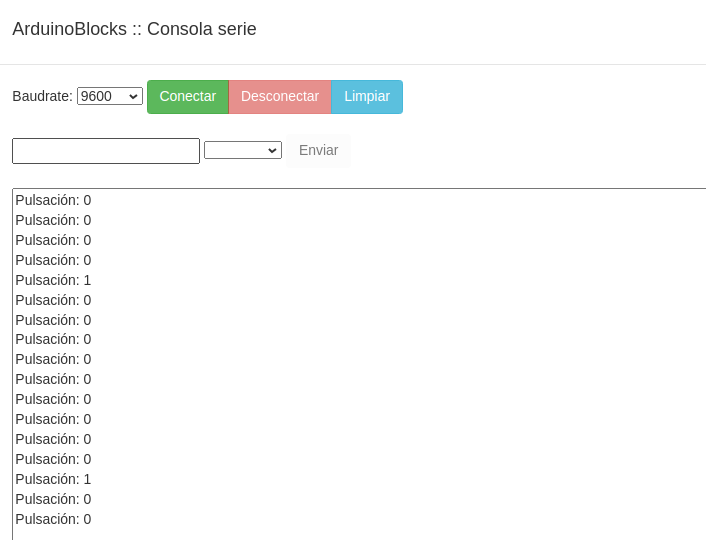
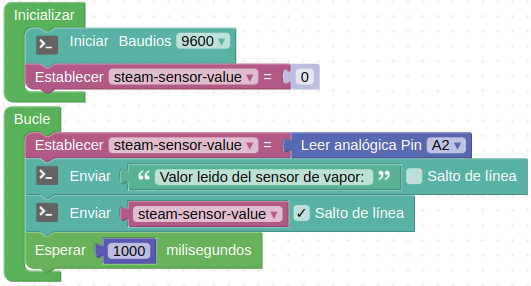
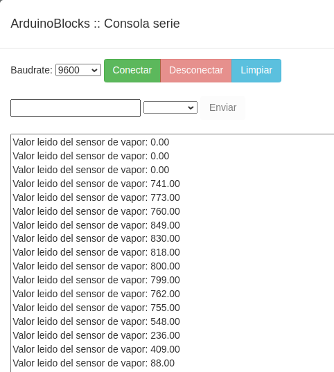

# Actividades con el sensor de vapor (steam)

## **Actividad A028**
Vamos a leer los datos del sensor de forma booleana, mostrarlos a través de la consola serie y hacer sonar el amplificador cuando el sensor actúa como detector táctil. El programa final queda como vemos en la figura siguiente y lo tenemos disponible en el enlace [Actividad MH-A028](../programas/MH-A028.abp).

*Solución A028*

El programa genera una salida por consola como la de la figura siguiente:

*Consola A028*

## **Actividad A029**
Leer y mostrar en la consola serie el valor entregado por el sensor steam. El programa final queda como vemos en la figura siguiente y lo tenemos disponible en el enlace [Actividad MH-A029](../programas/MH-A029.abp).

*Solución A029*

El programa genera una salida por consola como la de la figura siguiente:

*Consola A029*

## Propuestas

* Repetir la actividad A028 trabajando con el diodo LED interior.
* Repetir la actividad A029 mostrando los datos leídos en la pantalla LCD.
# Actividades con el sensor de vapor (steam)

## **Actividad A028**
Vamos a leer los datos del sensor de forma booleana, mostrarlos a través de la consola serie y hacer sonar el amplificador cuando el sensor actúa como detector táctil. El programa final queda como vemos en la figura siguiente y lo tenemos disponible en el enlace [Actividad MH-A028](../programas/MH-A028.abp).

*Solución A028*

El programa genera una salida por consola como la de la figura siguiente:

*Consola A028*

## **Act# Actividades con el sensor de vapor (steam)

## **Actividad A028**
Vamos a leer los datos del sensor de forma booleana, mostrarlos a través de la consola serie y hacer sonar el amplificador cuando el sensor actúa como detector táctil. El programa final queda como vemos en la figura siguiente y lo tenemos disponible en el enlace [Actividad MH-A028](../programas/MH-A028.abp).

*Solución A028*

El programa genera una salida por consola como la de la figura siguiente:

*Consola A028*

## **Act# Actividades con el sensor de vapor (steam)

## **Actividad A028**
Vamos a leer los datos del sensor de forma booleana, mostrarlos a través de la consola serie y hacer sonar el amplificador cuando el sensor actúa como detector táctil. El programa final queda como vemos en la figura siguiente y lo tenemos disponible en el enlace [Actividad MH-A028](../programas/MH-A028.abp).

*Solución A028*

El programa genera una salida por consola como la de la figura siguiente:

*Consola A028*

## **Actividad A029**
Leer y mostrar en la consola serie el valor entregado por el sensor steam. El programa final queda como vemos en la figura siguiente y lo tenemos disponible en el enlace [Actividad MH-A029](../programas/MH-A029.abp).

*Solución A029*

El programa genera una salida por consola como la de la figura siguiente:

*Consola A029*

## Propuestas

* Repetir la actividad A028 trabajando con el diodo LED interior.
* Repetir la actividad A029 mostrando los datos leídos en la pantalla LCD.
ividad A029**
Leer y mostrar en la consola serie el valor entregado por el sensor steam. El programa final queda como vemos en la figura siguiente y lo tenemos disponible en el enlace [Actividad MH-A029](../programas/MH-A029.abp).

*Solución A029*

El programa genera una salida por consola como la de la figura siguiente:

*Consola A029*

## Propuestas

* Repetir la actividad A028 trabajando con el diodo LED interior.
* Repetir la actividad A029 mostrando los datos leídos en la pantalla LCD.
ividad A029**
Leer y mostrar en la consola serie el valor entregado por el sensor steam. El programa final queda como vemos en la figura siguiente y lo tenemos disponible en el enlace [Actividad MH-A029](../programas/MH-A029.abp).

*Solución A029*

El programa genera una salida por consola como la de la figura siguiente:

*Consola A029*

## Propuestas

* Repetir la actividad A028 trabajando con el diodo LED interior.
* Repetir la actividad A029 mostrando los datos leídos en la pantalla LCD.
