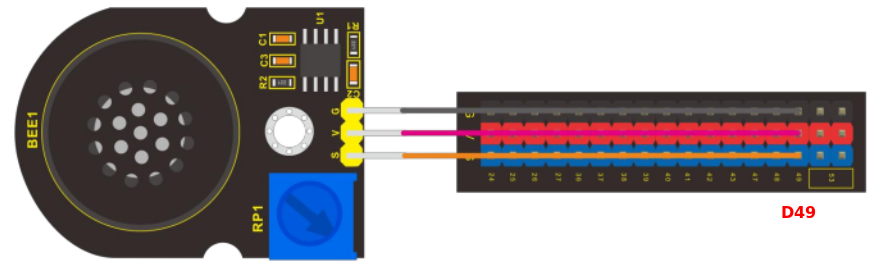
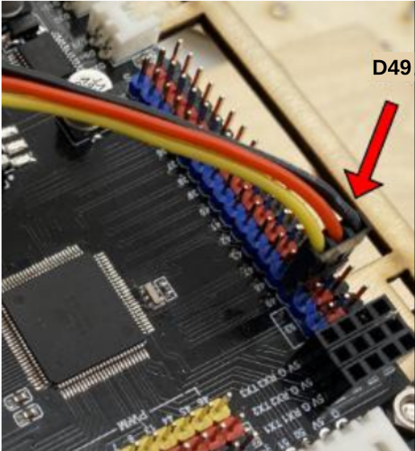
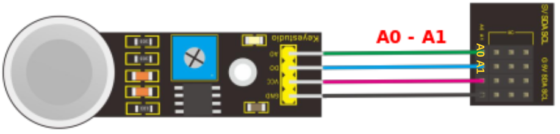

# Conexionado y fin de ensamblado
Describiremos principalmente de una forma gráfica donde va conectado cada elemento.

## **Motores**
La figura siguiente muestra gráficamente como van conectados los motores a la placa de control.

*Gráfico de conexiones de motores en la placa de control*

Vamos pasando uno a uno los cables de los motores por el orificio circular de la placa C llegando a la placa de control a través del orificio cuadrado dispuesto para el paso de cables. Lo hacemos uno a uno o bien etiquetamos a que motor pertenece cada grupo de cables con su conector. En la figura siguiente vemos ambas caras con los cables en su lugar y conectados.

*Conexionado de los motores*

## **Amplificador**
El amplificador va conectado al pin digital D4 según el esquema siguiente:

*Esquema de conexión del amplificador*

Pasamos el cable hacia la placa de control y lo conectamos en el pin D4 teniendo precaución de respetar la polaridad, tal y como vemos en la figura siguiente:

*Detalle de conexión del amplificador*

## **Sensor DHT11**
El sensor de temperatura y humedad DHT11 va conectado al pin digital D48 según el esquema siguiente:

*Esquema de conexión del DHT11*

Pasamos el cable hacia la placa de control y lo conectamos en el pin D48 teniendo precaución de respetar la polaridad, tal y como vemos en la figura siguiente:

*Detalle de conexión del DHT11*

## **Sensor PIR**
El sensor de presencia PIR va conectado al pin digital D47 según el esquema siguiente:

*Esquema de conexión del sensor PIR*

Pasamos el cable hacia la placa de control y lo conectamos en el pin D47 teniendo precaución de respetar la polaridad, tal y como vemos en la figura siguiente:

*Detalle de conexión del sensor PIR*

## **Tiras de LEDs RGB**
Las tiras van conectadas al pin digital D53 que en la placa de control tiene dos conectores y se hace según el esquema siguiente:

*Esquema de conexión de LEDs RGB*

Conectamos cada tira de LEDs RGB en uno de los bloques de pines D53 teniendo precaución de respetar la polaridad, tal y como vemos en la figura siguiente:

*Detalle de conexión de LEDs RGB*

## **LED blanco interior**
El LED blanco que proporciona la luz dentro de la autocaravana va conectado al pin digital D13 según el esquema siguiente:

*Esquema de conexión del LED blanco*

Llevamos el cable a la cara de la placa de control a través del orificio rectangular trasero y conectamos el LED tal y como vemos en la figura siguiente:

*Detalle de conexión del LED blanco*

## **Pulsador**
El pulsador va conectado al pin digital D2 según el esquema siguiente:

*Esquema de conexión del pulsador*

Llevamos el cable a la cara de la placa de control a través del orificio rectangular trasero y conectamos el LED tal y como vemos en la figura siguiente:

*Detalle de conexión del pulsador*

## **Servomotores**

### Puerta lateral
El servo de la puerta lateral va conectado al pin digital D6 según el esquema siguiente:

*Esquema de conexión del servo de la puerta lateral*

Llevamos el cable a la cara de la placa de control a través del orificio rectangular trasero y conectamos el servo tal y como vemos en la figura siguiente:

*Detalle de conexión del servo de la puerta lateral*

### Puerta trasera abatible
El servo de la puerta trasera abatible o de carga va conectado al pin digital D7 según el esquema siguiente:

*Esquema de conexión del servo de la puerta trasera abatible*

Llevamos el cable a la cara de la placa de control a través del orificio rectangular trasero y conectamos el servo tal y como vemos en la figura siguiente:

*Detalle de conexión del servo de la puerta trasera abatible*

### Techo corredizo
El servo del techo corredizo va conectado al pin digital D8 según el esquema siguiente:

*Esquema de conexión del servo del techo*

Llevamos el cable a la cara de la placa de control a través del orificio rectangular trasero y conectamos el servo tal y como vemos en la figura siguiente:

*Detalle de conexión del servo del techo*

## **Sensor HC-SR04**
El sensor de ultrasonidos HC-SR04 va al conector de cuatro pines con los pines digitales D22 y D23 según el esquema siguiente:

*Esquema de conexión del sensor de ultrasonidos*

Llevamos el cable a la cara de la placa de control a través del orificio rectangular grande y conectamos el sensor tal y como vemos en la figura siguiente:

*Detalle de conexión del sensor de ultrasonidos*

## **LEDs de 10mm**
Los LEDs de los faros van al conector doble de cuatro patillas con los pines digitales D3, D4 y D5 según el esquema siguiente:

*Esquema de conexión de los LEDS de 10mm*

Llevamos el cable a la cara de la placa de control a través del orificio rectangular grande y conectamos el sensor tal y como vemos en la figura siguiente:

*Detalle de conexión de los LEDS de 10mm*

## **Sensor de luz ambiente**
El sensor analógico de luz ambiente va conectado al pin A4 según el esquema siguiente:

*Esquema de conexión del sensor de luz ambiente*

Conectamos el sensor tal y como vemos en la figura siguiente:

*Detalle de conexión del sensor de luz ambiente*

## **Potenciómetro**
El potenciómetro va conectado al pin A3 según el esquema siguiente:

*Esquema de conexión del potenciómetro*

Conectamos el potenciómetro tal y como vemos en la figura siguiente:

*Detalle de conexión del potenciómetro*

## **Sensor de vapor**
El sensor de vapor va conectado al pin A2 según el esquema siguiente:

*Esquema de conexión del sensor de vapor*

Conectamos el sensor de vapor tal y como vemos en la figura siguiente:

*Detalle de conexión del sensor de vapor*

## **Teclado**
El teclado va conectado mediante el conector de 8 patillas a los pines A8 a A15 según el esquema siguiente:

*Esquema de conexión del teclado*

Conectamos el teclado tal y como vemos en la figura siguiente:

*Detalle de conexión del teclado*

## **Pantalla LCD I2C**
La pantalla LCD I2C 1602 va conectada a los pines marcados con IIC según el esquema siguiente:

*Esquema de conexión de la LCD*

Conectamos la LCD tal y como vemos en la figura siguiente:

*Detalle de conexión de la LCD*

## **Sensor de gases MQ-2**
El sensor de gases va conectado a los pines A0 y A1 que están en un bloque de conectores junto a I2C y según el esquema siguiente:

*Esquema del sensor de gases*

Conectamos el sensor de gases tal y como vemos en la figura siguiente:

*Detalle del sensor de gases*

## **Módulo seguidor de línea**
El módulo seguidor de línea va conectado a los pines D50, D51 y D52 en el conector JST de 5 pines utilizando el cable de 5 conductores y según el esquema siguiente:

*Esquema del seguidor de línea*

Conectamos el sensor de gases tal y como vemos en la figura siguiente:

*Detalle del seguidor de línea*

## Finalización del ensamblado
Una vez terminadas las conexiones ya podemos proceder a colocar los paneles faltantes para terminar de montar la autocaravana y comenzar a divertirnos programando su comportamiento.

El siguiente paso de ensamblado es colocar el panel N montado en su lugar y sujetarlo con un burlón pequeño teniendo cuidado en la manipulación porque hay partes que se pueden dañar o romper.

*Montaje panel N*

Ahora podemos colocar el dispositivo Bluetooth en su lugar aprovechando la abertura del panel N. Los pines extremos se quedan fuera del conector de la placa de control.

*Colocación del Bluetooth*

Sujetamos la puerta trasera basculante o panel J en su lugar utilizando dos burlones pequeños.

*Montaje panel J*

En la figura siguiente vemos el montaje finalizado visto desde la parte posterior del vehículo.

*Montaje finalizado*