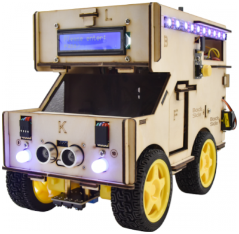

# Introducción
Vamos a trabajar con un kit programable de código abierto, fácil de construir y de bajo costo que integra una casa inteligente y coche robot.

Podemos crear el robot a partir de los tableros que se ensamblan por encaje en ranuras y burlones, montaje de las partes electrónicas y cableado. En el proceso de ensamblaje, las actividades irán detallando el principio de funcionamiento de sensores y módulos.

El aspecto final de la motorhome o autocaravana lo vemos en la figura siguiente:

*Aspecto del mobilhome montado*

**Características:**

* Función multipropósito: evitación de obstáculos, seguimiento de línea, control por Bluetooth, seguimiento ultrasónico, sensación inteligente, etc.
* Fácil de construir: ensamble por ranura y burlón y sin soldaduras.
* Estilo: tableros de madera y acrílicos, módulos RGB y LCD1602.
* Voltaje de alimentación: 5v
* Voltaje de entrada: 7 a 12V
* Corriente máxima de salida: 3A
* Disipación de potencia máxima: 15W
* Velocidad del motor: 200 rpm (4,5 V)
* Ángulo de detección ultrasónico: <15 grados
* Distancia de detección ultrasónica: de 2 a 400cm
* Distancia de control remoto Bluetooth: 50 metros
* Control de aplicaciones Bluetooth: compatible con sistema Android e iOS.
