# Montaje de las partes
Vamos a ir viendo paso a paso como montar cada una de las partes anteriores en su lugar para ensamblar el vehículo completo. Lo haremos con cuidado de que todo esté bien colocado, siendo pacientes y sin forzar ningún elemento.

Sobre la parte 7 montamos la parte 2 utilizando dos burlones grandes, teniendo cuidado con la orientación y de no aplastar ningún cable. En la figura siguiente vemos el proceso a seguir. Si los burlones entran demasiado justos es mejor limarlos un poco por sus laterales para no forzar el encaje en su lugar dada la debilidad de las paredes mas finas de los orificios.

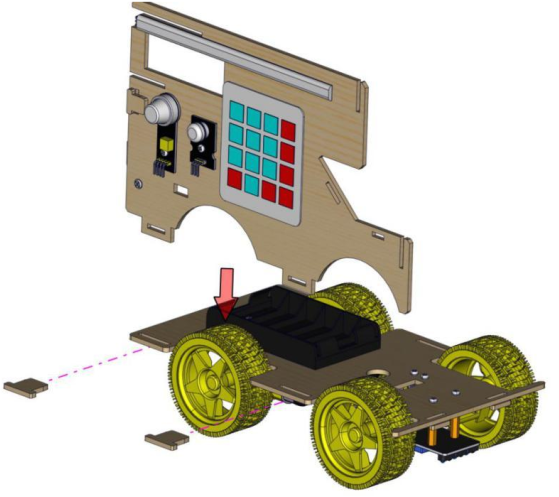

*Montaje de las partes 2 y 7*

Y ahora montamos la parte 1 de manera similar.

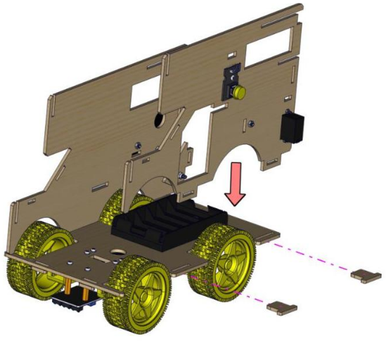

*Montaje de las parte 1*

Colocamos el panel G en el lugar indicado en la figura siguiente dejando las letras orientadas hacía arriba.

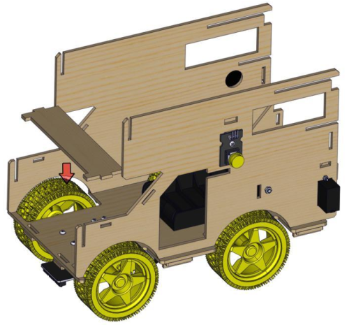

*Montaje del panel G*

Colocamos el panel acrílico marcado con la letra P en la posición que observamos en la figura siguiente dejando la letra hacía el exterior. El ensamble de este panel y el G se hace de manera simultanea.

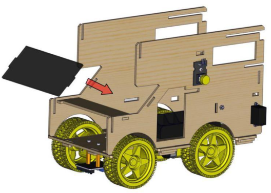

*Montaje del panel P*

A continuación encajamos el panel K en las ranuras de los paneles A y B y los hacemos coincidir con los orificios de la base, dondee lo sujetamos con dos burlones pequeños, tal y como vemos en la figura siguiente:

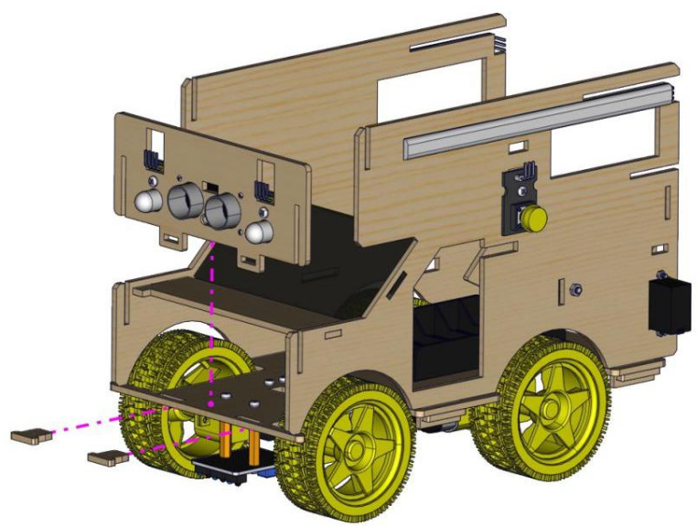

*Montaje del panel K*

El siguiente paso en el montaje es instalar en su lugar el panel M teniendo precaución al instalarlo porque las partees que sobresalen son débiles. En la figura siguiente vemos como proceder.

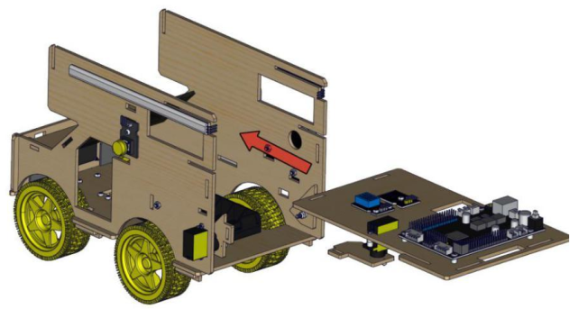

*Montaje del panel M*

<b>Opcional:</b> Si es necesario retiramos el panel E antes de instalar el F y lo colocamos posteriormente.

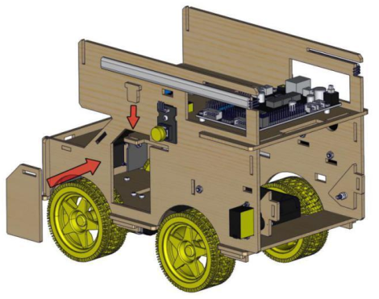

*Desmontaje del panel E*

En las imágenes siguientes y establecido el orden por numeración tenemos el proceso de colocación de los dos paneles D en su lugar.

* **1/4** Insertar las placa en las ranuras del panel F.

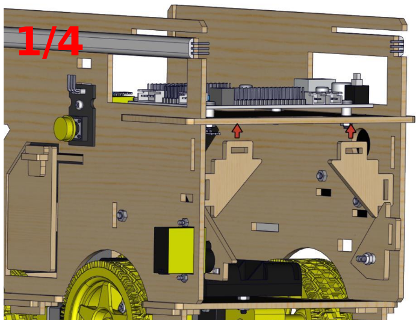

*Montaje paneles D*

* **2/4** Deslizamos los paneles D por la ranura superior hasta que encajen en los orificios de los paneles laterales.

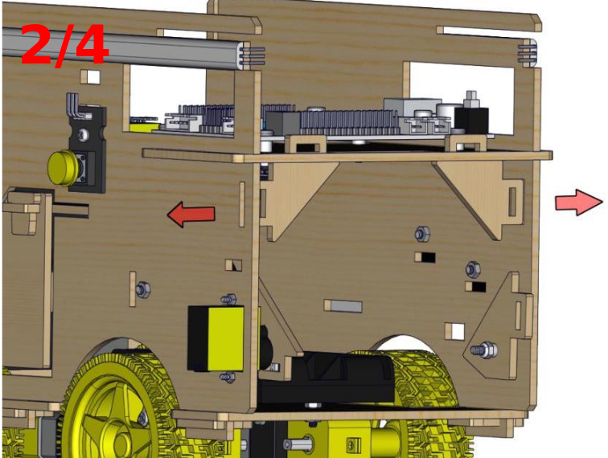

*Montaje paneles D*

* **3/4** Colocamos dos burlones pequeños en los orificios verticales de los paneles D.

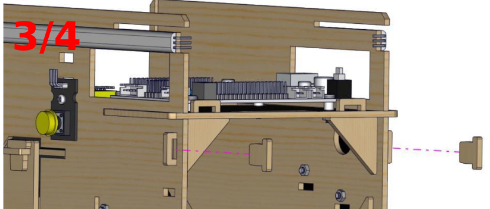

*Montaje paneles D*

* **4/4** Colocamos dos burlones pequeños en los orificios horizontales de los paneles D.

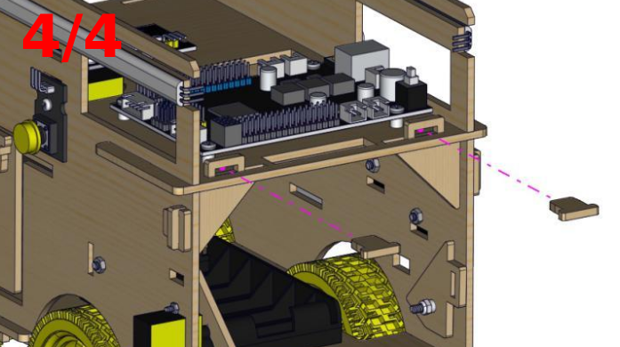

*Montaje paneles D*

El siguiente paso es colocar el panel L con la LCD en su lugar de manera similar a como hicimos con el panel K y lo sujetamos con dos burlones pequeños.

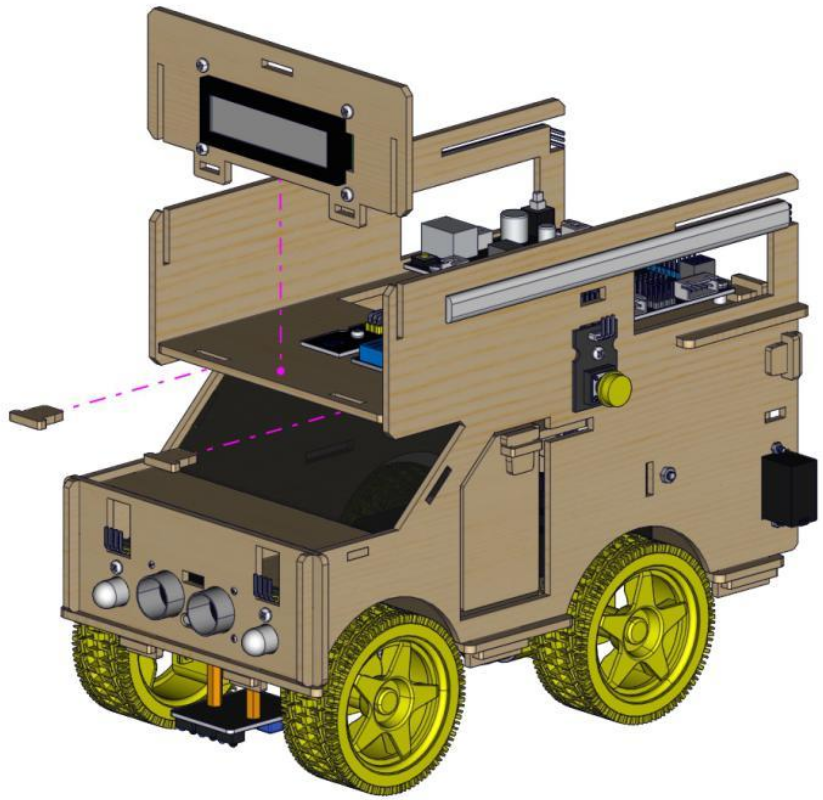

*Montaje panel L*

Antes de finalizar el montaje con la colocación del techo y la puerta abatible trasera es necesario cablear el conjunto por lo que estos pasos finales los incluiremos en el apartado [Conexionado](conex.md).
