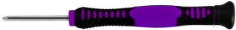

# Parte 1: Tableros B y H

## **Materiales**

En la tabla siguiente se listan de forma numerada todos los materiales para instalar completamente el montaje de la parte 1.

| N. | Cantidad | Imagen | Descripción |
|:-:|:-:|:-:|---|
| 1 | 2 |  | Tableros de madera con las letras B y H |
| 2 | 1 |  | Botón pulsador |
| 3 | 1 |  | Módulo amplificador de potencia |
| 4 | 1 |  | Servo 9g de 180º|
| 5 | 1 |  | Tira de luces LED WS2812B a color |
| 6 | 1 |  | Tornillos cabeza redonda M2x4mm (incluido con el servo) |
| 7 | 4 |  | Tornillos autoroscante cabeza redonda M1.2x4mm |
| 8 | 2 |  | Tornillos cabeza redonda M2x16mm |
| 9 | 2 |  | Tornillos cabeza redonda M3x8mm |
| 10 | 2 |  | Tuercas M2 |
| 11 | 2 |  | Tuercas M3 |
| 12 | 1 |  | Cable 26AWG (negro-rojo-amarillo) dupont de 15cm 3 pines H-H para el pulsador|
| 13 | 1 |  | Cable 26AWG (negro-rojo-verde) dupont de 15cm 3 pines H-H para el pulsador para tiras de LEDs|
| 14 | 1 |  | Cable 26AWG (negro-rojo-amarillo) dupont de 20cm 3 pines H-H para el amplificador|
| 15 | 1 |  | Destornillador 3.0x40mm |
| 16 | 1 |  | Destornillador 2.0x40mm |

## **Ensamble**
Seguimos la siguiente secuencia de colocación de elementos:

### Pulsador
Colocamos el pulsador, en la cara marcada con "Back side", en la posición marcada con el número 19 en el tablero B y lo sujetamos con un tornillo M3x8mm y una tuerca M3.

### Amplificador
Montamos el amplificador de potencia en el área marcada con 4 en la otra cara del panel B y lo sujetamos con un tornillo M3x8 y una tuerca M3. Dejamos el potenciómetro colocado en su punto central de forma aproximada.

### Servomotor
Inicializamos el servo de la puerta abatible trasera (0º - pin D7) y lo colocamos en su posición junto al amplificador debiendo quedar el lado del engranaje del eje en la misma cara que el amplificador. Lo sujetamos en su posición utilizando dos tornillos M2x10mm y dos tuercas M2.

### Aspa del servo y tablero H
Fijamos el aspa en forma de cruz en la pieza H utilizando 4 tornillos M1.2x4mm.

Utilizando el tornillo M2x4mm que viene con el servo fijamos el conjunto de aspa y panel H al eje del servo. Debemos tenemos la precaución de que no se mueva el eje del servo de su posición prefijada.

### Tira de LEDs RGB
Colocamos la tira de LEDs en la posición marcada con el número 21 en el tablero B.

## **Resultado final**
En la figura siguiente vemos el tablero B montado por la cara del pulsador.

*Montaje tablero B*

En la figura siguiente vemos el tablero B montado por la cara del amplificador.

*Montaje tablero B*

En la figura siguiente vemos en detalle el montaje del servo.

*Detalles del montaje del tablero B*

