# Parte 2: Tableros A e I

## **Materiales**
En la tabla siguiente se listan de forma numerada todos los materiales para instalar completamente el montaje de la parte 2.

| N. | Cantidad | Imagen | Descripción |
|:-:|:-:|:-:|---|
| 1 | 2 | 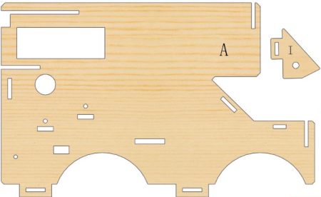 | Tableros de madera con las letras A e I |
| 2 | 1 | 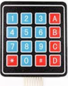 | Teclado 4x4 de membrana |
| 3 | 1 | 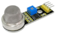 | Sensor de gases |
| 4 | 1 | 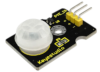 | Sensor de presencia PIR |
| 5 | 1 | 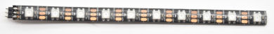 | Tira de luces LED WS2812B a color |
| 6 | 1 |  | Tornillos cabeza redonda M2x4mm (incluido con el servo) |
| 7 | 2 |  | Tornillos cabeza redonda M3x8mm | |
| 8 | 2 |  | Separadores o columnas de plástico ABS |
| 9 | 2 |  | Tuercas M3 |
| 9 | 1 |  | Tuercas M3 autoblocante |
| 10 | 2 | 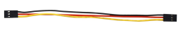 | Cable 26AWG (negro-rojo-amarillo) dupont de 15cm 3 pines H-H para el sensor PIR|
| 11 | 1 |  | Cable 26AWG (negro-rojo-verde) dupont de 15cm 3 pines H-H para el pulsador para tiras de LEDs|
| 12 | 1 |  | Cable 26AWG (negro-rojo-azul-verde) dupont de 20cm 4 pines H-H para el sensor de gases|
| 13 | 1 |  | Destornillador 3.0x40mm |

## **Ensamble**
Seguimos la siguiente secuencia de colocación de elementos:

### Sensor de gases
Colocamos el sensor de gases MQ2 en la posición marcada con el número 3 en el tablero A y lo sujetamos con un tornillo M3x8mm y una tuerca M3.

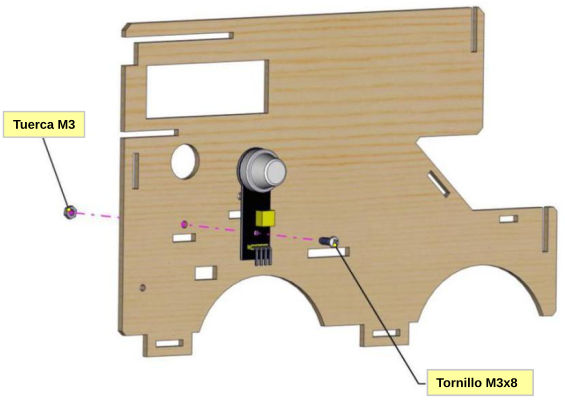

### Sensor de presencia PIR
Montamos el sensor de presencia PIR en el área marcada con 2 en el panel A  y lo sujetamos con un tornillo M3x8 y una tuerca M3.

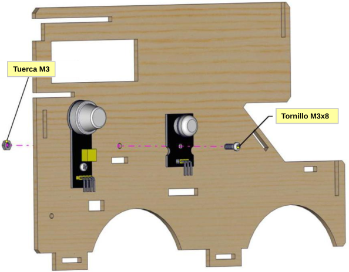

### Tira de LEDs RGB
Colocamos la tira de LEDs en la posición marcada con el número 20 en el tablero A.

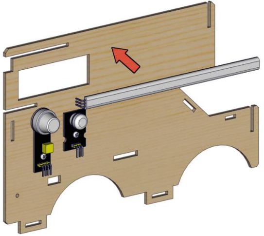

### Teclado
Retiramos el protector y adherimos el teclado de membrana de 4x4 en el área marcada con 1 en el panel A. Nos aseguramos de que quede bien pegado.

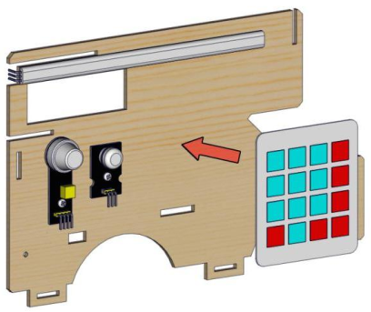

### Panel I
Montamos el panel I en el A utilizando el tornillo M3x20, los dos separadores de plástico ABS colocados uno encima del otro y una tuerca M3, de forma que el panel I quede por el lado contrario al teclado. No apretar mucho la tuerca de forma que el panel I gire libremente.

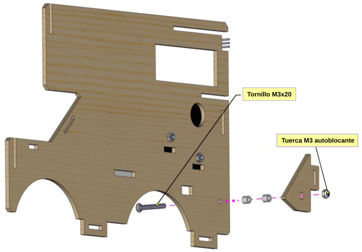

## **Resultado final**
En la figura siguiente vemos el tablero A montado por la cara de los sensores y el teclado.

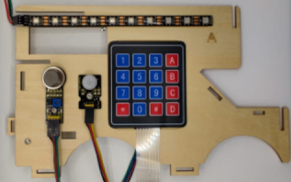

*Montaje tablero A*

En la figura siguiente vemos en detalle el montaje del panel I.

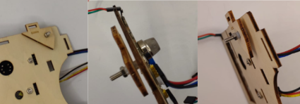

*Detalles del montaje del tablero I*

