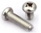
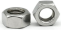

# Parte 3: Tablero K

## **Materiales**
En la tabla siguiente se listan de forma numerada todos los materiales para instalar completamente el montaje de la parte 3.

| N. | Cantidad | Imagen | Descripción |
|:-:|:-:|:-:|---|
| 1 | 1 |  | Tablero de madera con la letra K |
| 2 | 1 |  | Sensor de ultrasonidos HC-SR04 |
| 3 | 2 |  | LED RGB de 10mm de alto brillo |
| 4 | 2 |  | Tornillos cabeza redonda M3x8mm | |
| 5 | 4 |  | Tornillos cabeza redonda M1.4x8mm |
| 6 | 2 |  | Tuercas M3 |
| 7 | 4 |  | Tuercas M1.4 |
| 8 | 1 |  | Cable 26AWG (rojo-azul-verde-negro) dupont de 35cm 4 pines H-H para HC-SR04|
| 9 | 2 |  | Cable 26AWG (rojo-rojo-azul-verde) dupont de 35cm 4 pines H-H para LEDs RGB alto brillo|
| 10 | 1 |  | Destornillador 3.0x40mm |
| 16 | 1 |  | Destornillador 2.0x40mm |

## **Ensamble**
Seguimos la siguiente secuencia de colocación de elementos:

### Sensor de ultrasonidos
Colocamos el cable 26AWG (rojo-azul-verde-negro) dupont de 35cm 4 pines H-H en el sensor de ultrasonidos HC-SR04 de forma que el cable negro coincida con GND.

Colocamos el sensor de ultrasonidos HC-SR04 en la posición marcada con el número 8 en el tablero K y lo sujetamos con 4 tornillos M1.4x8mm y cuatro tuercas M1.4.

### Diodos LEDs RGB de 10mm
Cableamos los diodos LED RGB de alto brillo de 10mm con los cables 26AWG (rojo-rojo-azul-verde) dupont de 35cm 4 pines H-H de forma que el primer cable rojo coincida con VCC y así el resto coinciden con el color RGB correspondiente.

Instalamos los módulos con diodo LED en las zonas marcadas con los número 9 y 10 en el panel K y los fijamos en su posición con dos tornillos M3x8mm y dos tuercas M3.

## **Resultado final**
En la figura siguiente vemos el tablero K montado por la cara frontal.

*Montaje tablero K*

En la figura siguiente vemos el tablero K montado por la cara posterior.

*Montaje tablero K*

