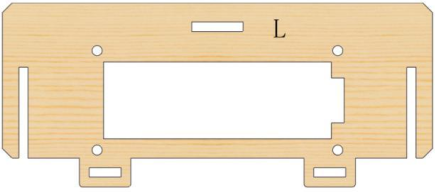
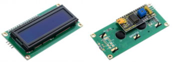
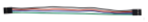
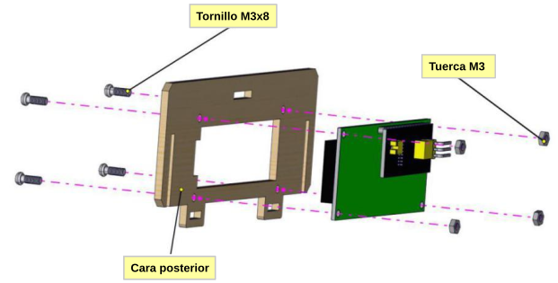
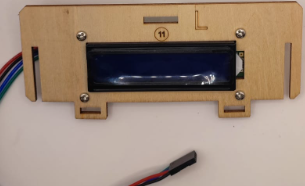
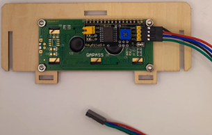

# Parte 4: Tablero L

## **Materiales**
En la tabla siguiente se listan de forma numerada todos los materiales para instalar completamente el montaje de la parte 3.

| N. | Cantidad | Imagen | Descripción |
|:-:|:-:|:-:|---|
| 1 | 1 |  | Tablero de madera con la letra L |
| 2 | 1 |  | Pantatalla LCD 16x2 I2C |
| 3 | 4 |  | Tornillos cabeza redonda M3x8mm | |
| 4 | 4 |  | Tuercas M3 |
| 5 | 1 |  | Cable 26AWG (negro-rojo-azul-verde) dupont de 20cm 4 pines H-H para LCD I2C|
| 6 | 1 |  | Destornillador 3.0x40mm |

## **Ensamble**
Seguimos la siguiente secuencia de colocación de elementos:

### Pantalla LCD
Colocamos en el display LCD con el cable 26AWG (negro-rojo-azul-verde) dupont de 20cm 4 pines H-H en el conector de la LCD de forma que el cable negro coincida con GND. Montamos el display LCD en la posición marcada con el número 11 en el tablero L y lo sujetamos con 4 tornillos M3x8mm y cuatro tuercas M3.

## **Resultado final**
En la figura siguiente vemos el tablero L montado por la cara frontal.

*Montaje tablero L*

En la figura siguiente vemos el tablero L montado por la cara posterior.

*Montaje tablero L*

