# Parte 5: Tableros N y O

## **Materiales**

En la tabla siguiente se listan de forma numerada todos los materiales para instalar completamente el montaje de la parte 5.

| N. | Cantidad | Imagen | Descripción |
|:-:|:-:|:-:|---|
| 1 | 1 | 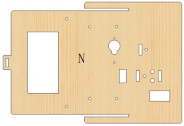 | Tablero de madera con la letra N |
| 2 | 1 | 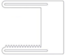 | Tablero acrílico con la letra O |
| 3 | 1 |  | Engranaje de madera |
| 4 | 1 | 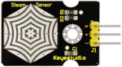 | Sensor de vapor |
| 5 | 1 | 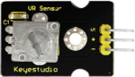 | Sensor analógico ratativo o Potenciómetro |
| 6 | 1 | 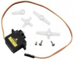 | Servo 9g de 180º|
| 7 | 2 | 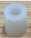 | Separadores o columnas de plástico ABS |
| 8 | 2 | 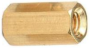 | Separadores o columnas metálicas de 10mm con rosca M3 interior |
| 9 | 4 | 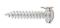 | Tornillos autoroscante cabeza redonda M1.2x4mm |
| 10 | 2 |  | Tornillos cabeza redonda M2x16mm |
| 11 | 1 | 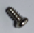 | Tornillos cabeza redonda M2x4mm (incluido con el servo) |
| 12 | 4 |  | Tornillos cabeza redonda M3x8mm |
| 13 | 4 |  | Tornillos cabeza redonda M3x10mm |
| 14 | 4 | 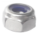 | Tuercas M3 autoblocante |
| 15 | 2 | 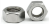 | Tuercas M2 |
| 16 | 4 | 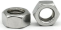 | Tuercas M3 |
| 17 | 2 | 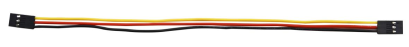 | Cable 26AWG (negro-rojo-amarillo) dupont de 20cm 3 pines H-H para sensor de vapor y potenciómetro|
| 18 | 1 | 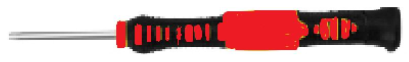 | Destornillador 3.0x40mm |
| 19 | 1 | 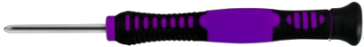 | Destornillador 2.0x40mm |

## **Ensamble**
Seguimos la siguiente secuencia de colocación de elementos:

### Sensor de vapor y potenciómetro
Colocamos el sensor de vapor en la posición marcada con el número 17 y el potenciómetro en el 16 en el tablero N y los sujetamos con un tornillo M3x8mm y una tuerca M3 cada uno.

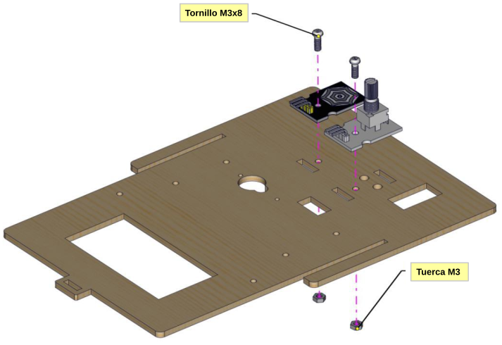

### Servomotor
Inicializamos el servo de la ventana del techo (0º - pin D8) y lo colocamos en su posición junto al amplificador debiendo quedar el lado del engranaje del eje en la cara opusta a los sensores. Lo sujetamos en su posición utilizando las dos columnas de plástico, los dos tornillos M2x16mm y dos tuercas M2.

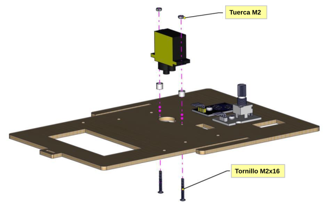

### Aspa del servo y engranaje
Fijamos el aspa en forma de cruz en el engranaje utilizando 4 tornillos M1.2x4mm y fijamos el conjunto con el tornillo M2x4mm (viene con el motor) al eje del servo teniendo mucho cuidado para no mover el eje sel mismo.

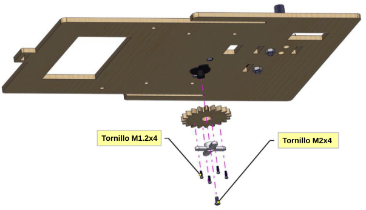

### Panel acrílico O
Instalamos el panel O en el panel N utilizado la tornillería que vemos en la figura siguiente. No es necesario apretar los tornillos firmemente. Los dos tornillos M3x8 que nos quedan los utilizamos para sujetar los separadores y los de M3x10 los utilizamos para sujetar el panel O junto con las tuercas M3 autoblocantees.

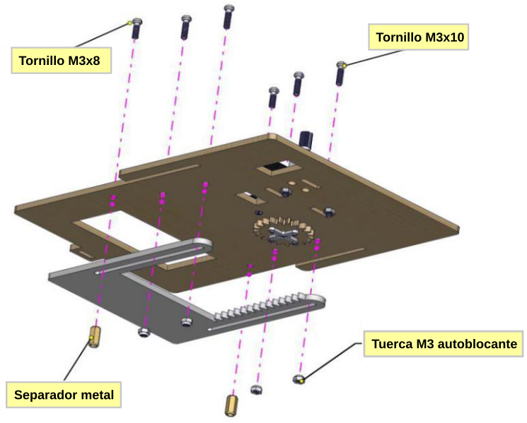

## **Resultado final**
En la figura siguiente vemos los tableros N y O por la cara de sensores.

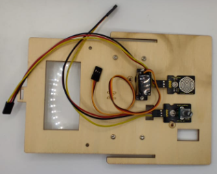

*Montaje tableros N y O*

En la figura siguiente vemos los tableros N y O montados por la cara del engranaje.

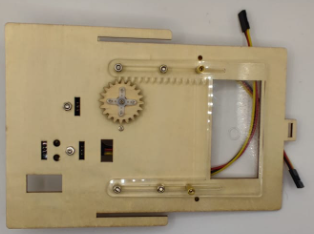

*Montaje tableros N y O*

En la figura siguiente vemos en detalle el montaje del servo.

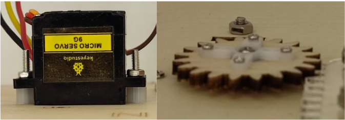

*Detalles del montaje del tablero B*

