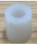
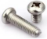
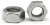
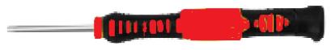

# Parte 6: Tableros M y E

## **Materiales**

En la tabla siguiente se listan de forma numerada todos los materiales para instalar completamente el montaje de la parte 6.

| N. | Cantidad | Imagen | Descripción |
|:-:|:-:|:-:|---|
| 1 | 1 |  | Tablero de madera con la letra M |
| 2 | 1 |  | Tablero de madera con la letra E |
| 3 | 1 |  | Diodo LED blanco |
| 4 | 1 |  | Sensor de temperatura y humedad DHT11 |
| 5 | 1 |  | Sensor de luz ambiente TEMT6000 |
| 6 | 1 |  | Servo 9g de 180º|
| 7 | 1 |  | Placa de control basada en Mega 2560 | 
| 8 | 4 |  | Separadores o columnas de plástico ABS |
| 9 | 4 |  | Tornillos autoroscante cabeza redonda M1.2x4mm |
| 10 | 2 |  | Tornillos cabeza redonda M2x16mm |
| 11 | 1 |  | Tornillos cabeza redonda M2x4mm (incluido con el servo) |
| 12 | 4 |  | Tornillos cabeza redonda M3x8mm |
| 13 | 4 |  | Tornillos cabeza redonda M3x12mm |
| 14 | 2 |  | Tuercas M2 |
| 15 | 8 |  | Tuercas M3 |
| 16 | 1 |  | Cable 26AWG (negro-rojo-amarillo) dupont de 20cm 3 pines H-H para DHT11 |
| 17 | 1 |  | Cable 26AWG (negro-rojo-amarillo) dupont de 15cm 3 pines H-H para el TEMT6000|
| 18 | 1 |  | Destornillador 3.0x40mm |
| 19 | 1 |  | Destornillador 2.0x40mm |

## **Ensamble**
Seguimos la siguiente secuencia de colocación de elementos:

### Sensores DHT11 y TEMT6000
Colocamos el sensor de temperatura y humedad en la posición marcada con el número 14 y sensor de luz ambiente en el 15 en el tablero M y los sujetamos con dos tornillos M3 el DHT11 y un tornillo M3x8mm el TEMT6000 y tres tuercas M3, una para cada uno.

### LED blanco
Colocamos el LED blanco en la posición marcada con el número 12 que está en la otra cara del panel M y lo sujetamos con un tornillo M3x8mm y una tuerca M3.

### Servomotor
Inicializamos el servo de la puerta (80º - pin D6) y lo colocamos en su posición debiendo quedar el lado del engranaje del eje en la cara del diodo LED. Lo sujetamos en su posición utilizando las dos columnas de plástico, los dos tornillos M2x16mm y dos tuercas M2.

### Aspa del servo y panel E
Fijamos el aspa en forma de cruz en el panel E utilizando 4 tornillos M1.2x4mm.

Fijamos el conjunto con el tornillo M2x4mm (viene con el motor) al eje del servo teniendo mucho cuidado para no mover el eje sel mismo.

### Placa de control
Instalamos la placa de control en el panel M y la fijamos utilizando cuatro tornillos M3x12mm, cuatro separados de plástico y 4 tuercas M3.

## **Resultado final**
En la figura siguiente vemos los tableros N y O por la cara de sensor DHT11.

*Montaje tableros M y E*

En la figura siguiente vemos los tableros M y E montados por la cara del LED.

*Montaje tableros M y E*

En la figura siguiente vemos en detalle el montaje del servo.

*Detalles del montaje del tablero E*

