# Parte 7: Tablero C

## **Materiales**

En la tabla siguiente se listan de forma numerada todos los materiales para instalar completamente el montaje de la parte 7.

| N. | Cantidad | Imagen | Descripción |
|:-:|:-:|:-:|---|
| 1 | 1 | 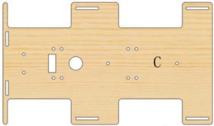 | Tablero de madera con la letra C |
| 2 | 1 | 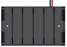 | Portapilas 6xAA con conector JST de 2 pines polarizado |
| 3 | 1 | 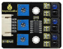 | Panel con tres sensores siguelíneas |
| 4 | 4 | 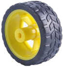 | Ruedas |
| 5 | 4 | 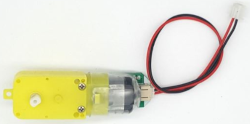 | Motor DC de 4.5V y 200 rpm con cable y conector JST de 2 pines polarizado |
| 6 | 4 |  | Piezas de aluminio con rosca M3 de 23x15x5mm |
| 7 | 2 | 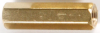 | Separadores de metal de 20mm con agujero roscado M3 |
| 9 | 2 | 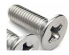 |Tornillos cabeza achaflanada M3x12mm |
| 10 | 12 |  | Tornillos cabeza redonda M3x8mm |
| 11 | 8 |  | Tornillos cabeza redonda M3x30mm |
| 12 | 12 |  | Tuercas M3 |
| 13 | 1 | 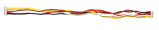 | Cable 26AWG de 40cm 5 pines con conectores JST de 2 pines polarizados |
| 14 | 1 |  | Destornillador 3.0x40mm |

## **Ensamble**
Seguimos la siguiente secuencia de colocación de elementos:

### Piezas de aluminio
Ensamblamos las cuatro piezas de aluminio de color negro para fijar los motores y las sujetamos con dos tornillos M3x8mm cada una. Van fijadas por la cara del panel marcada con la letra C

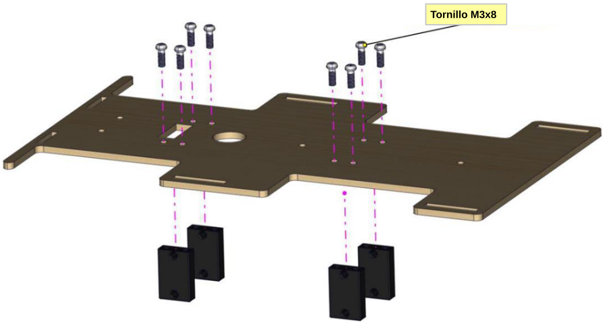

### Motores
Instalamos los motores sobre el panel pocicionandolos como vemos en las figuras siguientes y lo sujetamos a las piezas de aluminio con dos tornillos M3x30mm y dos tuercas M3 cada uno.

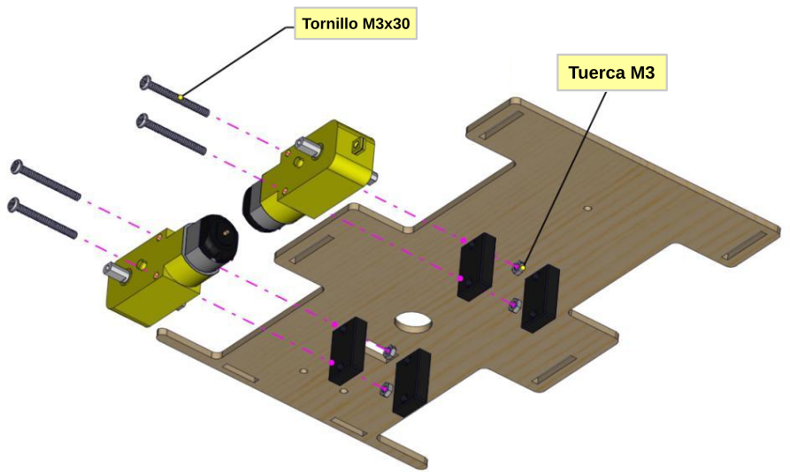

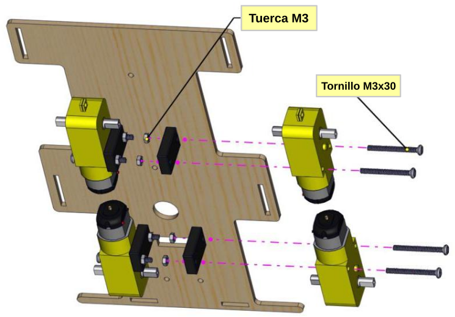

### Ruedas
Instalamos las ruedas en los motores

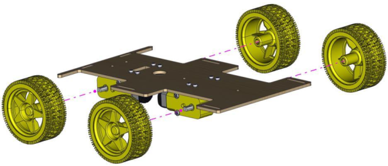

### Portapilas
Fijamos el portapilas en el panel C en la zona marcada con el número 7 y utilizando 2 tornillos M3x12mm con cabeza avellanada para sujetarlo.

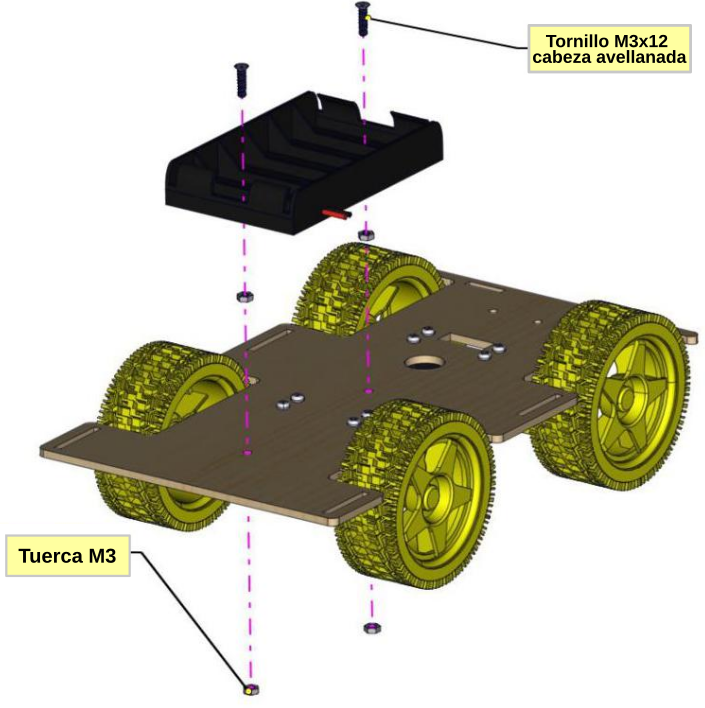

### Sensor siguelíneas
Montamos el sensor en la zona marcada con el número 6 en el panel C y lo fijamos utilizando cuatro tornillos M3x8mm y dos separados metálicos de 20mm.

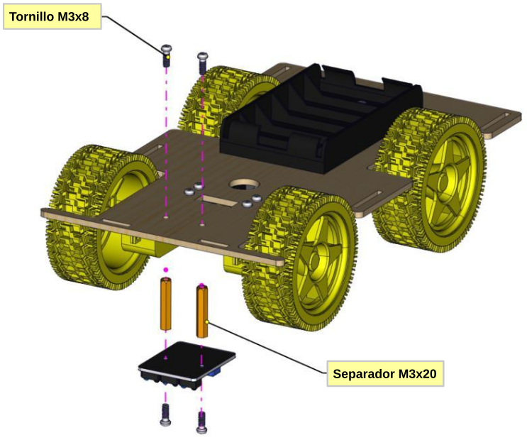

## **Resultado final**
En la figura siguiente vemos el tablero C montado.

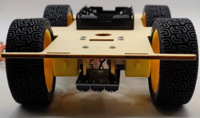

*Montaje tablero C*

