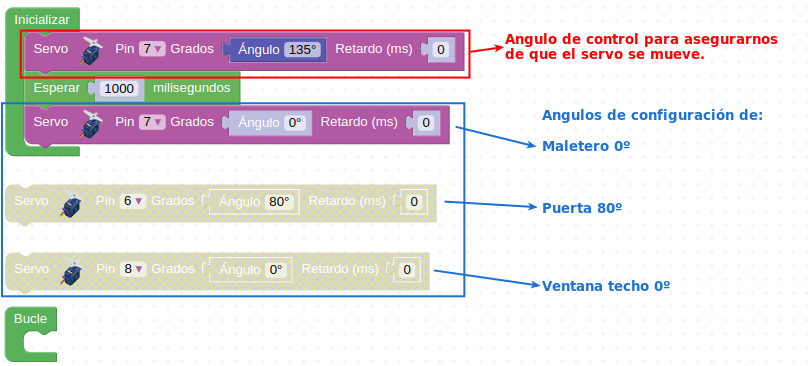
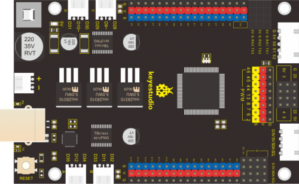
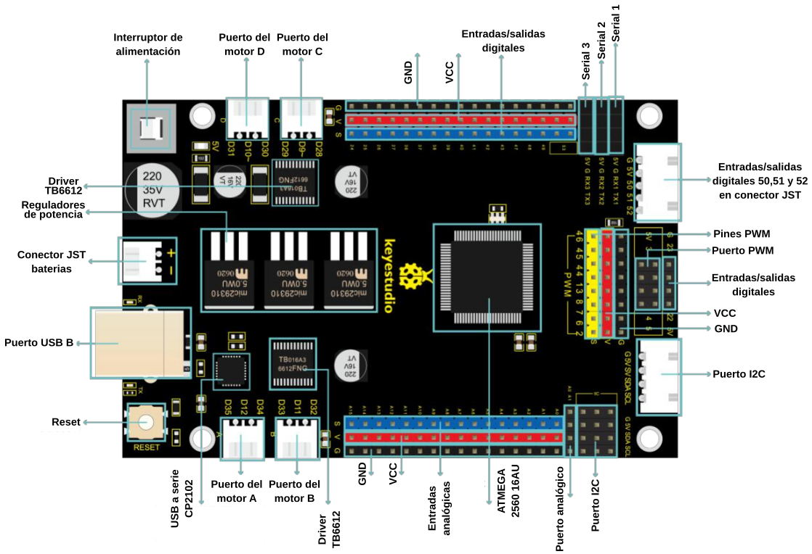
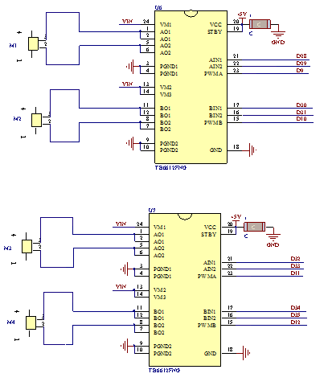
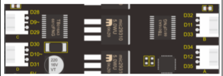

# Antes de continuar
Sección en la que vamos a detallar los materiales del kit, como se montan e instalan ampliando la información de los elementos que lo requieran.

Tomaremos la siguientes precauciones:

1. La cara frontal de los paneles tiene un número y la cara posterior está marcada con "Back side".
2. No es necesario apretar las tuercas de la ventana al principio.
3. Hay que tener cuida cuando ensamblamos los burlones de madera para no romperlos.
4. Hay que inicializar cada servo a su ángulo antes de instalarlo.
5. Hay que retirar el plástico protector de los paneles acrílicos antes de montarlos.

## **Posicionar servo**
Antes de colocar en el lugar que le corresponde cada servo es necesario llevarlo a un determinado ángulo según la tabla siguiente.

| Servo | Angulo de rotación | Puerto digital |
|:-:|:-:|:-:|
| Puerta | 80º | D6 |
| Puerta trasera abatible | 0º | D7 |
| Ventana de techo | 0º | D8 |

Hay que tener mucho cuidado de posicionar el conector de los servos en los tres pines macho de la placa en el orden correcto (el conector es reversible) o seguramente romperemos algo de manera irremediable. La asociación de colores y pines es la siguiente:

   * G en la placa - pin asociado al conductor marrón del servo
   * V en la placa - pin asociado al conductor rojo del servo
   * S en la placa - pin asociado al conductor naranja del servo

Ahora mismo no vamos a entrar en mas detalles sobre el tema y simplemente vamos a seguir el siguiente procedimiento:

1. Conectar el servo al pin según la tabla y recomendaciones anteriores. Con el fin de apreciar correctamente los movimientos podemos colocar alguna de las aspas en el servo.
2. Conectar la placa al puerto USB del ordenador utilizando el cable suministrado.
3. Poner en marcha Connector y entrar en ArduinoBlocks con nuestra cuenta.
4. Buscar y llevar a nuestra cuenta (si aún no lo hemos hecho) el programa [posicionar-servo](./programas/Posicionar-servo.abp).
5. Configurar el programa de acuerdo al servo que vamos a posicionar y la ayuda gráfica que vemos en la figura siguiente.

*Angulos de poscionado de servos*

6. Es muy probable que el servo no se mueva si no suministramos alimentación externa. Conectamos el portapilas con las 6 pilas colocadas y accionamos el interruptor de la placa. Este interruptor está cerrado cuando su mando está en la posición mas baja.
7. Una vez posicionado el servo desconectamos la alimentación completamente (incluido USB) y retiramos el aspa colocada en el servo con mucho cuidado de no mover el eje para no modificar el ángulo del mismo.
8. Ya podemos colocar el servo en su lugar.

Si quieres aprender mas en el documento [Control de servos](https://drive.google.com/file/d/1aYPxzOF4v0kIXyT0cjgaIumsSwZophS0/view) tienes mas información sobre servos y cuando trabajemos en su programación incluiremos teoría sobre los mismos.

## **La placa de control**
La placa de desarrollo inteligente KS0509 de Keyestudio basada en Mega 2560 es TMEGA2560-16AU, que es totalmente compatible con la placa de desarrollo Arduino MEGA 2650. Esta placa integra dos drivers para motor TB6612, y está pensada como la solución para montar la autocaravana o vehículos que requieren hardware igual o similar. La placa tiene el aspecto que vemos en la figura siguiente:

*Aspecto de la placa de control*

Además, la placa integra una fuente de alimentación que puede entregar un máximo de 5V y 3A, gracias a los tres reguladores de potencia 29310 dotados de disipación de calor. La mayoría de los pines se extienden a pines dotados de alimentación para facilitar la conexión externa de sensores/módulos.

En la figura siguiente vemos la descripción global de pines:

*Descripción de pines*

En la tabla siguiente se dan especificaciones técnicas de la placa referidas a la descripción de pines de la figura anterior.

| Característica | Valor |
|---|---|
| Procesador | ATMEGA2560-16AU |
| Tensión de alimentación | 5V |
| Tensión de salida | 5V |
| Corriente de salida | 3A |
| Alimentación externa | 7 a 12V DC |
| Entradas / salidas digitales | 54 puertos (D0 a D53) |
| Pines PWM | 15 pines (D2 a D13 y D44 a D46) |
| Entradas analógicas | 16 puertos (A0 a A15) |
| Puertos serie | RX1 (D19), TX1 (D18), RX2 (D17), TX2 (D16), RX3 (D15), TX3 (D14) |
| I2C | SDA (D20), SCL (D21) |
| Conectores para motores TB6612   junto interruptor de alimentación)  | Conector C: Velocidad = D9, Dirección = D28, D29  Conector D: Velocidad = D10, Dirección = D30, D31  |
| Conectores para motores TB6612   junto interface USB)  | Conector A: Velocidad = D12, Dirección = D34, D35  Conector B: Velocidad = D11, Dirección = D32, D33  |
| Corriente máxima pines entrada/salida | 20 a 50 mA |
| SRAM | 8 KB (ATMEGA2560-16AU) |
| EEPROM | 4 KB (ATMEGA2560-16AU) |
| Frecuencia de reloj | 16 MHz |

La velocidad de los motores se puede controlar con señales PWM y el sentido del movimiento o dirección con niveles alto y bajo.

## **Control de los motores**
Esquemáticamente las conexiones de los motores descritas en la tabla anterior están realizadas como vemos en la figura siguiente:

*Esquema de conexionado de motores*

Trasladado a la placa de control estas conexiones quedan como vemos en la figura siguiente:

*Conexiones de motores en la placa de control*

En la tabla siguiente se resumen todas las condiciones de funcionamiento de los motores.

| Motor | Pines | Giro en sentido antihorario | Giro en sentido horario | Parados |
|:-:|:-:|:-:|:-:|:-:|
|    A | D34 D35  D12~  | 0  1  PWM (0-255) | 1  0  PWM (0-255) | -  -  PWMA = 0  |
|    B | D32 D33  D11~  | 0  1  PWM (0-255) | 1  0  PWM (0-255) | -  -  PWMB = 0  |
|    C | D28 D29  D9~  | 1  0  PWM (0-255) | 0  1  PWM (0-255) | -  -  PWMC = 0  |
|    D | D30 D31  D10~  | 1  0  PWM (0-255) | 0  1  PWM (0-255) | -  -  PWMD = 0  |

