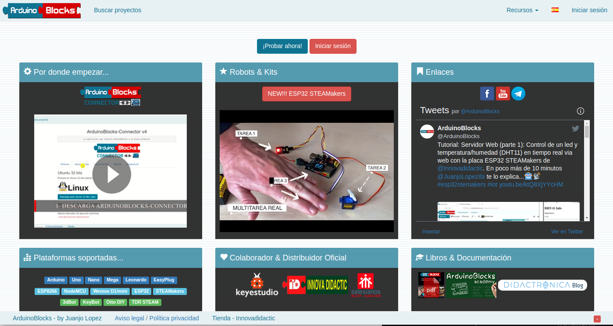

# Software

## **ArduinoBlocks**
Principalmente vamos a utilizar el lenguaje de programación visual por bloques denominado ArduinoBlocks. El aspecto de la plataforma al entrar lo vemos en la imagen siguiente:

*Portada de la plataforma ArduinoBlocks*

Podemos programar nuestra placa de control tipo UNO de diversas formas de las que las mas comunes son, a partir del IDE de Arduino o mediante bloques, que será el método que sigamos. Programar mediante el IDE requiere teclear instrucciones de código mientras que con ArduinoBlocks estas instrucciones se sustituyen por bloques tipo puzzle que evitan errores de sintaxis. Evidentemente detrás de cada bloque en realidad lo que hay son instrucciones y ArduinoBlocks nos va a permitir verlas y exportarlas. En la imagen siguiente tenemos una comparativa entre bloques de código e instrucciones en el IDE.

*Comparativa entre bloques y código*

Es importante entender que la programación con ArduinoBlocks simplifica la iniciación en el pensamiento computacional permitiendo realizar tareas complejas de una forma sencilla.

Para el caso de la TdR STEAM cabe destacar que ArduinoBlocks incluye una serie de bloques específicos que facilitan aún mas si cabe su programación.

**ArduinoBlocks** trabaja a través de una plataforma online por lo que no requiere instalación en nuestro sistema. No obstante, si que tenemos que instalar un pequeño programa que será el encargado de conectar nuestro programa en el navegador con la placa Keyestudio UNO. Este programa basado en Python se llama **Connector**.

Lo primero que deberemos hacer es crear una cuenta en ArduinoBlocks utilizando una dirección de correo electrónico válida y después instalar el software [Connector](http://www.arduinoblocks.com/web/site/abconnector5).

En los manuales de referencia disponibles en la plataforma están todos los detalles sobre como llevar a cabo estas tareas. La versión 5.1 del programa una vez iniciado la vemos en la imagen siguiente:

*Connector V5.1*

Si no estás muy avezado en estos temas es necesarios al menos ver los siguientes vídeos sobre el tema:

* Bloque 1: Puesta en marcha con ArduinoBlocks

    - [Empezando con ArduinoBlocks y la programación por bloques](https://didactronica.com/funcionamiento-de-un-programa-en-arduinoblocks-y-primera-carga/)
    - [Crear una cuenta en ArduinoBlocks e iniciar un proyecto personal](https://didactronica.com/crear-una-cuenta-en-arduinoblocks-e-iniciar-un-proyecto-personal/)
    - [Configurar la conexión a ArduinoBlocks y detectar la placa Arduino](https://didactronica.com/configurar-la-conexion-a-arduinoblocks-y-detectar-la-placa-arduino/)
    - [Carga del primer programa](https://didactronica.com/carga-del-primer-programa/)

## **IDE de Arduino**

### Previo
Casi con toda seguridad que se nos va a presentar alguna ocasión en que ArduinoBlocks no satisfaga nuestras necesidades porque no exista el bloque en el momento que lo necesitamos. En estas ocasiones no nos va a quedar mas remedio que recurrir al Entorno de Desarrollo Integrado o IDE de Arduino.

Antes de continuar indicar que aquí vamos a describir como llevar a cabo los primeros pasos con el IDE 2.0 pero no vamos a tratar conceptos de programación mediante código.

En la animación de la figura siguiente vemos como ArduinoBlocks nos permite diferentes opciones de trabajo con el IDE, que son:

* **Ver código**. Se despliega una ventana con el código del programa actual cargado.
* **Descargar código (.ino)**. Para exportar el código para utilizarlo en Arduino IDE.
* **ZIP project (.zip)**. Para exportar el proyecto completo como .zip incluyendo librerías para Arduino IDE.

*Opciones de exportación de ArduinoBlocks*

Vamos a describir como trabajar con el Arduino IDE 2.0 ya que ofrece mayor rendimiento, una interfaz de usuario mejorada y características nuevas, como el autocompletado , un depurador incorporado y la sincronización de bocetos con Arduino Cloud.
 https://docs.arduino.cc/software/ide-v2./img/teo-basica/soft/
Todos los [tutoriales del Arduino IDE 2](https://docs.arduino.cc/software/ide-v2) los tenemos en el enlace.

### Descarga
Podemos descargarlo desde la [página de software de Arduino IDE 2.0](https://www.arduino.cc/en/software) y en el momento de creación de este apartado de la web nos ofrece la versión 2.0.2 además de los enlaces al editor online, tal y como vemos en la figura siguiente.

 https://docs.arduino.cc/software/ide-v2./img/teo-basica/soft/
*Descargas*

En esta página tenemos disponibles las versiones Nightly y otras informaciones importantes como:

* La versión de escritorio no está disponible para Chromebook donde deberemos trabajar con el [editor web de Arduino](https://create.arduino.cc/editor/).
* Es posible programar las placas utilizando MicroPython. En la página [MicroPython with Arduino](https://docs.arduino.cc/micropython) tenemos toda la información.
* Opciones de descarga de versiones anteriores del IDE.
* Términos de servicio

Si tenemos alguna duda podemos seguir el tutorial en inglés de [descarga e instalación de Arduino IDE 2.0](https://docs.arduino.cc/software/ide-v2/tutorials/getting-started/ide-v2-downloading-and-installing).

### Ventana principal del IDE 2.0
En la figura siguiente vemos el aspecto que presenta el IDE en la versión 2.0.

*Arduino IDE 2.0*

A continuación se describen de forma rápida los apartados señalados en la figura anterior.

1. Verify/Upload (Verificar/Cargar): Para compilar y cargar el código en la placa.
2. Select board & port (Seleccionar placa y puerto): En el desplegable se muestran las placas detectadas de forma automática, junto con el puerto asignado.
3. Open Serial Plotter (abrir trazador seríe): Abre la herramienta de graficado como una nueva ventana.
4. Open Serial Monitor (abrir el monitor serie): abre la herramienta Serial Monitor, como una nueva pestaña en la consola.
5. Sketchbook (Carpeta de programas): es el directorio o carpeta donde se almacenan localmente los programas. Además, desde aquí se puede sincronizar con Arduino Cloud y también obtener los sketch del entorno online.
6. Boards Manager (Administrador de placas): para explorar los paquetes de Arduino y de terceros que se pueden instalar. Por ejemplo, usar una placa MKR WiFi 1010 requiere tener instalado el paquete *Arduino SAMD Boards*.
7. Library Manager (Ad https://docs.arduino.cc/software/ide-v2./img/teo-basica/soft/ministrador de librerías): Para navegar por las librerías propias de Arduino y las creadas por la comunidad.
8. Debugger (Depurador): Para probar y depurar programas en tiempo real.
9. Search (Buscar): búsqueda de palabras en el código.

### Características principales del IDE 2.0

<b>Ajustar preferencias</b>

En la animación de la figura siguiente vemos como acceder a la configuración de las mismas y también como se realiza algún ajuste adicional.

*Preferencias IDE 2.0*

<b>La carpeta de programas</b>

Los programas o sketches de Arduino se guardan como.ino y deben almacenarse en una carpeta con el mismo nombre. Por ejemplo, un programa de nombre 'mi_programa.ino' debe almacenarse en una capreferenciaspeta llamada 'mi_programa'. Generalmente se guardan en una carpeta de nombre 'Arduino' en la carpeta personal.

En la animación siguiente vemos como abrir y cerrar esta carpeta desde el botón de la barra lateral y como nos muestra el contenido

*Carpeta de programas*

<b>Administrador de placas</b>

Con el Administrador de placas se pueden buscar e instalar paquetes o "núcleos" para nuestras placas. Compilar y cargar un programa en una placa siempre requiere un paquete de la placa. Hay muchos paquetes de placa Arduino disponibles, como avr, samd, megaav y muchos más.

Podemos decir que un "núcleo" está escrito y diseñado para microcontroladores específicos y sabemos que las diferentes placas tienen micros de diferentes tipos. Por ejemplo, un Arduino UNO tiene un **ATmega328P**, que usa el **núcleo AVR**, mientras que un Arduino Nano 33 IoT tiene un microcontrolador **SAMD21**, donde necesitamos usar el **núcleo SAMD**. En definitiva, para poer usar una placa concreta debemos instalar su núcleo específico.

Al hacer clic en el botón de la barra lateral se nos abren todas las opciones disponibles y ne indica si están o no instalados y además dispone de un buscador que permite localizar el núcleo que necesitamos. Hay que tener presente que la instalación de algunos de ellos puede tardar varios minutos.

En la animación vemos el funcionamiento de este botón.

*Administrador de placas*
 https://docs.arduino.cc/software/ide-v2./img/teo-basica/soft/

<b>Gestor de librerías</b>

Este botón nos permite buscar e instalar librerías, que son extensiones de la API de Arduino que facilitan el control de un servo, leer un sensor específico o utilizar un módulo WiFi.

En la animación vemos como utilizar este botón.

*Gestor de librerías*

<b>Monitor serie</b>

Esta herramienta que habitualmente estaba en una ventana separada ahora se integra en el editor. La herramienta sirve para comunicarse con la placa o para depurar programas.

Una ventaja de tener e https://docs.arduino.cc/software/ide-v2./img/teo-basica/soft/l Serial Monitor integrado con el editor es la posibilidad de tener múltiples monitores abiertos simultáneamente. En el editor antiguo, al cambiar el puerto/placa, cambiaba en todas las ventanas. Además, estábamos limitados a una ventana de Serial Monitor, un obstáculo que el IDE 2.0 elimina.

En la animación vemos el uso básico del mismo.

*Monitor serie*

Para obtener más información sobre Serial Monitor podemos visitar el [Serial Monitor tutorial](https://docs.arduino.cc/software/ide-v2/tutorials/ide-v2-serial-monitor).

<b>Serial Plotter</b>

Nos permite visualizar datos utilizando gráficos permitiendo monitorizar varias variables de manera simultanea. Para ver mejor el funcionamiento de este elemento vamos a utilizar el potenciómetro de la autocaravana (A3) junto con una variable estática y una aleatoria. El código del ejemplo es:

~~~
int potenciometro;
int aleatoria;
int static_variable = 500;

void setup() {
  Serial.begin(9600);
}

void loop() {
potenciometro = analogRead(A3);
aleatoria = random(0, 1000);
  Serial.print("Potenciometro:");
  Serial.print(potenciometro);
  Serial.print(",");
  Serial.print("Vlor aleatorio:");
  Serial.print(aleatoria);
  Serial.print(",");
  Serial.print("Variable estatica:");
  Serial.println(static_variable);
}
~~~

En la animación vemos como cargar el programa y el funcionamiento en la ventana del Serial Plotter.

*Serial Plotter*

<b>Debugger</b>

El depurador se utiliza para probar y depurar programas. Básicamente lo que permite es navegar a través de la ejecución de un programa, lo que sirve para detectar fallos o errores de código.

El depurador solamente está disponible con las placas SAMD.

Tenemos mas información en [ Debugging tutorial](https://docs.arduino.cc/software/ide-v2/tutorials/ide-v2-debugger).

<b>Autocompletado</b>

Es una nueva característica de la versión 2.0 muy bien equipada. Debemos tener presente que para que funcione debemos tener seleccionada la placa a utilizar.

En la animación siguiente vemos la herramienta funcionando.

*Autocompletado*
